# دليل المستخدم — خارطة مشاريع الاستقامة (الإصدار 3)

هذا الدليل لكل من يستخدم التطبيق: المُدخل الميداني، ومشرف الفرع، ومدير الدولة، والإدارة العليا،
ومستخدم «الاطلاع فقط». ابدأ بالقسم الخاص بدورك، وارجع إلى «حل المشكلات» و«الأسئلة الشائعة» في آخره.

> الصور في هذا الدليل مأخوذة من بيئة التجربة، لذلك تظهر فيها شارة «بيانات تجريبية» وأسماء
> تجريبية. في النسخة الفعلية لا تظهر هذه الشارة.

## المحتويات

1. [قبل أن تبدأ](#1-قبل-أن-تبدأ)
2. [الدخول إلى التطبيق](#2-الدخول-إلى-التطبيق)
3. [دليل المُدخل الميداني](#3-دليل-المدخل-الميداني)
4. [دليل مشرف الفرع](#4-دليل-مشرف-الفرع)
5. [دليل مدير الدولة](#5-دليل-مدير-الدولة)
6. [دليل الإدارة العليا](#6-دليل-الإدارة-العليا)
7. [دور «الاطلاع فقط»](#7-دور-الاطلاع-فقط)
8. [حل المشكلات](#8-حل-المشكلات)
9. [أسئلة شائعة](#9-أسئلة-شائعة)
10. [معاني الحالات والكلمات](#10-معاني-الحالات-والكلمات)

---

## 1. قبل أن تبدأ

- **التطبيق يعمل في المتصفح** (Chrome على أندرويد هو الأفضل)، ويمكن تثبيته على الشاشة الرئيسية
  للهاتف مثل أي تطبيق: من القائمة «المزيد» اختر «تثبيت التطبيق» إن ظهر الزر، أو من قائمة المتصفح
  اختر «إضافة إلى الشاشة الرئيسية».
- **أول دخول يحتاج إنترنت** لأن التطبيق ينزّل بيانات منطقتك إلى الهاتف. بعد ذلك تستطيع العمل
  أيامًا كاملة دون اتصال.
- **اللغة:** العربية هي الافتراضية، ويمكنك اختيار السواحيلية أو الإنجليزية من شاشة الدخول أو من
  الإعدادات. تتبدل اتجاهات الشاشة تلقائيًا.
- **حسابك شخصي.** لا تعطِ رمز الدخول ولا رمز PIN لأحد. كل ما تُدخله يُسجَّل باسمك.

## 2. الدخول إلى التطبيق

### 2.1 البريد أو الهاتف، ثم الرمز

1. اكتب بريدك الإلكتروني (أو اختر «الهاتف» واكتب رقمك) واضغط «إرسال الرمز».
2. يصلك رمز من 6 أرقام. اكتبه واضغط «تحقق».

| إدخال البريد                                       | إدخال الرمز                                      |
| -------------------------------------------------- | ------------------------------------------------ |
| 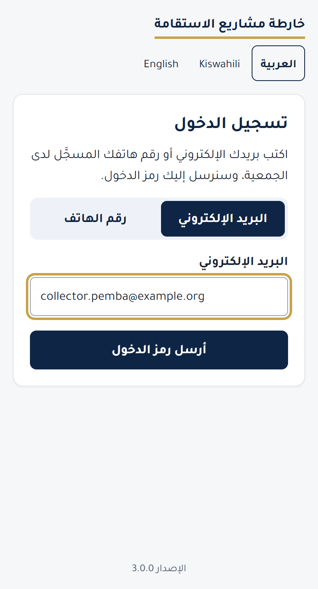 | 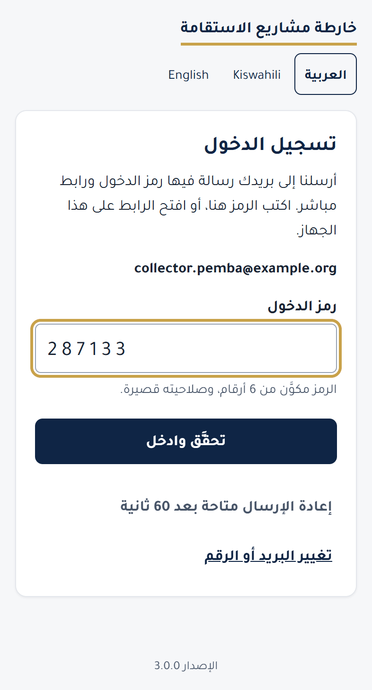 |

### 2.2 رمز PIN للجهاز

في أول دخول على هذا الهاتف تختار **رمز PIN** من 4 إلى 8 أرقام وتكرره. هذا الرمز خاص بهذا الجهاز:

- يُقفل التطبيق تلقائيًا بعد **15 دقيقة** دون استخدام، وعند إعادة فتحه، فتكتب الرمز لتكمل.
- رمز الدخول المحفوظ على الهاتف مشفَّر بهذا الرمز، فلا يستطيع من يأخذ الهاتف أن يدخل حسابك.
- إن نسيته اضغط «نسيت الرمز؟ سجِّل الدخول من جديد». تحتاج إنترنت لتصلك رسالة دخول جديدة،
  و**بياناتك التي لم تُرفع تبقى محفوظة** على الهاتف.

| اختيار PIN أول مرة                          | قفل التطبيق                         |
| ------------------------------------------- | ----------------------------------- |
| 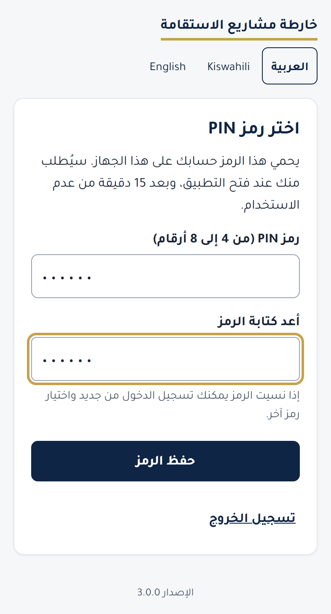 | 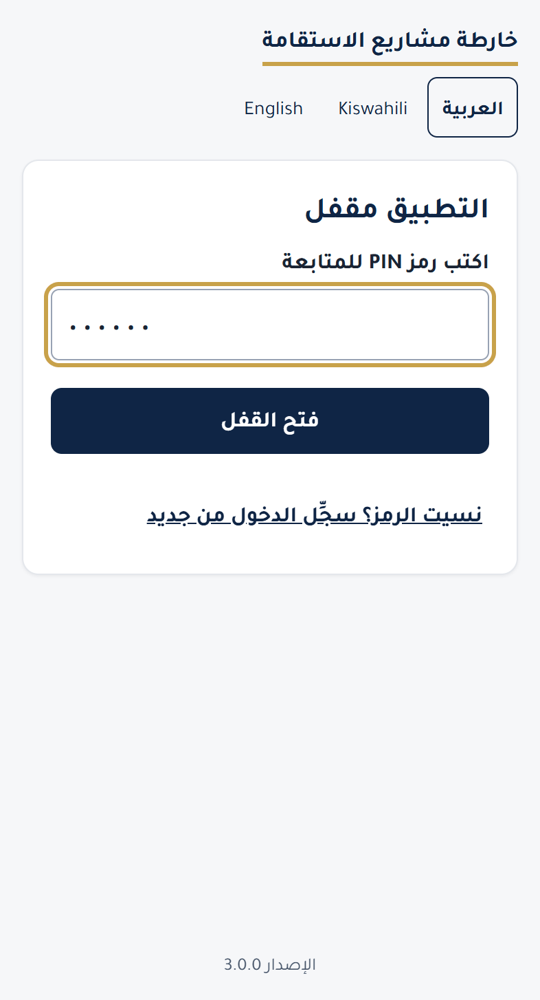 |

### 2.3 المصادقة الثنائية (لمدير الدولة والإدارة العليا فقط)

هذان الدوران يحتاجان خطوة إضافية في كل دخول: رمز من تطبيق المصادقة على هاتفك
(Google Authenticator أو Microsoft Authenticator أو ما يشبههما). انظر [5.1](#51-الدخول-بالمصادقة-الثنائية).

---

## 3. دليل المُدخل الميداني

### 3.1 الشاشة الرئيسية والتنقل

في أسفل الهاتف شريط فيه: **الخارطة · المشاريع · إضافة (+) · الصيانة · التقارير**. باقي الصفحات
(السجلات الناقصة، الأشخاص، الاستيراد، الإعدادات) في زر **المزيد** (الخطوط الثلاثة أعلى الشاشة).

| الخارطة                        | قائمة «المزيد»                             |
| ------------------------------ | ------------------------------------------ |
| 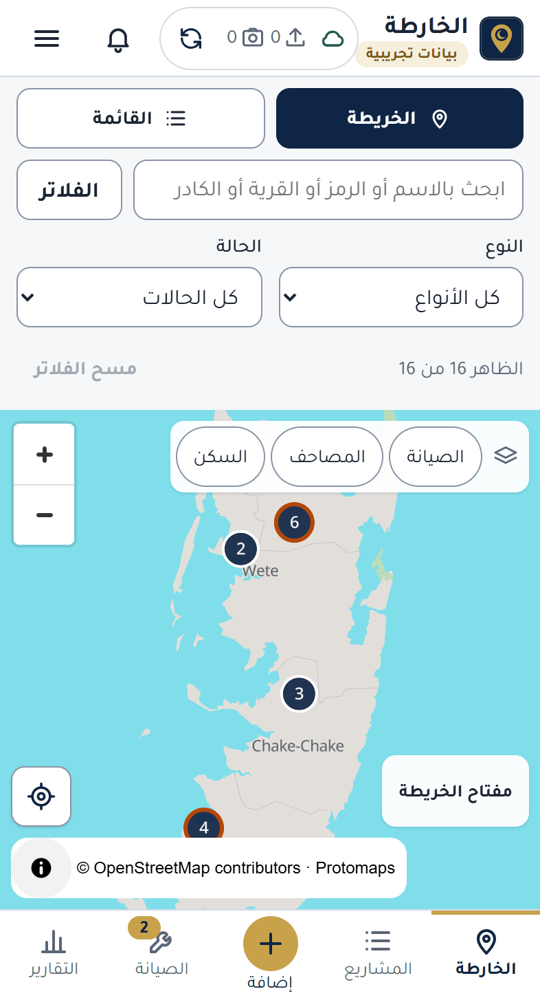 | 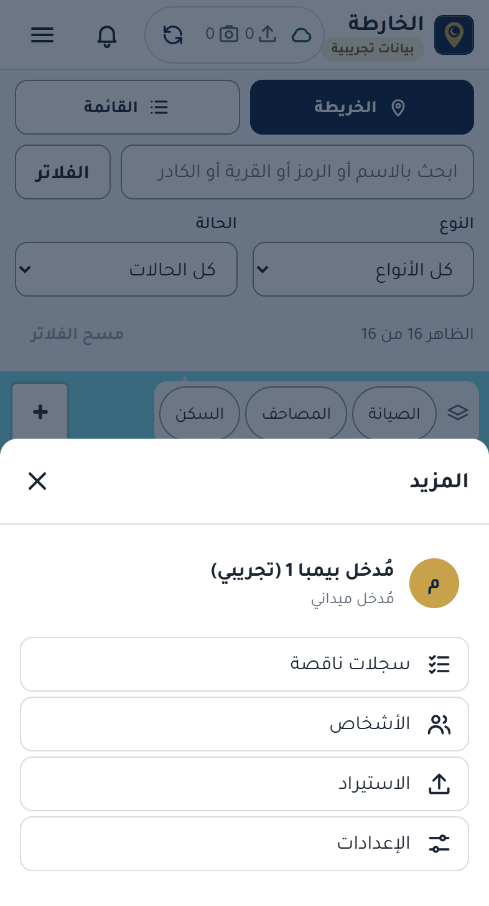 |

- **الخارطة / القائمة:** زران أعلى الصفحة للتبديل بين عرض الخريطة وعرض القائمة.
- **البحث:** اكتب اسم المشروع أو رمزه أو اسم القرية أو اسم أحد الكادر. البحث يعمل دون اتصال أيضًا.
- **الفلاتر:** النوع والحالة. تبقى الفلاتر محفوظة لكل صفحة حتى لو انتقلت إلى صفحة أخرى.
- **الأرقام على الخريطة** مجموعات مشاريع؛ قرّب الخريطة لتظهر المشاريع منفردة.
- **أزرار الصيانة والمصاحف والسكن** تُظهر خريطة حرارية للاحتياجات.
- **زر «موقعي»** يضع علامة واحدة لمكانك الحالي.
- اضغط على أي مشروع في القائمة أو الخريطة لتفتح بطاقته المختصرة، ثم «عرض التفاصيل».

| خريطة حرارية للصيانة                     | اختيار مشروع من القائمة             | بطاقة المشروع                                     |
| ---------------------------------------- | ----------------------------------- | ------------------------------------------------- |
|  | 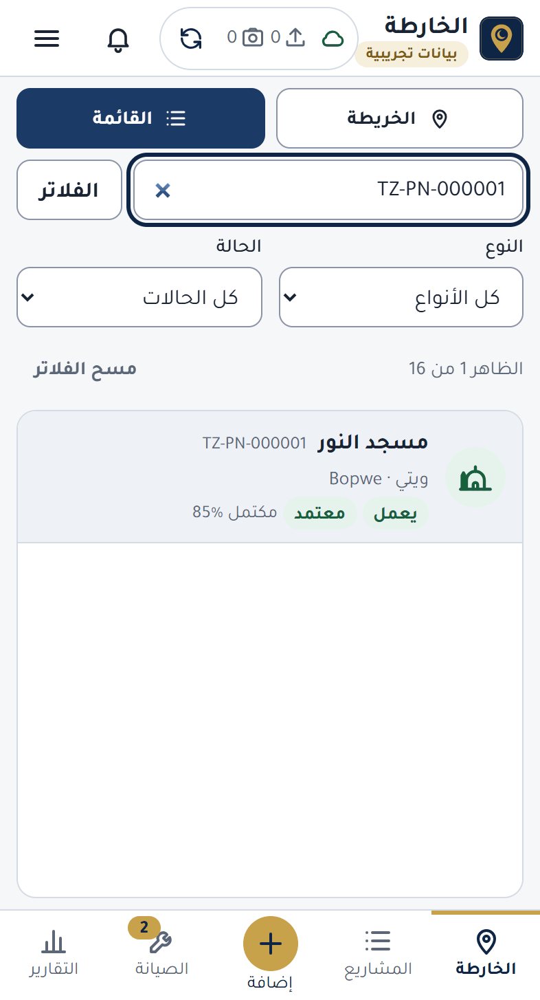 | 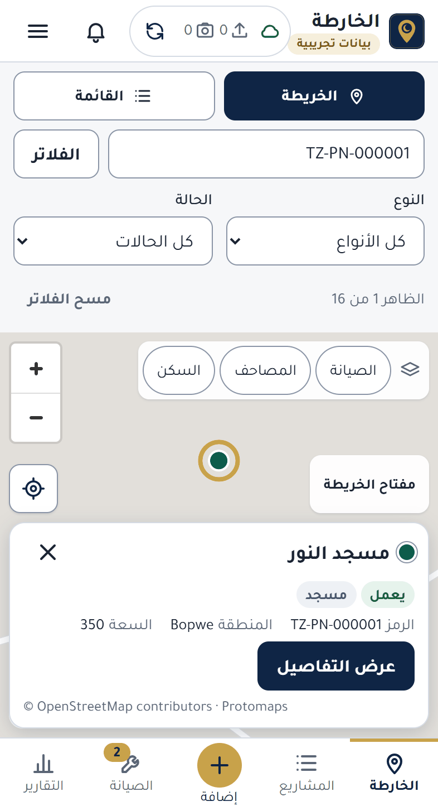 |

### 3.2 مؤشر المزامنة — اقرأه دائمًا

في أعلى كل صفحة مؤشر صغير يخبرك بحالة بياناتك:

| الحالة             | الشكل                                         | المعنى                                                                     |
| ------------------ | --------------------------------------------- | -------------------------------------------------------------------------- |
| متصل وكل شيء مرفوع | 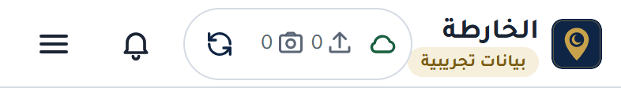           | سحابة خضراء، والرقمان **0** (عمليات وصور بانتظار الرفع)                    |
| دون اتصال          | 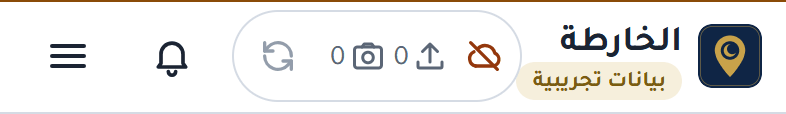     | سحابة مشطوبة. واصل العمل عاديًا؛ كل شيء يُحفظ على الهاتف                   |
| بانتظار الرفع      | 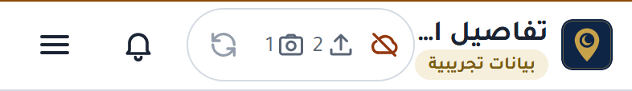 | الرقم بجانب السهم = تعديلات لم تُرفع، والرقم بجانب الكاميرا = صور لم تُرفع |

- **زر الدائرة (مزامنة الآن)** يرفع وينزّل فورًا. وإلا فالتطبيق يزامن وحده عند عودة الاتصال وكل دقيقتين.
- عند انقطاع الاتصال يظهر شريط أعلى الشاشة: «أنت الآن دون اتصال — واصل الإدخال…».
- لا تحذف التطبيق ولا تمسح بيانات المتصفح **وفي المؤشر أرقام غير صفر**: ستضيع البيانات التي لم تُرفع.

### 3.3 العمل دون اتصال — ما يجب أن تعرفه

1. افتح التطبيق مرة واحدة **وأنت متصل** في بداية اليوم ليصلك آخر تحديث.
2. في القرية أدخل كل شيء عاديًا: المشاريع، والصور، والصيانة، والكادر. كل حفظ يبقى على الهاتف.
3. إذا أغلقت التطبيق أو انطفأ الهاتف فلا شيء يضيع؛ عند الفتح تكتب رمز PIN فقط.
4. عندما تصل إلى مكان فيه إنترنت (أو Wi-Fi) يرفع التطبيق كل شيء وحده. انتظر حتى يصبح الرقمان **0**.
5. الصور ترفع على أجزاء: إن انقطع الاتصال في منتصف صورة يكمل من حيث توقف ولا يبدأ من جديد.
6. إن أردت توفير باقة البيانات فعّل «رفع الصور عبر Wi-Fi فقط» من الإعدادات.

| الخريطة دون اتصال                        | مشروع محفوظ على الهاتف بانتظار الرفع             |
| ---------------------------------------- | ------------------------------------------------ |
| 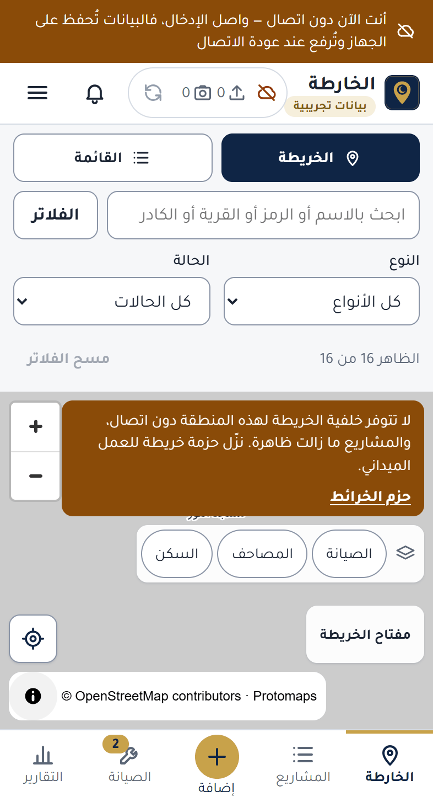 | 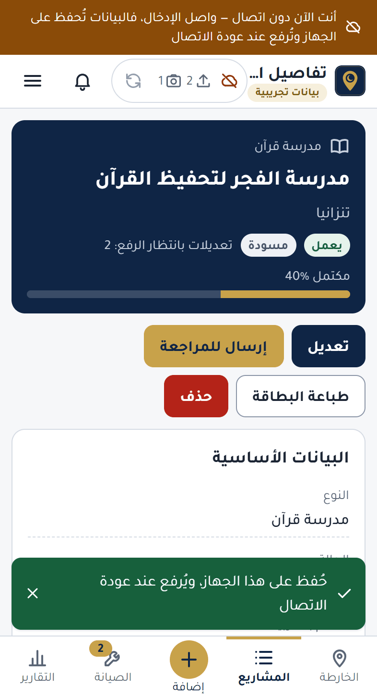 |

### 3.4 إضافة مشروع جديد — خطوة بخطوة

اضغط **+ إضافة**. الاستمارة مرتبة بترتيب العمل في الميدان، والحقول المطلوبة عليها نجمة حمراء (*).
اسم «المُدخِل» يُكتب تلقائيًا من حسابك.

**1) النوع والاسم.** اختر: مسجد، أو مدرسة قرآن، أو مسجد ومدرسة. اكتب الاسم كما يعرفه الناس
(العربية أفضل)، والاسم بالحروف اللاتينية اختياري ويسهّل البحث.

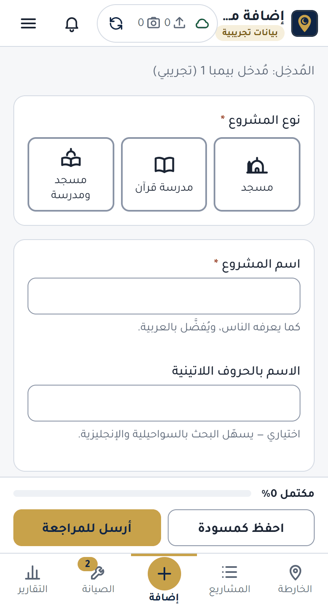

**2) الموقع.** قف عند المشروع واضغط **«التقط موقع GPS»**، أو «اختر على الخريطة» إن لم تكن
في المكان. تظهر **الدقة** بالأمتار. بعدها تُملأ **الدولة والمنطقة تلقائيًا** من الإحداثيات،
ويمكنك تصحيحهما إن كان فيهما خطأ.

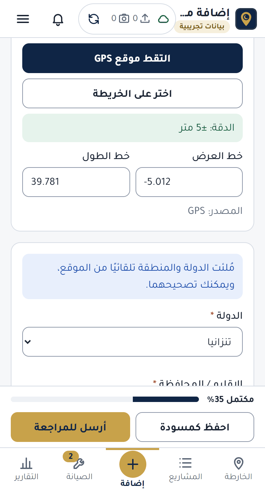

> **تحذير الدقة:** إذا كانت الدقة أضعف من 30 مترًا يظهر تنبيه برتقالي. اخرج إلى مكان مكشوف
> (بعيدًا عن السقف والأشجار الكثيفة)، وانتظر قليلًا، ثم التقط الموقع مرة أخرى.
>
> 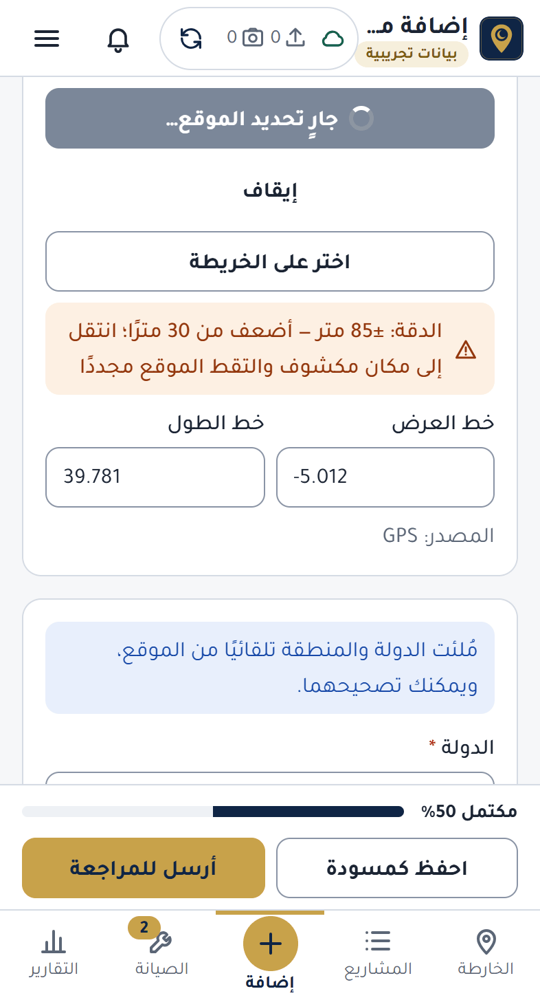

إذا وقعت النقطة خارج الدولة أو المنطقة المختارة يظهر تنبيه واضح قبل الحفظ. راجع الموقع أو المنطقة.

**3) القرية.** اختر القرية من القائمة. إن لم تجدها اكتب اسمها؛ تُحفظ «قرية مقترحة» ويعتمدها المشرف.

**4) الحالة.** الحالة ظاهرة دائمًا: يعمل، يحتاج صيانة، قيد الإنشاء، متوقف. عند اختيار
**«يحتاج صيانة»** تُفتح نافذة لإدخال الصيانة: الوصف، والأولوية، والتكلفة التقديرية.

| الحالة والصور                                      | نافذة الصيانة                                          |
| -------------------------------------------------- | ------------------------------------------------------ |
| 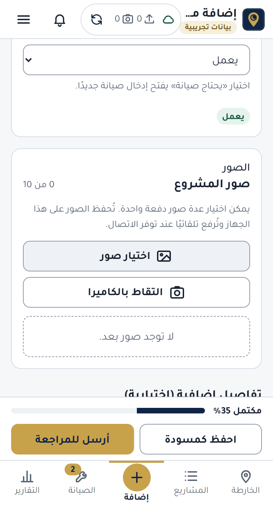 | 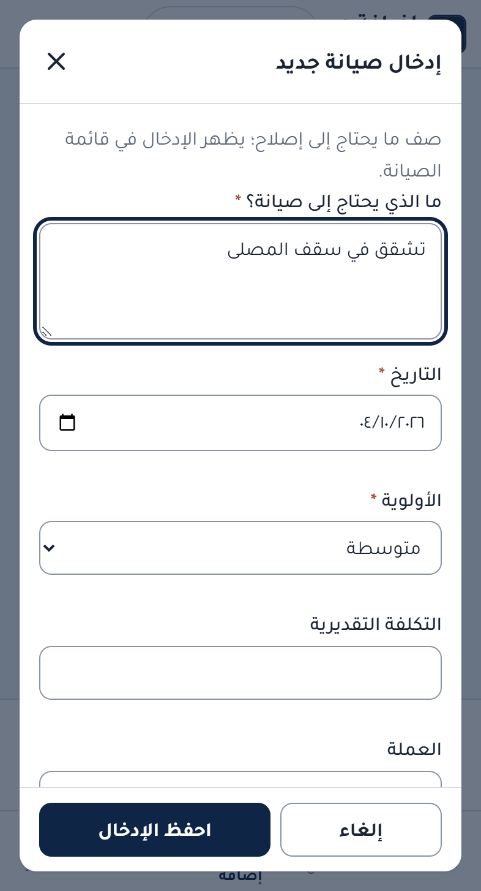 |

**5) الصور.** انظر [3.5](#35-الصور).

**6) التفاصيل الإضافية (اختيارية).** أقسام مطوية؛ اضغط على أي قسم لفتحه:

| القسم                            | ماذا تُدخل                                                                                        |
| -------------------------------- | ------------------------------------------------------------------------------------------------- |
| السعة والجهة البانية وسنة البناء | عدد المصلين/الطلاب، والجهة البانية (الافتراضي «الاستقامة»)، وسنة البناء (والتاريخ الكامل اختياري) |
| المتبرعون                        | اختر متبرعًا موجودًا أو أضف جديدًا، مع المبلغ والعملة والسنة إن عُرفت                             |
| الكادر                           | الإمام والمعلمون والوكيل والإداري والمدير. اكتب الاسم واختر من «الأشخاص المحتملين» (انظر 3.9)     |
| الأرض                            | الملكية والمالك والمساحة ونسبة الاستغلال وقابلية التوسع                                           |
| المرافق                          | السكن والمكتبة والمصاحف (الموجود والمطلوب) والقاعة والنقل                                         |
| بيانات المجتمع                   | السكان ونسبة المسلمين والأنشطة والتحديات… (اختيار متعدد)                                          |
| بيانات مقيّدة                    | بيانات حساسة لا يراها إلا مدير الدولة والإدارة العليا                                             |

| السعة والبناء                                        | المتبرعون                                        | الكادر                                       |
| ---------------------------------------------------- | ------------------------------------------------ | -------------------------------------------- |
| 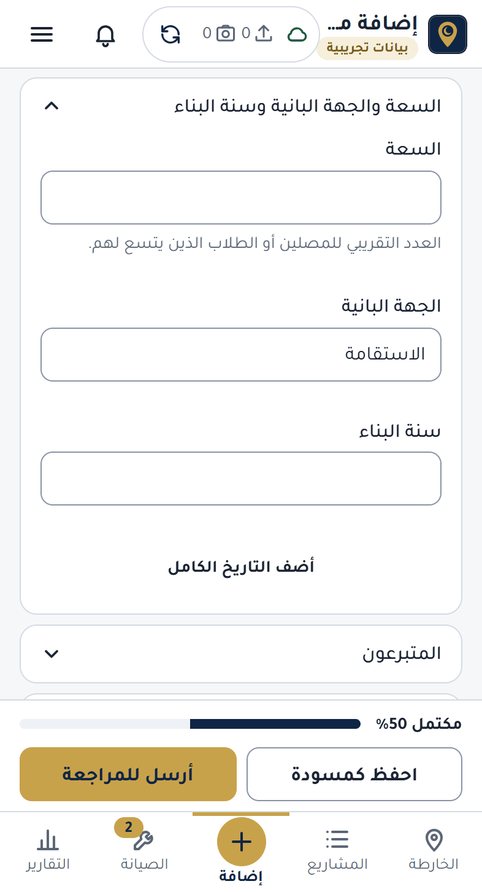 | 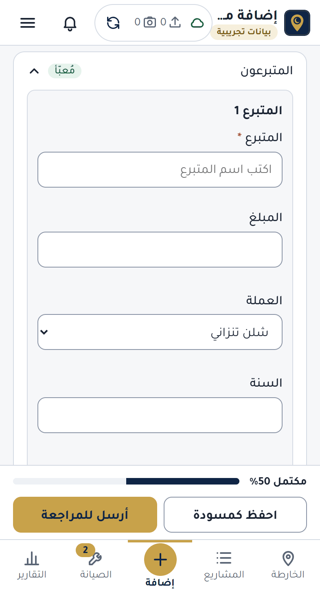 | 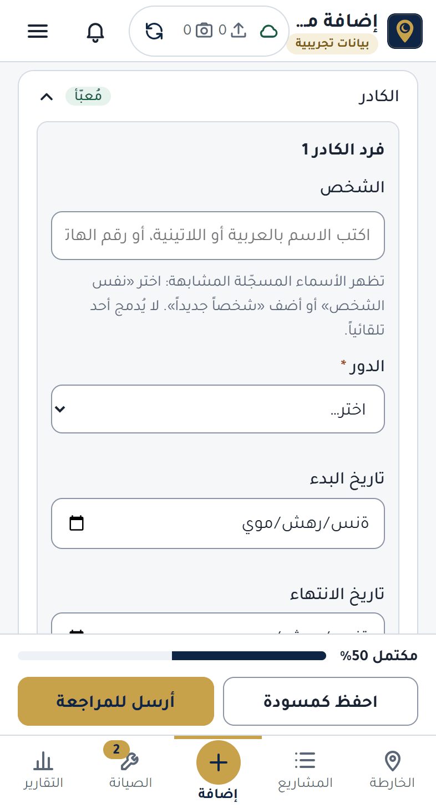 |

| الأرض                                      | المرافق                                            | المجتمع                                           | البيانات المقيّدة                                          |
| ------------------------------------------ | -------------------------------------------------- | ------------------------------------------------- | ---------------------------------------------------------- |
| 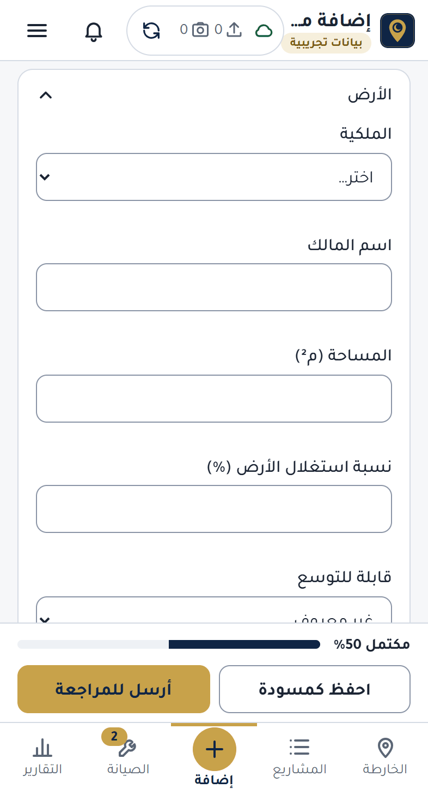 | 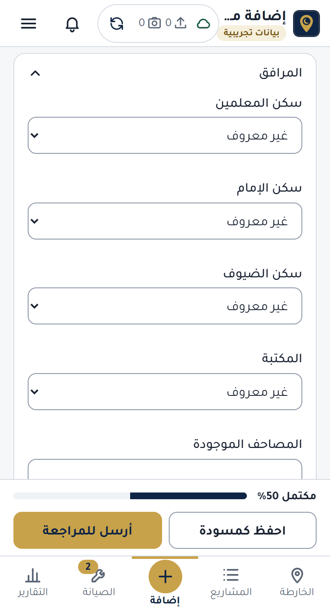 | 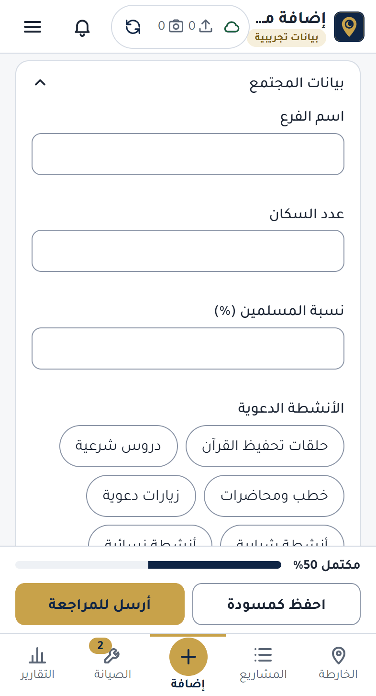 | 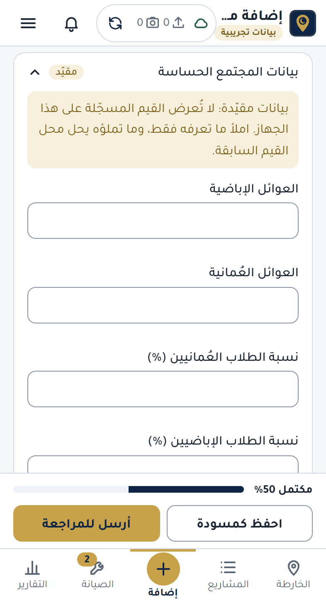 |

> **الرواتب والبيانات المقيّدة:** تستطيع إدخالها، لكنها **لا تبقى على هاتفك**: تُرفع ثم تُحذف من
> الجهاز، ولا تستطيع أنت ولا أي مُدخل آخر رؤيتها بعد ذلك. هذا مقصود لحماية الناس.

**7) مؤشر الاكتمال.** أسفل الاستمارة شريط «مكتمل ٪». كلما أكملت أقسامًا ارتفع. السجلات الناقصة
تظهر لك في صفحة «سجلات ناقصة».

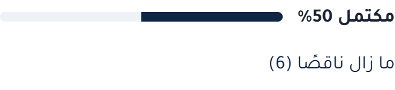

**8) الحفظ.** زران:

- **«احفظ كمسودة»**: يحفظ ويبقى السجل عندك لتكمله لاحقًا.
- **«أرسل للمراجعة»**: يحفظ ويرسل السجل إلى مشرف الفرع ليعتمده.

إذا كان في حقل خطأ يظهر الخطأ **بجانب الحقل نفسه** بالأحمر.

### 3.5 الصور

- اضغط **«اختيار صور»** لاختيار عدة صور مرة واحدة، أو **«التقاط بالكاميرا»**.
- حتى **10 صور** لكل مشروع. يضغط التطبيق كل صورة على الهاتف قبل حفظها، ويحذف منها بيانات الموقع
  الشخصية ويُبقي وقت التقاطها فقط.
- لكل صورة: **نوع الصورة** (واجهة المسجد، داخل المدرسة، الأرض…)، و**«صورة الغلاف»** (تظهر في
  القوائم والخريطة)، و«إعادة التقاط»، و«حذف».
- عبارة **«بانتظار الرفع»** على الصورة تعني أنها محفوظة في الهاتف ولم تُرفع بعد. هذا طبيعي دون اتصال.
- يُرفض الملف الذي ليس صورة أو الذي يزيد على 25 م.ب.

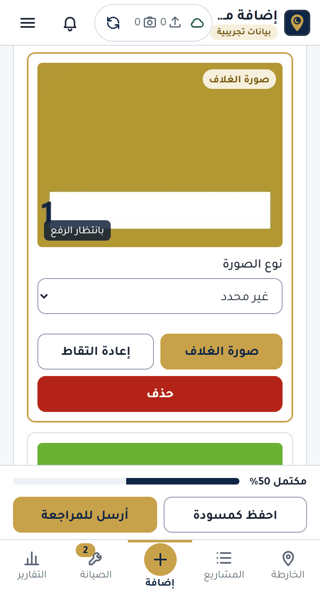

### 3.6 تحذير «مشروع مكرر محتمل»

قبل الحفظ يبحث التطبيق عن مشروع **من النوع نفسه على بُعد أقل من 150 مترًا**، أو باسم مشابه في
القرية نفسها. إن وجد يسألك:

- **«هو نفسه – افتحه للتعديل»**: لا تُنشئ نسخة ثانية؛ يفتح المشروع الموجود لتعدّله.
- **«مشروع مختلف – احفظ»**: إذا كانا مشروعين حقيقيين متجاورين.
- **«العودة إلى الاستمارة»**: لتراجع ما أدخلت.

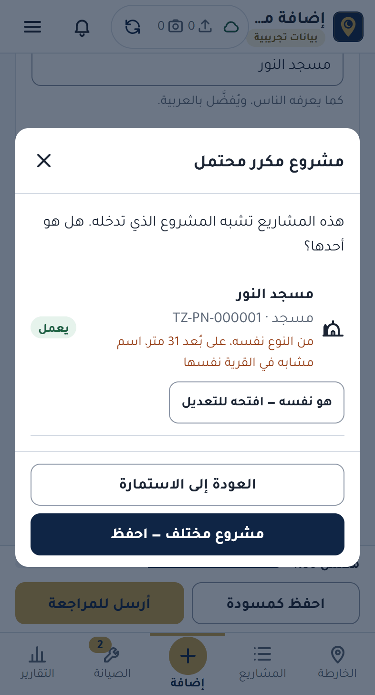

### 3.7 لا شيء يضيع: المسودة التلقائية

- الاستمارة تُحفظ تلقائيًا على الهاتف **كل 5 ثوانٍ وعند كل تغيير**.
- زر الرجوع أو Esc أو الضغط خارج النافذة **لا يمحو شيئًا**؛ يسألك أولًا.
- إذا خرجت من الاستمارة ثم ضغطت «إضافة» مرة أخرى يعرض عليك **إكمال الإدخال غير المنتهي**.
- «تجاهل» يحذف الإدخال غير المحفوظ بعد تأكيدك فقط.

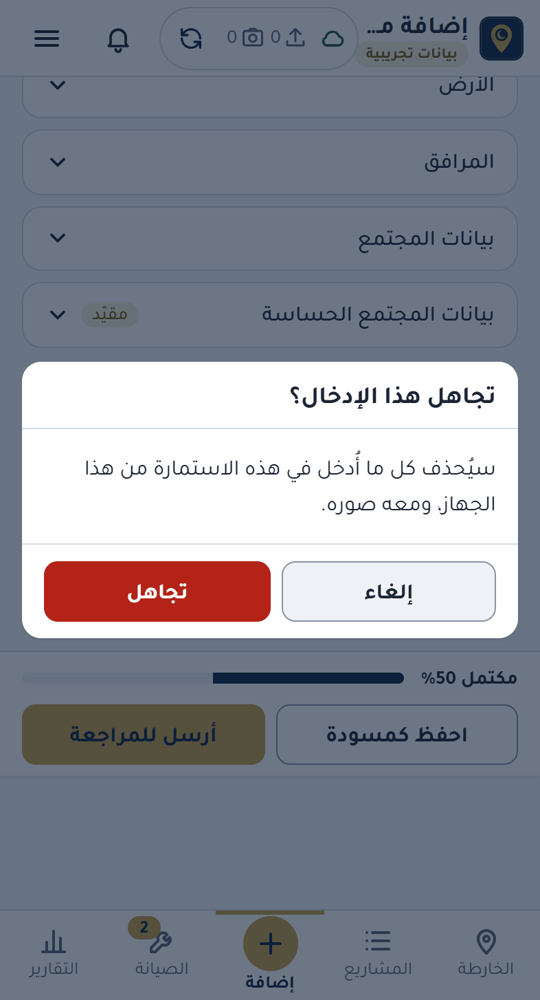

### 3.8 تفاصيل المشروع والصيانة والسجلات الناقصة

صفحة التفاصيل تعرض كل الأقسام والصور وسجل الصيانة، وأزرار: **تعديل**، **إرسال للمراجعة**،
**طباعة البطاقة**، **حذف** (الحذف لا يمحو السجل نهائيًا، ويحتاج صلاحية)، و**الاتجاهات** (يفتح
الخرائط على الهاتف).

| أعلى التفاصيل                                     | سجل الصيانة                                                  | الأزرار                                                   |
| ------------------------------------------------- | ------------------------------------------------------------ | --------------------------------------------------------- |
| 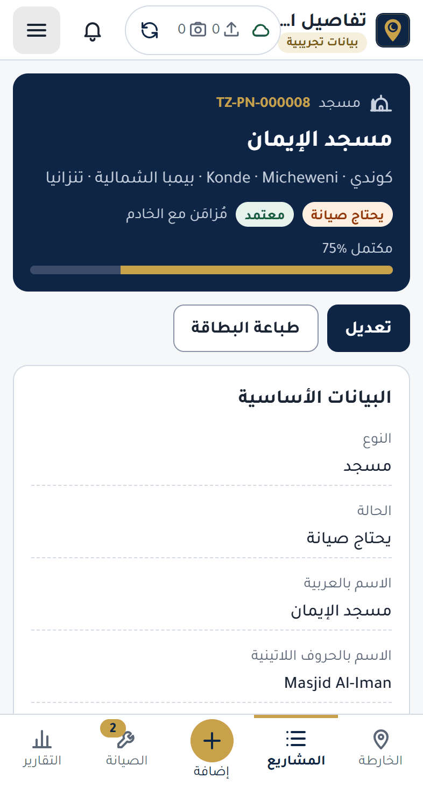 | 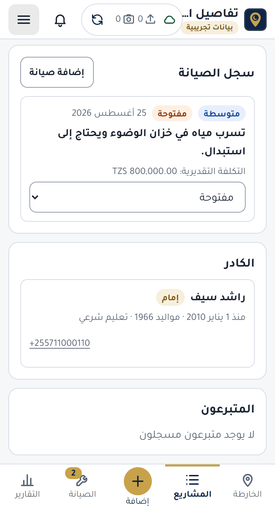 | 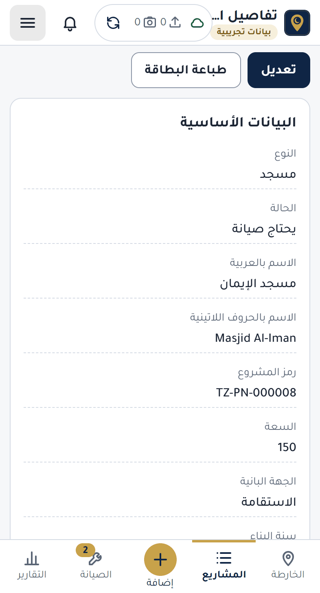 |

- **صفحة الصيانة** (في الشريط السفلي، وعليها عدد المفتوح): كل طلبات الصيانة المفتوحة مرتبة بالأولوية.
  تستطيع إضافة إدخال صيانة لأي مشروع في نطاقك.
- **سجلات ناقصة** (من «المزيد»): سجلاتك التي ينقصها شيء، مع ما ينقص كلًا منها.

| الصيانة                                | سجلات ناقصة                               | سجل المشاريع                                  |
| -------------------------------------- | ----------------------------------------- | --------------------------------------------- |
| 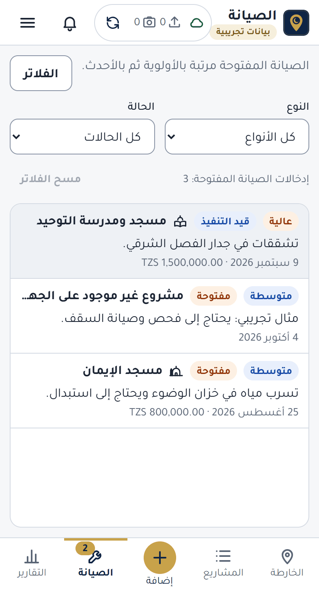 | 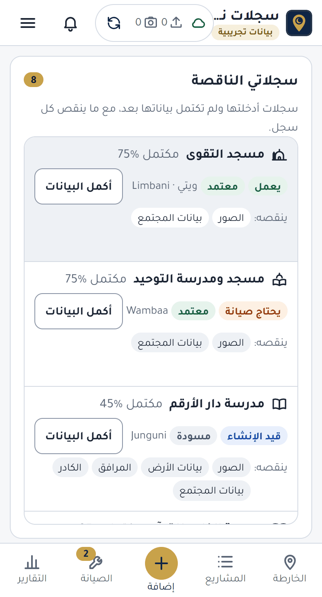 | 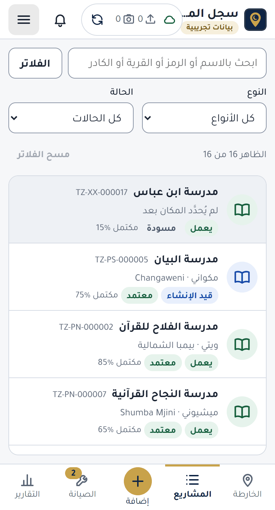 |

**إذا أعاد المشرف سجلك للتعديل:** تظهر حالته «مُعاد للتعديل» مع **ملاحظة المشرف** أعلى صفحة
التفاصيل. صحّح ما طلبه ثم اضغط «أرسل للمراجعة» من جديد.

**إذا عدّلت سجلًا معتمدًا:** يعود إلى «مُرسل للمراجعة» ليراه المشرف مرة أخرى. هذا مقصود.

### 3.9 الأشخاص: لا دمج تلقائي

عند كتابة اسم إمام أو معلم يعرض التطبيق **«أشخاص محتملون مطابقون»** (بالهاتف، أو بتشابه الاسم،
أو بالمنطقة). اختر:

- **«نفس الشخص»** إن كان هو فعلًا (مثلًا الإمام نفسه يعمل في مسجدين)، أو
- **«شخص جديد»** إن لم يكن.

التطبيق **لا يدمج شخصين أبدًا لأن اسميهما متشابهان**. إن أدخلت شخصًا مرتين بالخطأ، يستطيع المشرف
دمجهما لاحقًا.

### 3.10 ما معنى «التعارض»؟ (شرح بسيط)

أحيانًا يعدّل شخصان **الحقل نفسه** في **المشروع نفسه** وهما دون اتصال (مثلًا أنت على هاتفك وزميلك
على هاتفه). عند الرفع لا يستطيع النظام أن يعرف أي القيمتين أصح، فيحفظ الأولى ويرسل الاثنتين إلى
**مشرف الفرع** ليختار. هذا اسمه «تعارض».

- إن عدّل كل منكما **حقلًا مختلفًا** (أنت الاسم وزميلك السعة) يُدمج التعديلان تلقائيًا دون أي سؤال.
- لا تحتاج أن تفعل شيئًا عند التعارض؛ لا شيء يضيع، والمشرف يقرر.
- لتقليل التعارضات: زامن قبل الخروج إلى الميدان وبعد العودة، ولا يعدّل اثنان المشروع نفسه في اليوم نفسه.

### 3.11 «يحتاج إلى انتباه»

إذا رفض الخادم تعديلًا (مثلًا لأنه خارج نطاقك) يبقى التعديل في قائمة «يحتاج إلى انتباه» مع السبب،
ويظهر رقم أحمر في مؤشر المزامنة. باقي التعديلات تُرفع عاديًا. اقرأ السبب وصحّح السجل أو اسأل مشرفك.

### 3.12 الاستيراد الجماعي (من ملف)

لإدخال عدد كبير من المشاريع من جدول (CSV أو Excel):

1. افتح **المزيد ← الاستيراد** ونزّل **القالب الرسمي** (CSV أو XLSX). اضغط «دليل الأعمدة» لترى
   معنى كل عمود والقيم المقبولة.
2. املأ القالب ثم اختر الملف واضغط **رفع**.
3. **راجع الصفوف قبل التنفيذ:** لكل صف حالته (صالح، فيه أخطاء، مكرر محتمل، فيه تنبيهات) والإجراء
   (إنشاء، تحديث، ترك). الصفوف المكررة تُعرض مع المشروع المشابه.
4. اضغط **تنفيذ**. الاستيراد **يدمج** ولا يستبدل البيانات الموجودة، والمشاريع الجديدة تُحفظ مسودات.
5. في «سجل الاستيراد» تستطيع **التراجع عن دفعة كاملة** إن أخطأت.

| البداية والقالب                                 | دليل الأعمدة                                    |
| ----------------------------------------------- | ----------------------------------------------- |
| 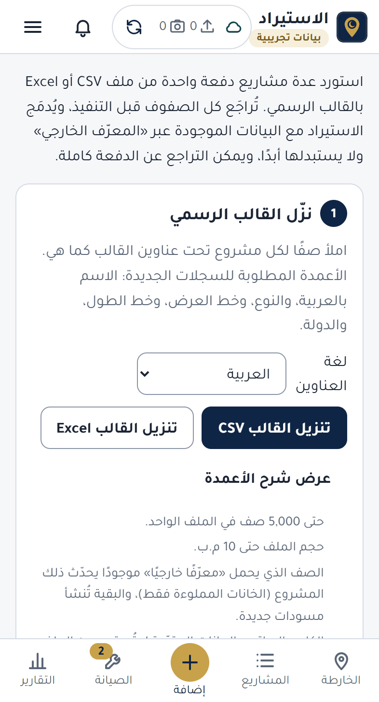 | 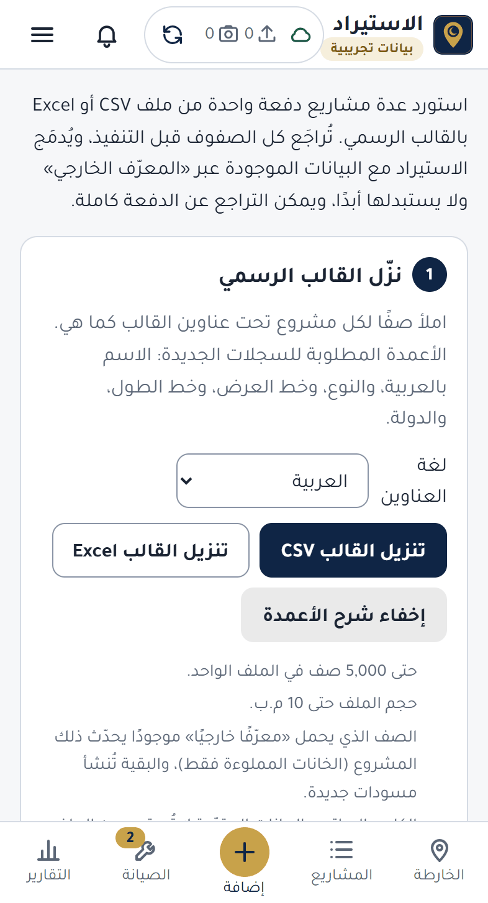 |

| مراجعة الصفوف                              | تفاصيل صف                                     | سجل الاستيراد والتراجع                          |
| ------------------------------------------ | --------------------------------------------- | ----------------------------------------------- |
| 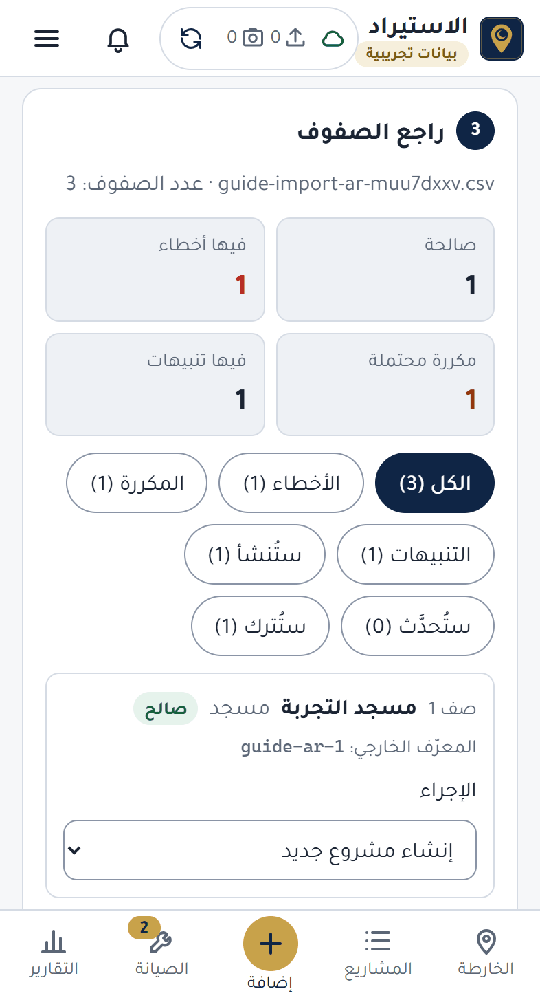 | 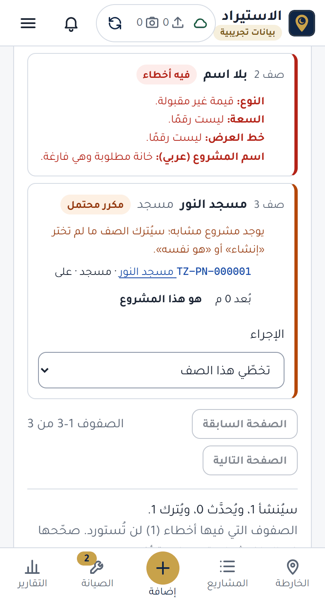 | 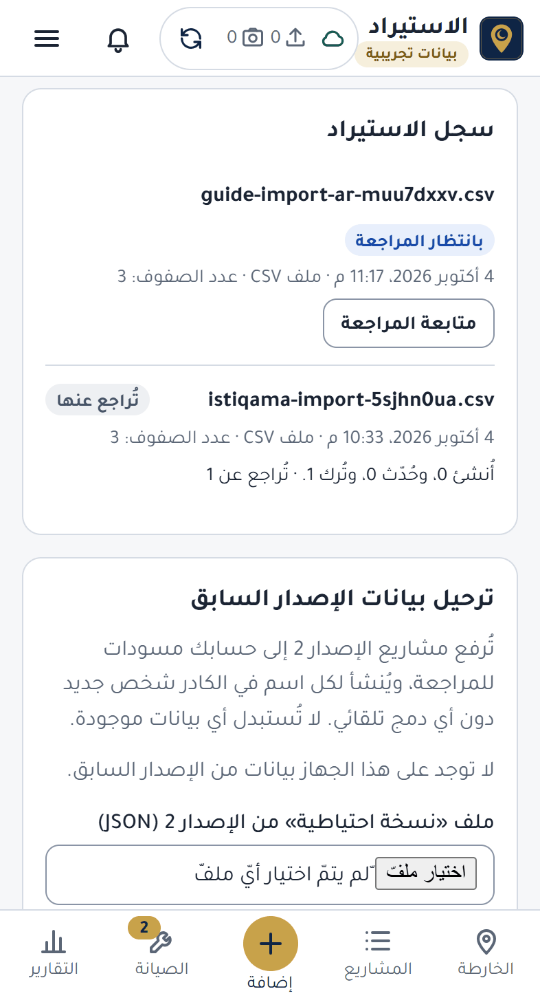 |

### 3.13 نقل بياناتك من الإصدار القديم (الإصدار 2)

إذا كان على هاتفك الإصدار القديم من التطبيق وفيه مشاريع، يعرض عليك التطبيق الجديد عند أول دخول
**رفعها إلى حسابك**:

1. اضغط «اعرض ما سيُرفع». يظهر **ملخص**: عدد المشاريع والأشخاص والتعيينات والرواتب والصيانة.
2. اضغط **«رفع المشاريع كمسودات»**. كل مشروع يُحفظ **مسودة** لتراجعها وترسلها.
3. لا يُدمج أي شخص بالاسم؛ الأسماء المتطابقة تُرسل إلى المشرف **اقتراح دمج** ليقرر.
4. الرواتب في الإصدار القديم بلا عملة، فتُسجَّل بعملة الدولة ويُعلَّم المشروع للمراجعة.
5. **تبقى البيانات القديمة على الهاتف حتى يتأكد رفع كل شيء**، ثم تُحذف.

عندك ملف نسخة احتياطية (JSON) من الإصدار القديم؟ ارفعه من **الإعدادات ← استيراد ملف من
الإصدار 2** أو من صفحة الاستيراد.

| العرض                                   | الملخص                                     | التنبيهات                                      |
| --------------------------------------- | ------------------------------------------ | ---------------------------------------------- |
| 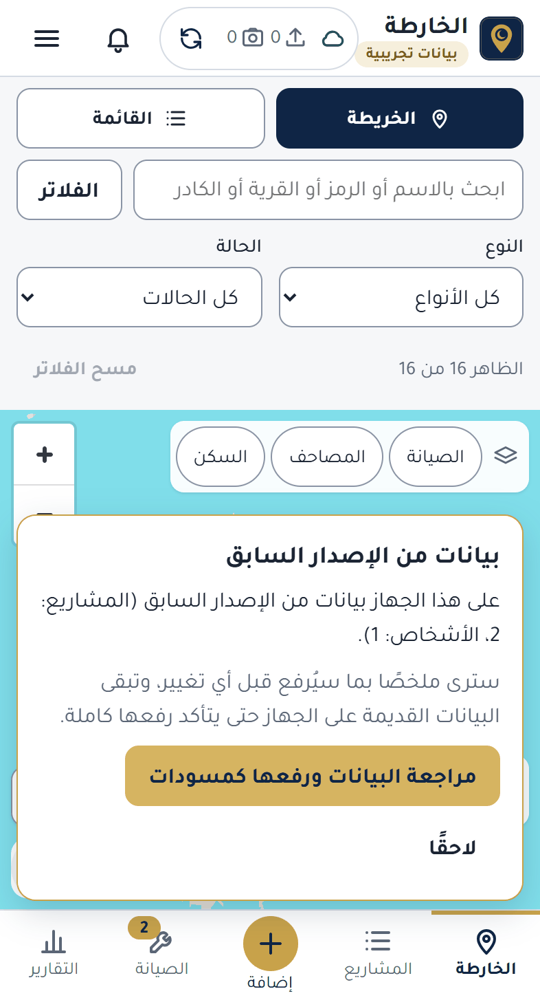 | 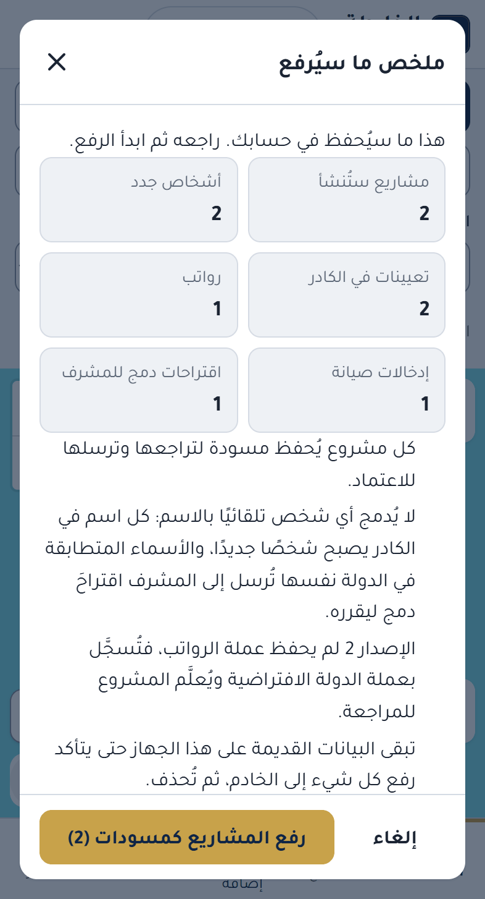 | 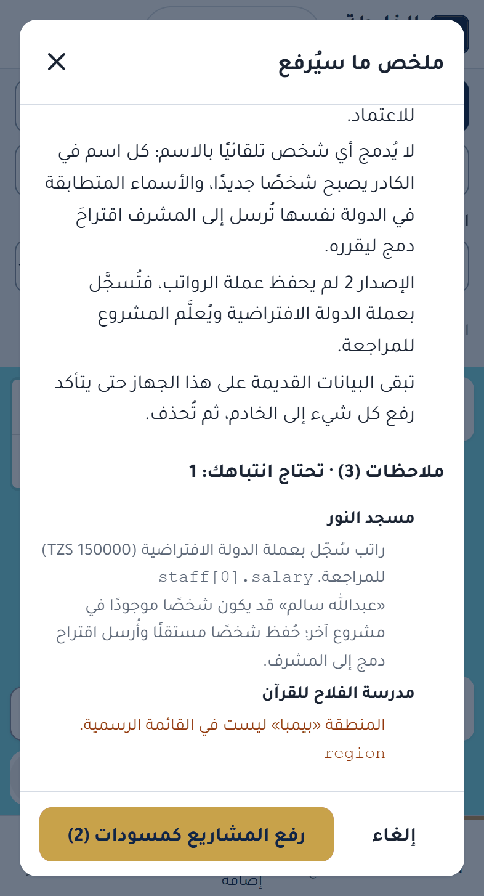 |

### 3.14 الإعدادات

من **المزيد ← الإعدادات**:

- **اللغة:** العربية أو السواحيلية أو الإنجليزية.
- **التخزين والمزامنة:** المساحة المستخدمة على الهاتف، وعدد العمليات والصور التي لم تُرفع، وزر تحديث.
- **رفع الصور عبر Wi-Fi فقط:** تبقى الصور على الهاتف حتى تتصل بشبكة Wi-Fi.
- **حزم الخرائط دون اتصال:** نزّل خريطة منطقتك (مثل «بيمبا كاملة») لتظهر خلفية الخريطة في القرى
  البعيدة. يظهر حجم كل حزمة قبل التنزيل، ويُستأنف التنزيل إن انقطع.
- **الأمان:** تغيير رمز PIN، و«اقفل الآن»، و«تسجيل الخروج».
- **حول التطبيق:** رقم الإصدار ومعرّف الجهاز (يطلبه منك الدعم الفني).

| الإعدادات                             | التخزين وWi-Fi                              | حزم الخرائط                                       |
| ------------------------------------- | ------------------------------------------- | ------------------------------------------------- |
| 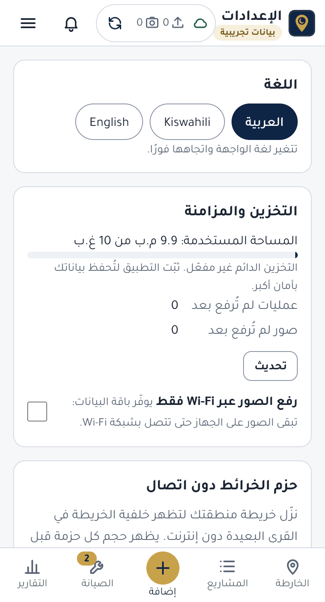 | 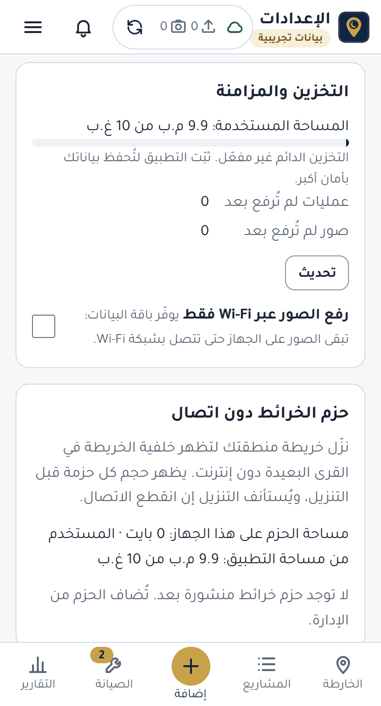 | 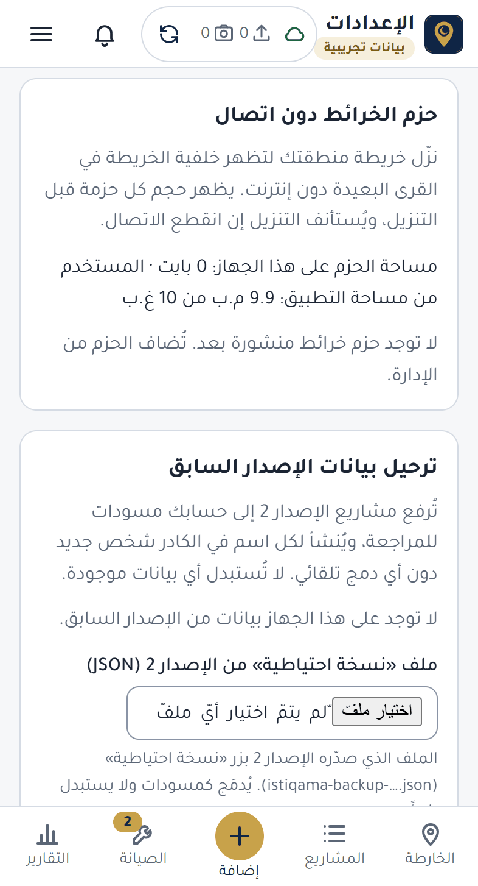 |

| تغيير PIN                                 | ملف من الإصدار 2                                     | حول التطبيق                                   |
| ----------------------------------------- | ---------------------------------------------------- | --------------------------------------------- |
| 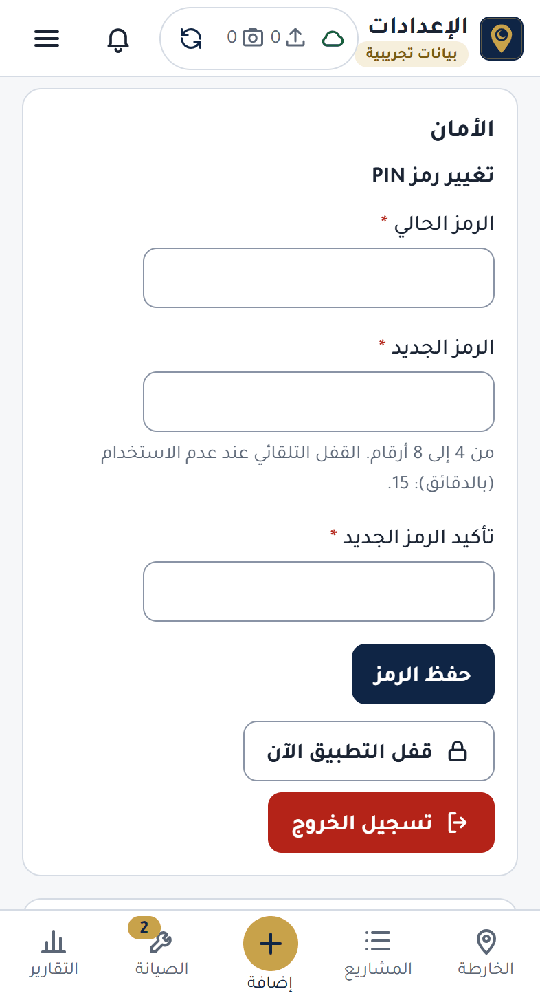 | 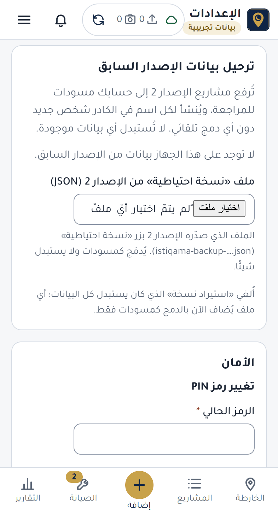 | 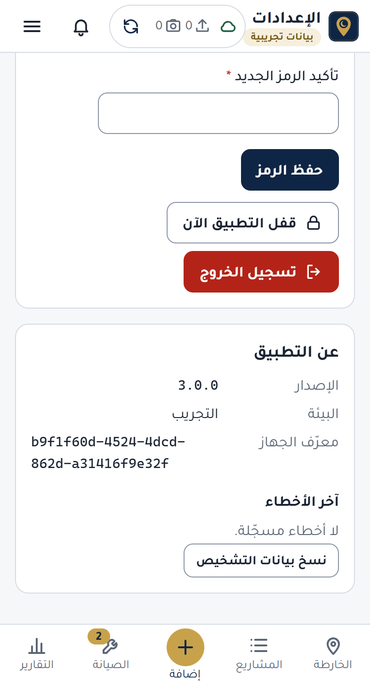 |

> **تسجيل الخروج وفي الهاتف بيانات لم تُرفع:** يحذّرك التطبيق أولًا. ارفع كل شيء قبل الخروج.

---

## 4. دليل مشرف الفرع

المشرف يرى كل مشاريع فرعه، ويستطيع كل ما يستطيعه المُدخل، وفوق ذلك: **المراجعة والاعتماد**،
و**حل التعارضات**، و**اعتماد القرى المقترحة**، و**دمج الأشخاص**. صفحة «المراجعة والاعتماد» في
قائمة «المزيد» على الهاتف وفي الشريط الجانبي على الحاسوب.

### 4.1 قائمة المراجعة

تبويب **«بانتظار المراجعة»** فيه كل سجل أُرسل للمراجعة، مع نسبة اكتماله ووقت إرساله.

- **اعتماد:** يصبح السجل «معتمدًا».
- **إعادة للتصحيح:** اكتب ملاحظة واضحة للمُدخل (ماذا ينقص وماذا يصحح). تصله الملاحظة على هاتفه.
  النص الذي تكتبه لا يضيع إن ضغطت رجوع بالخطأ؛ يسألك التطبيق أولًا.

| بانتظار المراجعة                               | الإعادة مع ملاحظة                                |
| ---------------------------------------------- | ------------------------------------------------ |
| 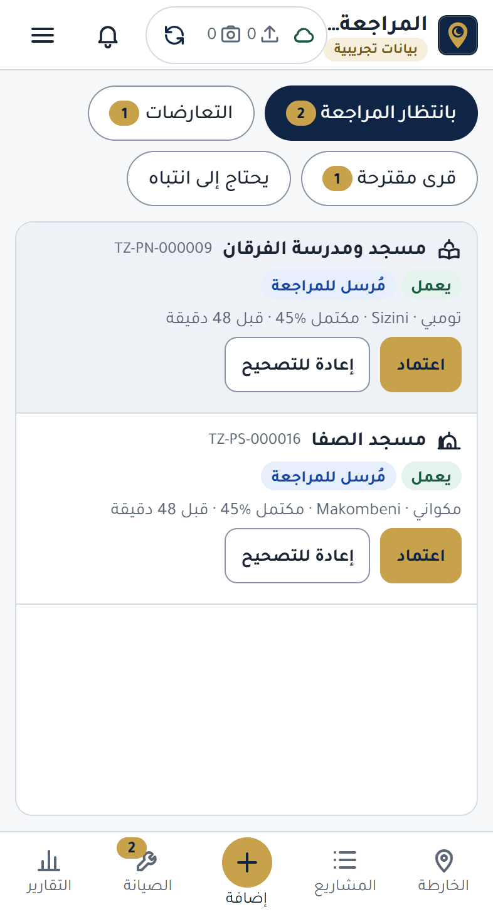 | 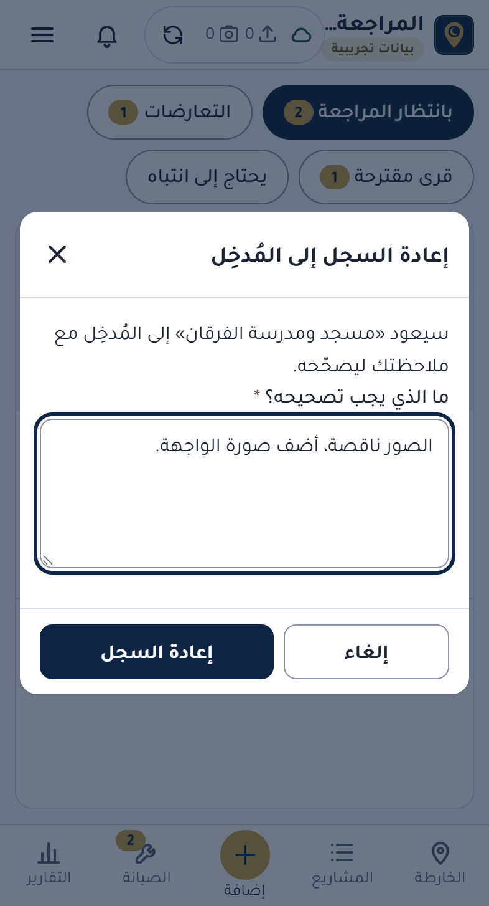 |

### 4.2 حل التعارضات

تبويب **«التعارضات»** يعرض كل حقل عُدّل من جهتين: **القيمة في الخادم** و**القيمة المرسلة من
الجهاز**، ومن عدّلها ومتى. اختر:

- **«إبقاء قيمة الخادم»**، أو
- **«اعتماد قيمة الجهاز»**.

يصل قرارك إلى كل الأجهزة في المزامنة التالية. إن لم تكن متأكدًا اتصل بالمُدخل قبل أن تختار.

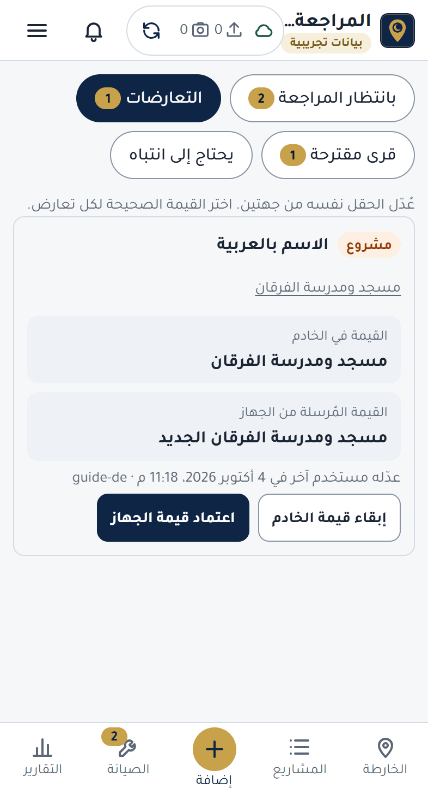

### 4.3 القرى المقترحة

تبويب **«قرى مقترحة»**: القرى التي كتبها المُدخلون لأنها غير موجودة في القائمة. اعتمد الصحيحة،
وصحّح الاسم إن لزم، وادمج المكررة مع القرية المعتمدة (ويمكن التراجع عن الدمج).

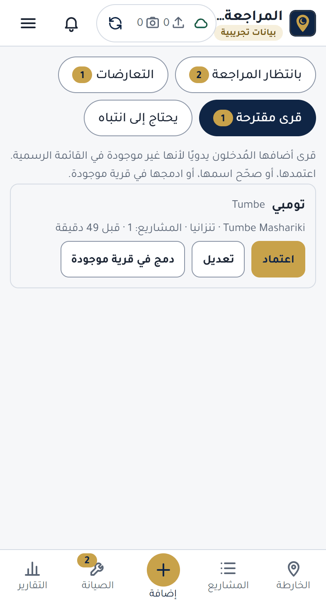

### 4.4 الأشخاص ودمج المكرر

صفحة **الأشخاص**: دليل كل الأشخاص في فرعك (الأئمة والمعلمون والوكلاء…) مع مشاريعهم وأدوارهم.

- افتح بطاقة الشخص لترى هاتفه ومهامه في كل مشروع.
- **دمج شخصين:** من البطاقة اضغط «دمج». اختر «الشخص الباقي» واكتب **سبب الدمج**. تُنقل مهام
  المكرر إلى الباقي ويُكمل ما نقص من بياناته، ثم يُخفى المكرر. **يمكن التراجع عن الدمج لاحقًا.**
- تبويب **طلبات الدمج**: اقتراحات من المُدخلين ومن ترحيل الإصدار 2. وافق أو ارفض مع ملاحظة.

| الدليل                            | بطاقة الشخص                                |
| --------------------------------- | ------------------------------------------ |
| 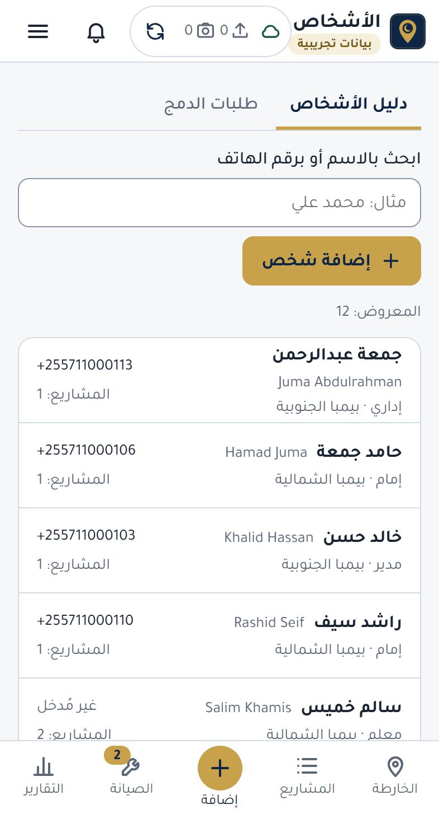 | 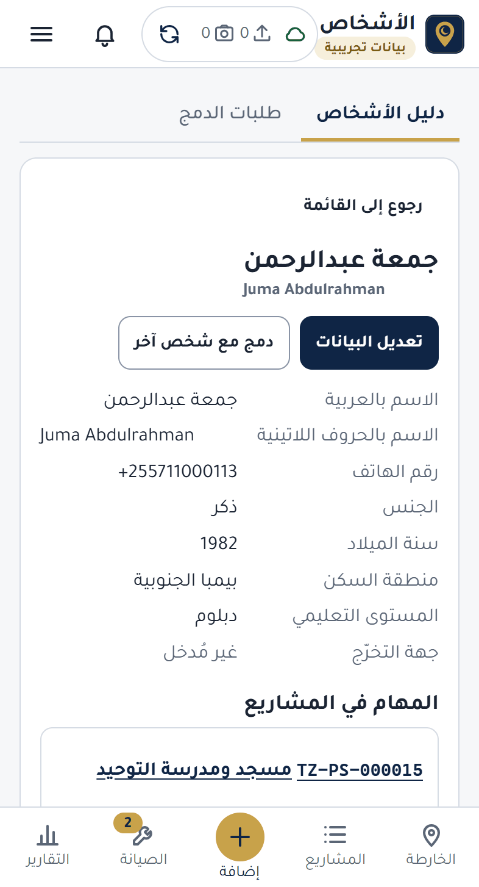 |

| نافذة الدمج                               | طلبات الدمج                                   |
| ----------------------------------------- | --------------------------------------------- |
| 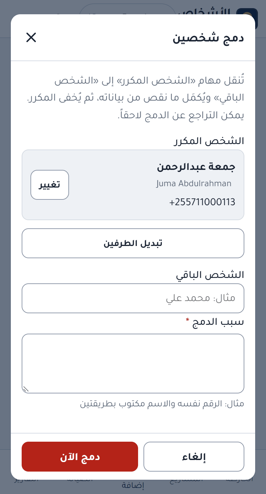 | 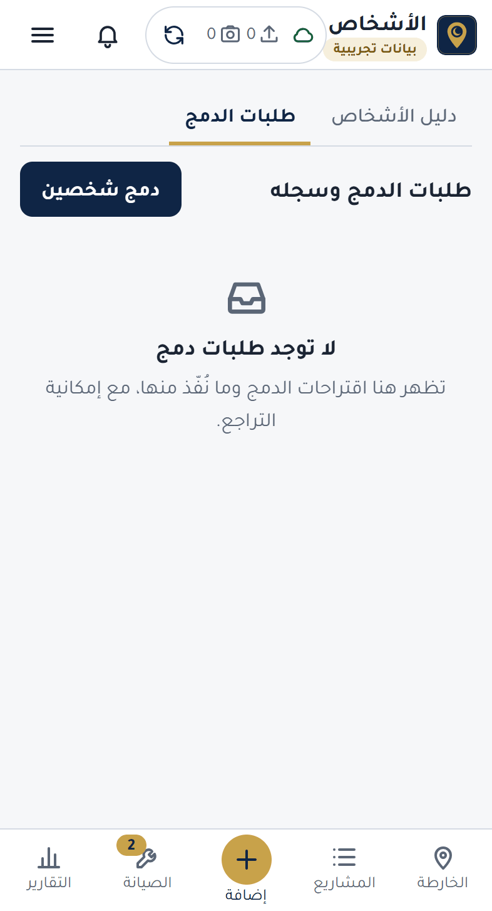 |

> المشرف **لا يرى الرواتب** ولا البيانات المقيّدة. هذه لمدير الدولة والإدارة العليا.

---

## 5. دليل مدير الدولة

مدير الدولة يرى كل بيانات دولته، **بما فيها الرواتب والبيانات المقيّدة** (وكل قراءة لها تُسجَّل
باسمه)، والتقارير، وإدارة مستخدمي دولته وأجهزتهم.

### 5.1 الدخول بالمصادقة الثنائية

بعد رمز البريد ورمز PIN تظهر شاشة المصادقة الثنائية:

1. **أول مرة:** افتح تطبيق المصادقة على هاتفك وامسح الرمز المربع (QR) أو اكتب المفتاح الظاهر،
   ثم اكتب الرمز المكوّن من 6 أرقام.
2. **بعد ذلك:** اكتب الرمز الحالي من تطبيق المصادقة في كل دخول.

دون هذه الخطوة لا تظهر لك صلاحيات المدير.

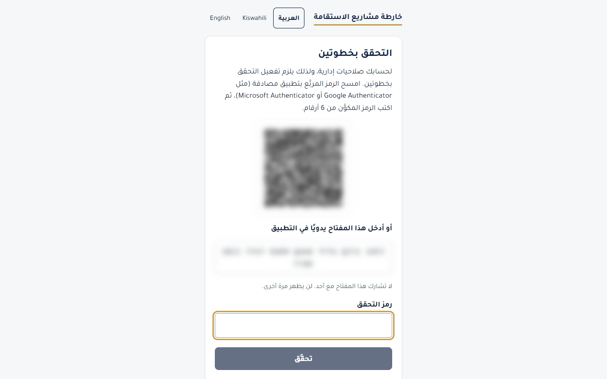

### 5.2 لوحة المؤشرات

**التقارير** تعرض لنطاقك (الدولة كلها أو فرع منها): عدد المشاريع حسب النوع والحالة، والسعة،
والصيانة المفتوحة بالأولوية والتكلفة، والكادر حسب الدور، و**الرواتب الشهرية بالعملة المحلية
وبالدولار**، والاحتياجات (مصاحف، سكن، نقل، مواقع قابلة للتوسع)، ونسبة اكتمال البيانات، ونشاط
الإدخال الأسبوعي لكل مُدخل.

- الأرقام تُحسب في الخادم وتُحدَّث كل 15 دقيقة؛ وقت آخر حساب مكتوب أعلى اللوحة.
- ما دامت أسعار الصرف مؤقتة يظهر تنبيه بأن أرقام الدولار للاسترشاد فقط.

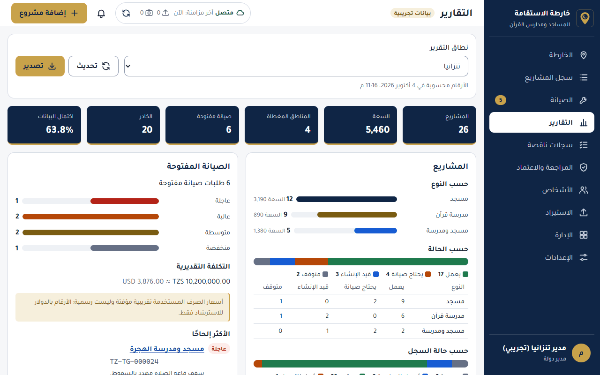

| الرواتب                                    | الاحتياجات                                  | نشاط المُدخلين                                      |
| ------------------------------------------ | ------------------------------------------- | --------------------------------------------------- |
| 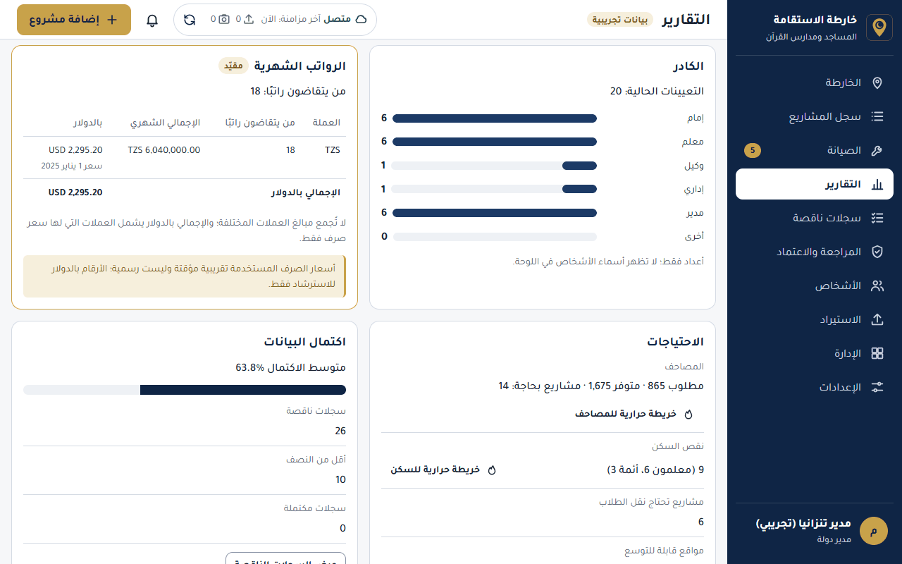 | 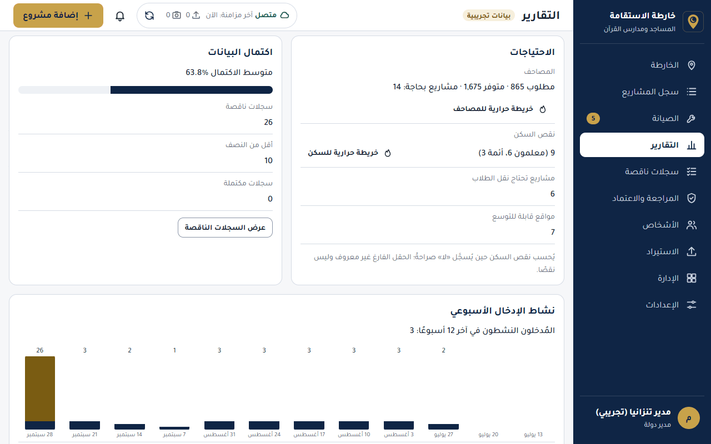 | 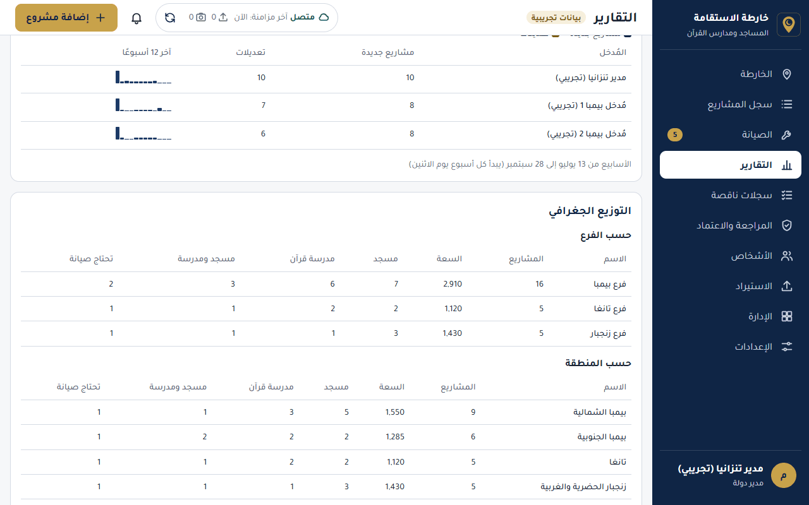 |

اللوحة نفسها على الهاتف:

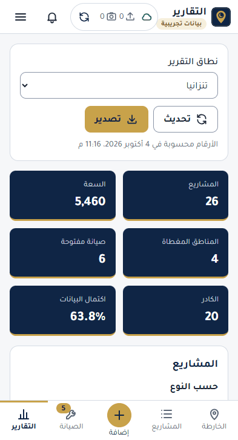

### 5.3 التصدير (CSV وExcel)

1. اضغط **تصدير**، واختر الصيغة (CSV أو XLSX) واللغة، والفلاتر إن أردت (صيانة مفتوحة فقط، سجلات
   ناقصة فقط).
2. يُجهَّز الملف **في الخادم** وتصلك **إشعار** (الجرس) حين يجهز، ثم اضغط «تنزيل».
3. الملف بكل الحقول، والعناوين والقيم بلغتك («مسجد» و«يعمل»، لا رموز إنجليزية). من لا يحق له رؤية
   الرواتب لا تُصدَّر له.

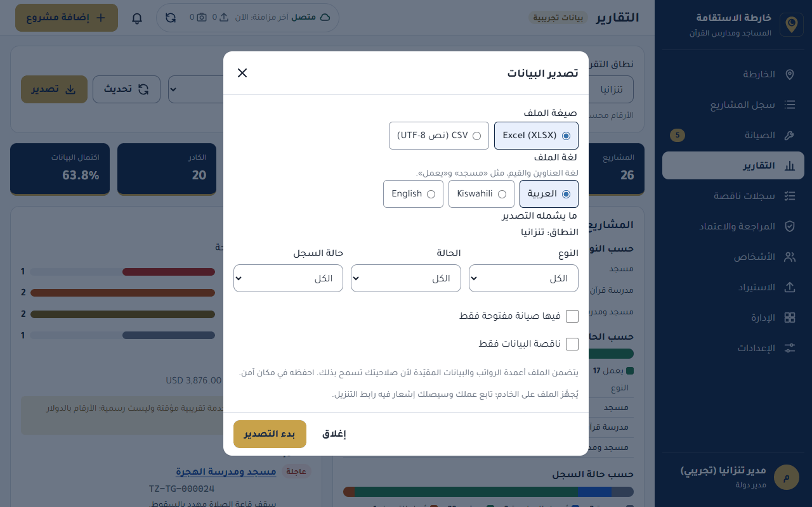

### 5.4 الطباعة وPDF

من صفحة تفاصيل أي مشروع اضغط **«طباعة البطاقة»**: بطاقة مشروع مصوّرة بالعربية من اليمين إلى اليسار
وبالألوان المؤسسية. من التقارير تستطيع أيضًا طباعة **تقرير متبرع** و**تقرير دولة**. للحفظ PDF
اختر في نافذة الطباعة «حفظ بتنسيق PDF». لمدير الدولة خيار إظهار الرواتب في البطاقة.

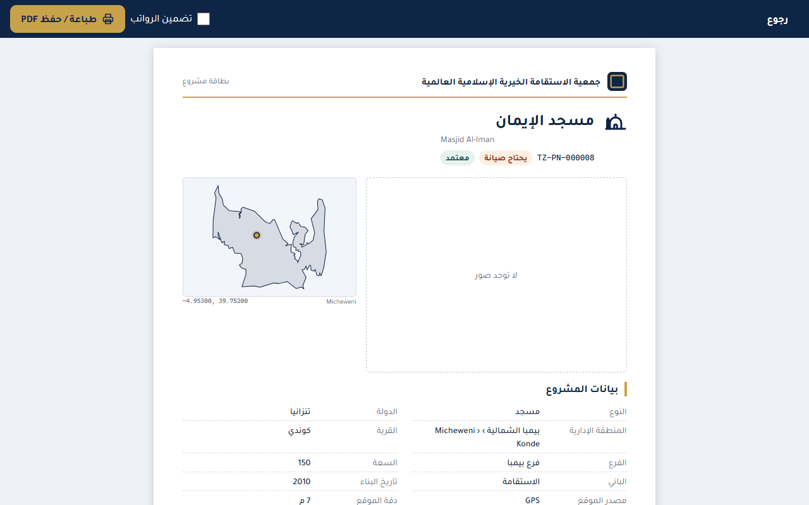

### 5.5 مستخدمو دولتك وأجهزتهم

من **الإدارة ← المستخدمون** ترى مستخدمي دولتك وأدوارهم وآخر دخول لكل منهم وأجهزتهم.

- **هاتف ضائع أو مسروق:** افتح المستخدم واضغط **«حظر الجهاز»** بجانب ذلك الجهاز. يُمنع الجهاز
  حتى تعيده، و**تُحذف البيانات المحفوظة عليه** عند أول اتصال له بالخادم (ما لم يُرفع منها يضيع،
  فاطلب من المستخدم أن يزامن قبل ذلك إن كان الهاتف معه).
- **«إنهاء كل الجلسات»** يُخرج المستخدم من كل أجهزته فورًا، ويبقى عمله غير المرفوع على هواتفه حتى
  يدخل من جديد برمز جديد. استخدمه عند الاشتباه في إساءة استخدام الحساب.
- إنشاء الحسابات والأدوار والقوائم من صلاحيات الإدارة العليا.

| المستخدمون                                | تفاصيل مستخدم                                        |
| ----------------------------------------- | ---------------------------------------------------- |
| 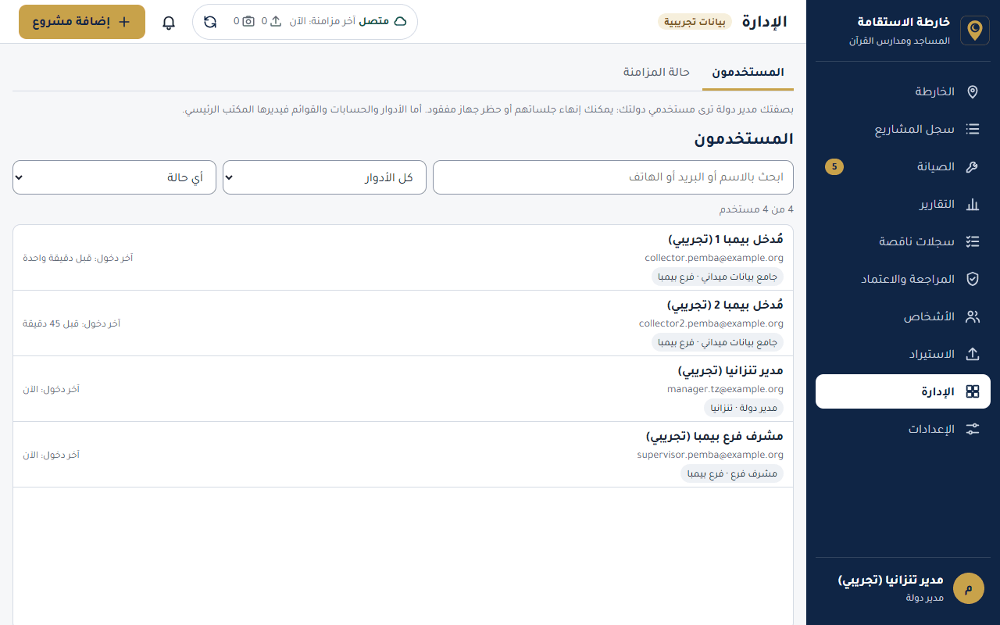 | 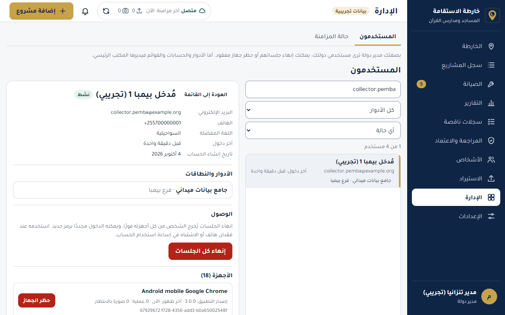 |

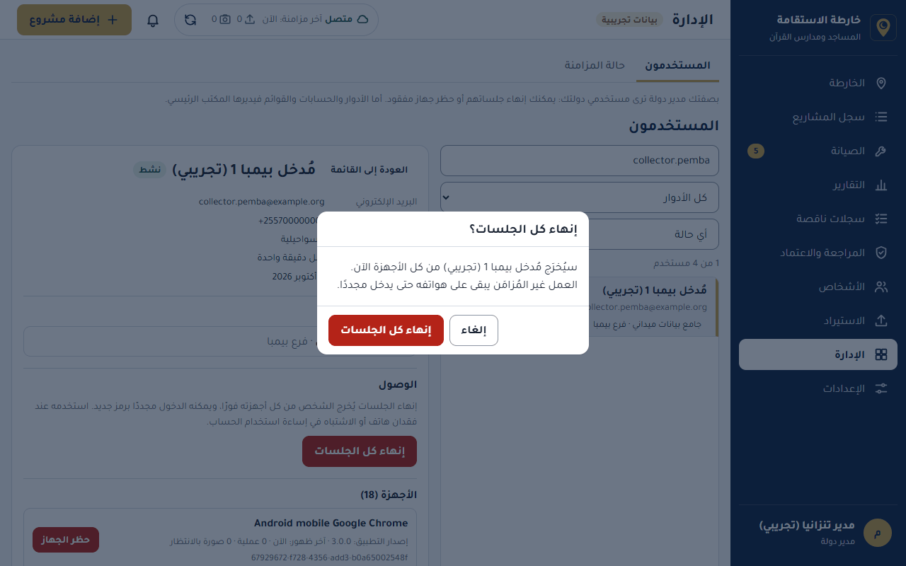

### 5.6 حالة المزامنة

تبويب **«حالة المزامنة»**: كل مستخدم وكل جهاز مع آخر رفع وآخر تنزيل، والعمليات والصور المعلّقة،
والتعديلات المرفوضة. استخدمه لتعرف من لم يزامن منذ مدة طويلة، واتصل به قبل أن تضيع بياناته.

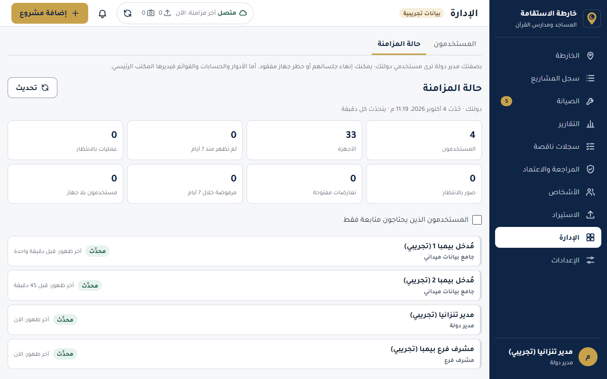

---

## 6. دليل الإدارة العليا

للإدارة العليا كل صلاحيات مدير الدولة لكل الدول، وفوقها (من صفحة **الإدارة**):

- **المستخدمون:** إنشاء حساب (الاسم، البريد، الهاتف، اللغة)، وإضافة دور بنطاقه (عام، دولة، فرع)،
  وإزالة دور، وتعطيل حساب، وإنهاء الجلسات، وحظر جهاز أو إعادته.
- **الدول:** إضافة دولة جديدة (الرمز، الأسماء بالعربية والإنجليزية والسواحيلية، العملة) **دون أي
  تحديث للتطبيق**.
- **الفروع:** الفرع ونطاقه الجغرافي.
- **القوائم:** خيارات الأنشطة والتحديات والمعيشة… بثلاث لغات، وترتيبها، وتعطيلها.
- **أسعار الصرف:** سعر كل عملة مقابل الدولار وتاريخه. حدّثها دوريًا؛ التقارير تنبّه ما دامت مؤقتة.
- **حزم الخرائط:** الحزم المنشورة لكل منطقة وحجمها.
- **الإعدادات:** إعدادات عامة للتطبيق.
- **حالة المزامنة:** لكل الدول.

> قواعد مهمة: لا يمكن حذف آخر حساب للإدارة العليا، ولا يستطيع المسؤول سحب دوره هو من نفسه بالخطأ.
> كل تغيير يُسجَّل في سجل التدقيق.

---

## 7. دور «الاطلاع فقط»

لعلاقات المتبرعين. يرى الخريطة والتقارير العامة **للمشاريع المعتمدة فقط**، دون أسماء الأشخاص،
ودون الهواتف (تظهر مقنّعة)، ودون الرواتب والبيانات المقيّدة. لا يستطيع التعديل.

---

## 8. حل المشكلات

| المشكلة                                         | الحل                                                                                                                                   |
| ----------------------------------------------- | -------------------------------------------------------------------------------------------------------------------------------------- |
| لم يصلني رمز الدخول                             | تأكد من البريد أو الرقم، وانظر في البريد المزعج، واضغط «إعادة الإرسال» بعد دقيقة. تحتاج اتصالًا                                        |
| نسيت رمز PIN                                    | «نسيت الرمز؟ سجِّل الدخول من جديد». بياناتك غير المرفوعة تبقى على الهاتف. تحتاج اتصالًا                                                |
| أخرجني التطبيق وظهرت رسالة «أنهى المسؤول جلستك» | المسؤول أنهى جلساتك (مثلًا بعد الإبلاغ عن ضياع هاتف). سجّل الدخول من جديد، وإن كان خطأ فاتصل بمشرفك                                    |
| رسالة «أوقف المسؤول هذا الجهاز أو الحساب»       | الجهاز محظور (مثلًا أُبلغ عنه أنه ضائع). اتصل بمدير دولتك ليعيده                                                                       |
| المؤشر يبقى على رقم غير صفر                     | اتصل بالإنترنت واضغط «مزامنة الآن». إن كان «Wi-Fi فقط» مفعّلًا فالصور تنتظر شبكة Wi-Fi. إن ظهر رقم أحمر فافتح «يحتاج إلى انتباه»       |
| تحذير دقة GPS لا يختفي                          | اخرج من المبنى إلى مكان مكشوف، وفعّل «الدقة العالية» للموقع في إعدادات الهاتف، وانتظر 30 ثانية ثم التقط من جديد. أو «اختر على الخريطة» |
| الخريطة رمادية دون اتصال                        | نزّل حزمة خريطة منطقتك من الإعدادات وأنت متصل. المشاريع تظهر حتى دون الحزمة                                                            |
| «المساحة ممتلئة» أو الهاتف بطيء                 | ارفع كل شيء ثم احذف حزم الخرائط غير المستعملة من الإعدادات. انظر «المساحة المستخدمة»                                                   |
| لا أجد مشروعًا أعرف أنه موجود                   | امسح الفلاتر («مسح الفلاتر») وابحث بالرمز. قد يكون خارج نطاقك (فرع آخر)                                                                |
| حفظت مشروعًا وظهر في مكان آخر من المنطقة        | تأكد أن الموقع التُقط عند المشروع نفسه. المنطقة تُحسب من الإحداثيات                                                                    |
| التطبيق يطلب تحديثًا                            | اضغط «تحديث» في الشريط الذي يظهر. بياناتك محفوظة                                                                                       |
| تغيّرت اللغة وحدها                              | اللغة محفوظة لكل جهاز. غيّرها من الإعدادات                                                                                             |

## 9. أسئلة شائعة

**هل أحتاج إنترنت طوال الوقت؟** لا. تحتاجه لأول دخول، ثم مرة من وقت لآخر للرفع والتحديث.

**ماذا يحدث لو انطفأ الهاتف قبل الرفع؟** لا شيء يضيع. البيانات محفوظة على الهاتف وتُرفع عند الاتصال
التالي، دون تكرار.

**هل يمكن أن يُرفع المشروع مرتين؟** لا. لكل سجل معرّف فريد يُنشأ على الهاتف، وكل عملية رفع لها رقم؛
تكرار الإرسال لا يُنشئ نسخة ثانية.

**لماذا لا أرى الرواتب التي أدخلتها؟** لأنها بيانات مقيّدة: تُرفع ثم تُحذف من هاتفك. يراها مدير
الدولة والإدارة العليا فقط.

**هل يمكن حذف مشروع نهائيًا؟** لا. الحذف «ناعم»: يختفي من القوائم ويبقى محفوظًا في قاعدة البيانات
وفي سجل التدقيق. والصور المحذوفة تُزال من التخزين بعد 90 يومًا.

**لماذا رجع سجلي المعتمد إلى «مُرسل للمراجعة»؟** لأنك عدّلته بعد الاعتماد؛ يراجعه المشرف من جديد.

**أدخلت الشخص نفسه مرتين، ماذا أفعل؟** أخبر مشرف الفرع، أو أرسل «طلب دمج» من بطاقة الشخص. المشرف
يدمجهما ويمكنه التراجع.

**كيف أنقل بياناتي من التطبيق القديم؟** افتح التطبيق الجديد على الهاتف نفسه وسجّل الدخول؛ سيعرض
عليك رفعها. انظر [3.13](#313-نقل-بياناتك-من-الإصدار-القديم-الإصدار-2).

**أريد العمل على هاتف جديد.** سجّل الدخول عليه واختر PIN جديدًا. **قبل** ترك الهاتف القديم تأكد أن
المؤشر صفر.

## 10. معاني الحالات والكلمات

| الكلمة                                   | المعنى                                                  |
| ---------------------------------------- | ------------------------------------------------------- |
| مسودة                                    | محفوظ ولم يُرسل للمراجعة                                |
| مُرسل للمراجعة                           | ينتظر قرار مشرف الفرع                                   |
| معتمد                                    | راجعه المشرف واعتمده                                    |
| مُعاد للتعديل                            | أعاده المشرف مع ملاحظة لتصححه                           |
| يعمل / يحتاج صيانة / قيد الإنشاء / متوقف | حالة المشروع في الواقع                                  |
| بانتظار الرفع                            | محفوظ على الهاتف ولم يصل إلى الخادم بعد                 |
| تعارض                                    | الحقل نفسه عُدّل من جهازين؛ المشرف يختار                |
| قرية مقترحة                              | قرية كتبها مُدخل ولم يعتمدها المشرف بعد                 |
| بيانات مقيّدة                            | الرواتب والبيانات الحساسة؛ لمدير الدولة والإدارة العليا |
| النطاق                                   | ما يحق لك رؤيته: فرعك أو دولتك أو الكل                  |

---

_لإعادة توليد الصور: `GUIDE_SCREENS=1 npx playwright test screenshots.spec.ts` في `apps/web`، ثم
`python docs/screens/optimize.py`._
