# Mwongozo wa Mtumiaji — Ramani ya Miradi ya Istiqama (Toleo 3)

Mwongozo huu ni wa kila anayetumia programu: mwingizaji data wa uwandani, msimamizi wa tawi,
meneja wa nchi, ofisi kuu, na mtumiaji wa "kutazama tu". Anza na sehemu ya jukumu lako, kisha
tazama "Kutatua matatizo" na "Maswali yanayoulizwa mara kwa mara" mwishoni.

> Picha za mwongozo huu zimechukuliwa kwenye mazingira ya majaribio, kwa hiyo zinaonyesha alama
> ya "data ya majaribio" na majina ya majaribio. Kwenye programu halisi alama hiyo haionekani.
>
> **Kumbuka:** tafsiri hii ya Kiswahili inahitaji kukaguliwa na mzungumzaji asilia kabla ya
> kusambazwa.

## Yaliyomo

1. [Kabla ya kuanza](#1-kabla-ya-kuanza)
2. [Kuingia kwenye programu](#2-kuingia-kwenye-programu)
3. [Mwongozo wa mwingizaji data wa uwandani](#3-mwongozo-wa-mwingizaji-data-wa-uwandani)
4. [Mwongozo wa msimamizi wa tawi](#4-mwongozo-wa-msimamizi-wa-tawi)
5. [Mwongozo wa meneja wa nchi](#5-mwongozo-wa-meneja-wa-nchi)
6. [Mwongozo wa ofisi kuu](#6-mwongozo-wa-ofisi-kuu)
7. [Jukumu la "kutazama tu"](#7-jukumu-la-kutazama-tu)
8. [Kutatua matatizo](#8-kutatua-matatizo)
9. [Maswali yanayoulizwa mara kwa mara](#9-maswali-yanayoulizwa-mara-kwa-mara)
10. [Maana ya hali na maneno](#10-maana-ya-hali-na-maneno)

---

## 1. Kabla ya kuanza

- **Programu inafanya kazi kwenye kivinjari** (Chrome kwenye Android ni bora), na unaweza
  kuisakinisha kwenye skrini ya simu kama programu nyingine: kwenye menyu ya **Zaidi** chagua
  "Sakinisha programu" kitufe kikionekana, au kwenye menyu ya kivinjari chagua "Ongeza kwenye
  skrini ya mwanzo".
- **Kuingia mara ya kwanza kunahitaji intaneti**, kwa sababu programu inapakua data ya eneo lako
  kwenye simu. Baada ya hapo unaweza kufanya kazi siku nzima bila mtandao.
- **Lugha:** Kiarabu ndiyo lugha ya kawaida. Unaweza kuchagua Kiswahili au Kiingereza kwenye skrini
  ya kuingia au kwenye Mipangilio.
- **Akaunti yako ni yako peke yako.** Usimpe mtu msimbo wa kuingia wala PIN. Kila unachoingiza
  kinarekodiwa kwa jina lako.

## 2. Kuingia kwenye programu

### 2.1 Barua pepe au simu, kisha msimbo

1. Andika barua pepe yako (au chagua "Simu" na uandike namba yako) kisha bonyeza kutuma msimbo.
2. Utapokea msimbo wa tarakimu 6. Uandike kisha bonyeza kuthibitisha.

| Barua pepe                                         | Msimbo                                        |
| -------------------------------------------------- | --------------------------------------------- |
| 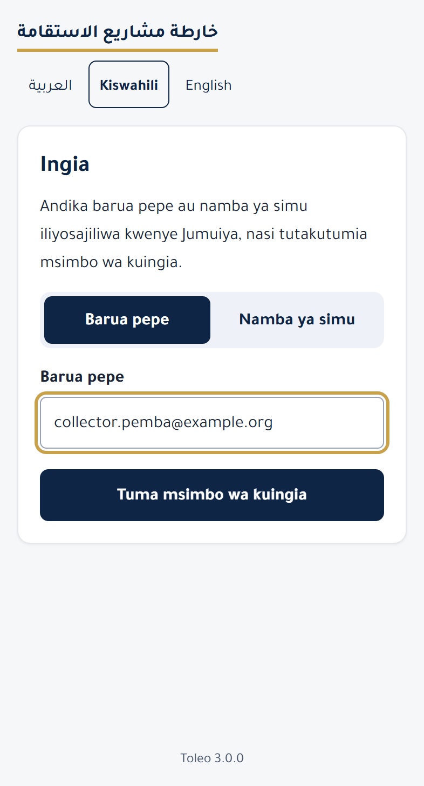 | 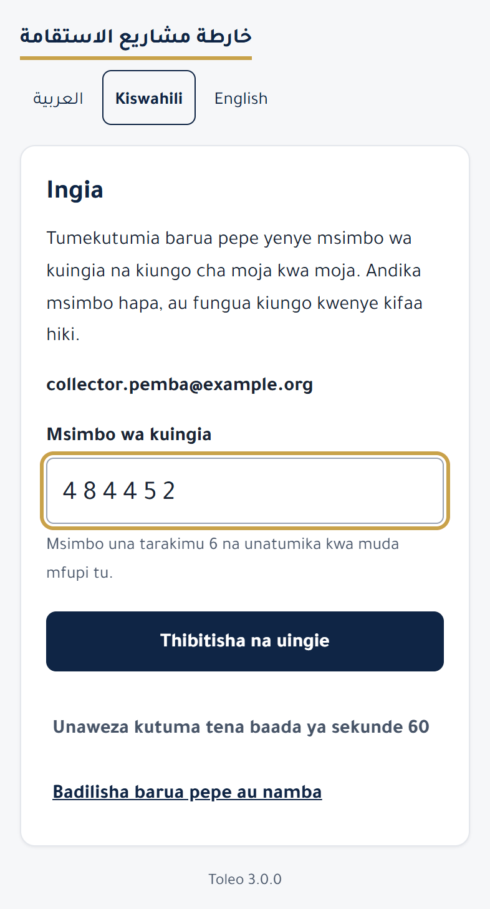 |

### 2.2 PIN ya kifaa

Unapoingia mara ya kwanza kwenye simu hii unachagua **PIN** ya tarakimu 4 hadi 8 na kuirudia.
PIN hii ni ya kifaa hiki tu:

- Programu inajifunga yenyewe baada ya **dakika 15** bila kutumiwa, na unapoifungua tena; andika
  PIN ili kuendelea.
- Kitambulisho cha kuingia kilichohifadhiwa kwenye simu kimesimbwa kwa PIN hii, kwa hiyo mtu
  akichukua simu hawezi kuingia kwenye akaunti yako.
- Ukiisahau, bonyeza "Umesahau PIN? Ingia upya". Utahitaji intaneti ili kupokea msimbo mpya, na
  **data yako ambayo bado haijapakiwa inabaki kwenye simu**.

| Kuchagua PIN                              | Programu imefungwa                           |
| ----------------------------------------- | -------------------------------------------- |
| 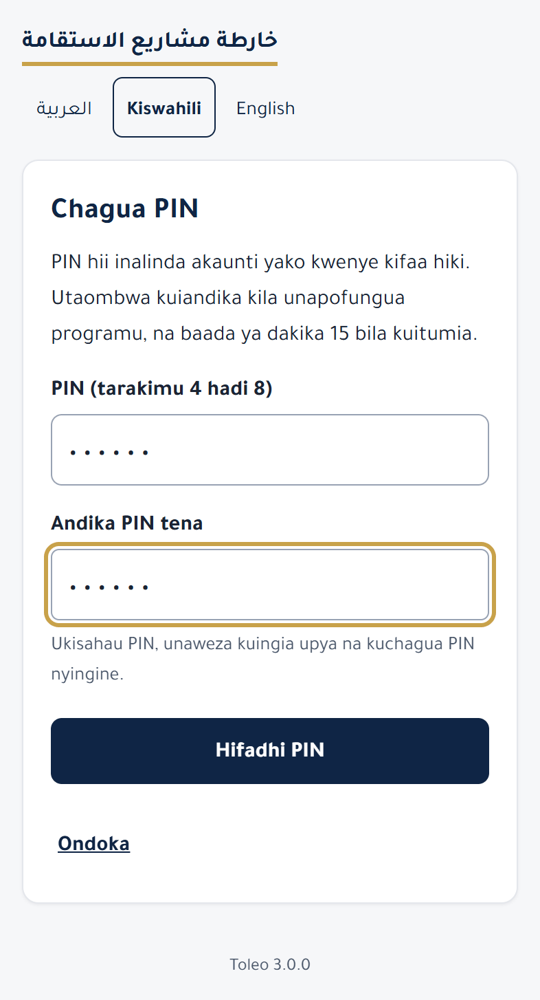 | 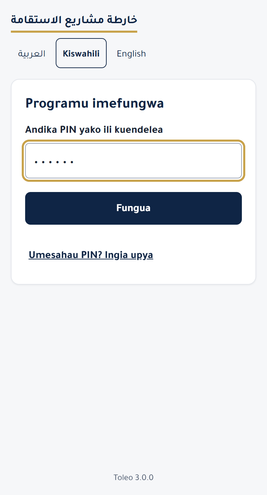 |

### 2.3 Uthibitishaji wa hatua mbili (meneja wa nchi na ofisi kuu tu)

Majukumu haya mawili yanahitaji hatua ya ziada kila unapoingia: msimbo kutoka programu ya
uthibitishaji kwenye simu yako (Google Authenticator, Microsoft Authenticator au nyingine kama
hizo). Tazama [5.1](#51-kuingia-kwa-uthibitishaji-wa-hatua-mbili).

---

## 3. Mwongozo wa mwingizaji data wa uwandani

### 3.1 Skrini kuu na urambazaji

Chini ya simu kuna upau wenye: **Ramani · Miradi · Ongeza (+) · Matengenezo · Ripoti**. Kurasa
nyingine (Rekodi pungufu, Watu, Kuingiza data, Mipangilio) ziko kwenye kitufe cha **Zaidi**
(mistari mitatu juu ya skrini).

| Ramani                        | Menyu ya "Zaidi"                             |
| ----------------------------- | -------------------------------------------- |
| 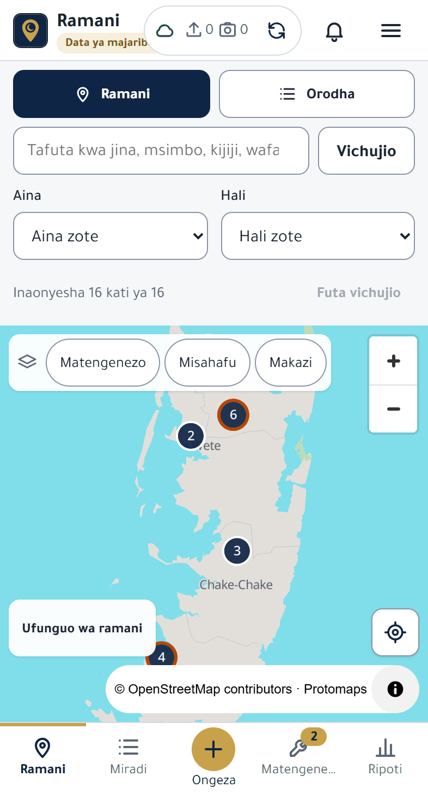 | 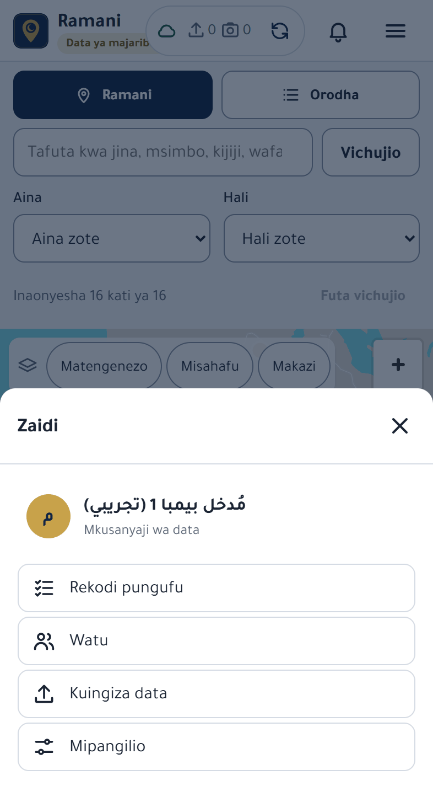 |

- **Ramani / Orodha:** vitufe viwili juu ya ukurasa vya kubadilisha mwonekano.
- **Kutafuta:** andika jina la mradi, msimbo wake, jina la kijiji au jina la mtumishi. Utafutaji
  unafanya kazi hata bila mtandao.
- **Vichujio:** aina na hali. Vichujio vinabaki kwa kila ukurasa hata ukihamia ukurasa mwingine.
- **Namba kwenye ramani** ni makundi ya miradi; kuza ramani ili kuona mradi mmoja mmoja.
- **Vitufe vya matengenezo, Misahafu na makazi** vinaonyesha ramani ya joto ya mahitaji.
- **Kitufe cha "mahali nilipo"** kinaweka alama moja ya mahali ulipo sasa.
- Bonyeza mradi wowote kwenye orodha au ramani ili kufungua kadi yake fupi, kisha "Maelezo".

| Ramani ya joto ya matengenezo              | Kuchagua mradi kwenye orodha       | Kadi ya mradi                                     |
| ------------------------------------------ | ---------------------------------- | ------------------------------------------------- |
| 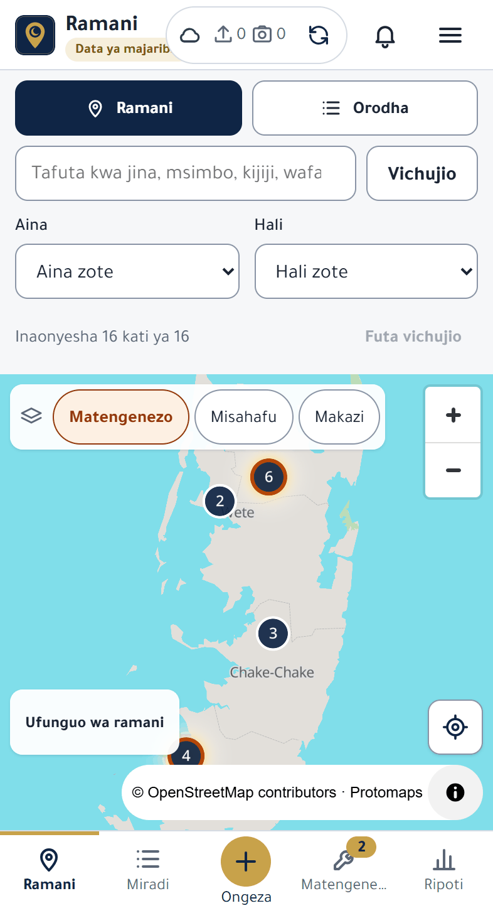 | 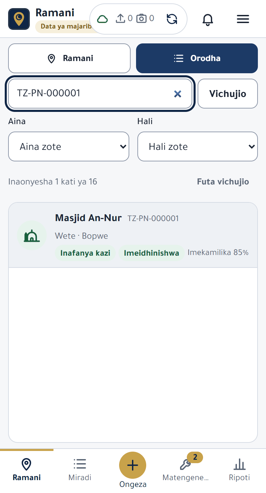 | 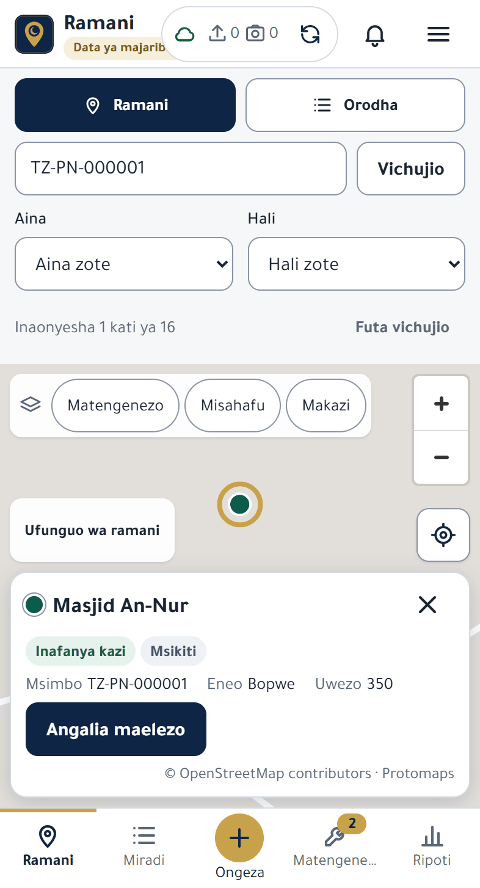 |

### 3.2 Kiashiria cha usawazishaji — kisome kila wakati

Juu ya kila ukurasa kuna kiashiria kidogo kinachoonyesha hali ya data yako:

| Hali                              | Mwonekano                                      | Maana                                                                                                       |
| --------------------------------- | ---------------------------------------------- | ----------------------------------------------------------------------------------------------------------- |
| Mtandaoni na kila kitu kimepakiwa |        | Wingu la kijani, na namba zote mbili ni **0** (mabadiliko na picha zinazosubiri)                            |
| Nje ya mtandao                    |  | Wingu lililokatwa mstari. Endelea na kazi kama kawaida; kila kitu kinahifadhiwa kwenye simu                 |
| Inasubiri kupakiwa                |       | Namba karibu na mshale = mabadiliko ambayo hayajapakiwa; namba karibu na kamera = picha ambazo hazijapakiwa |

- **Kitufe cha duara (Sawazisha sasa)** kinapakia na kupakua mara moja. Vinginevyo programu
  inasawazisha yenyewe mtandao ukirudi na kila dakika mbili.
- Mtandao ukikatika, ujumbe unaonekana juu: "Uko nje ya mtandao — endelea kuingiza data…".
- Usifute programu wala data ya kivinjari **wakati kiashiria kina namba isiyo sifuri**: data
  ambayo haijapakiwa itapotea.

### 3.3 Kufanya kazi bila mtandao — mambo ya kujua

1. Fungua programu mara moja **ukiwa mtandaoni** mwanzoni mwa siku ili kupata taarifa mpya.
2. Kijijini ingiza kila kitu kama kawaida: miradi, picha, matengenezo na watumishi. Kila
   unachohifadhi kinabaki kwenye simu.
3. Ukifunga programu au simu ikizima, hakuna kinachopotea; ukifungua utaandika PIN tu.
4. Ukifika mahali penye intaneti (au Wi-Fi) programu inapakia kila kitu yenyewe. Subiri hadi
   namba zote mbili ziwe **0**.
5. Picha hupakiwa kwa vipande: mtandao ukikatika katikati ya picha, inaendelea ilipoishia na
   haianzi upya.
6. Ukitaka kuokoa kifurushi cha data, washa "Pakia picha kwa Wi-Fi pekee" kwenye Mipangilio.

| Ramani bila mtandao                         | Mradi uliohifadhiwa kwenye simu unasubiri kupakiwa    |
| ------------------------------------------- | ----------------------------------------------------- |
| 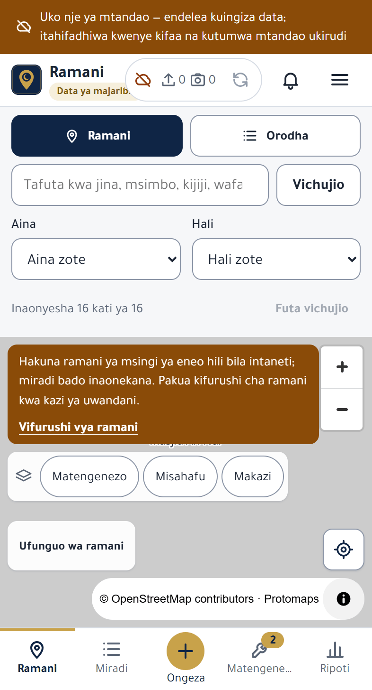 | 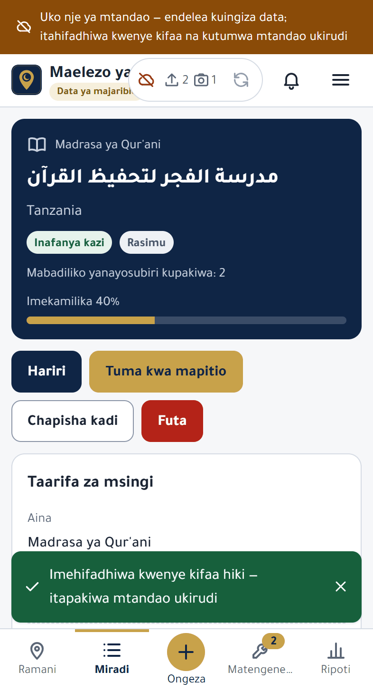 |

### 3.4 Kuongeza mradi mpya — hatua kwa hatua

Bonyeza **+ Ongeza**. Fomu imepangwa kwa mpangilio wa kazi ya uwandani, na sehemu zinazohitajika
zina nyota nyekundu (*). Jina la "Aliyeingiza" linaandikwa lenyewe kutoka akaunti yako.

**1) Aina na jina.** Chagua: Msikiti, Madrasa ya Qur'ani, au Msikiti na madrasa. Andika jina kama
watu wanavyolijua (kwa Kiarabu ni bora); jina kwa herufi za Kilatini si lazima lakini linasaidia
kutafuta.

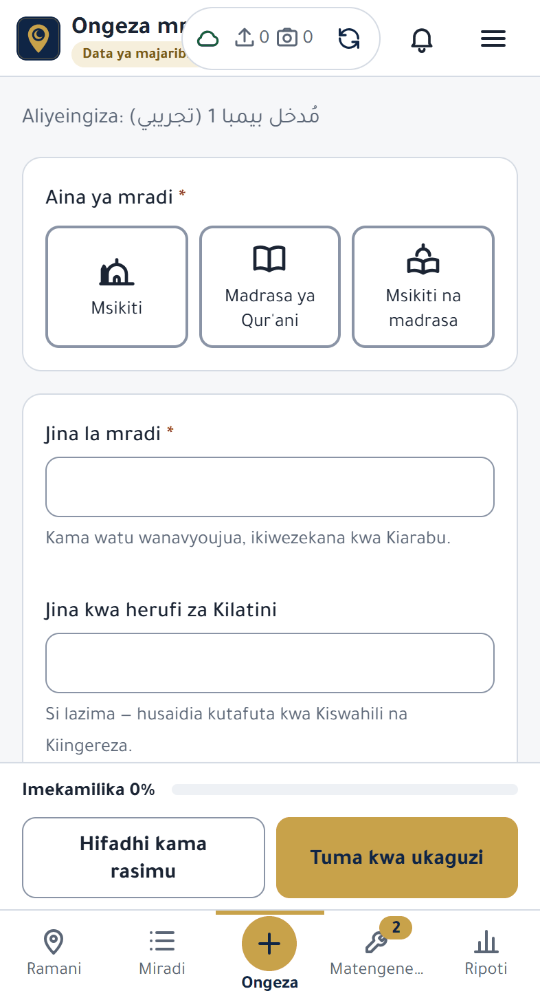

**2) Mahali.** Simama kwenye mradi na ubonyeze **"Chukua mahali kwa GPS"**, au "Chagua kwenye
ramani" kama haupo hapo. **Usahihi** unaonekana kwa mita. Kisha **nchi na eneo hujazwa
zenyewe** kutoka viwianishi, na unaweza kuvirekebisha kama kuna kosa.

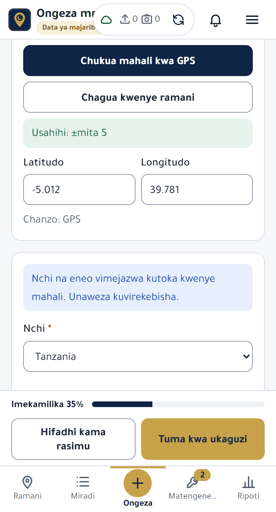

> **Onyo la usahihi:** usahihi ukiwa dhaifu kuliko mita 30, onyo la rangi ya machungwa
> linaonekana. Toka mahali wazi (mbali na paa na miti mingi), subiri kidogo, kisha chukua mahali
> tena.
>
> 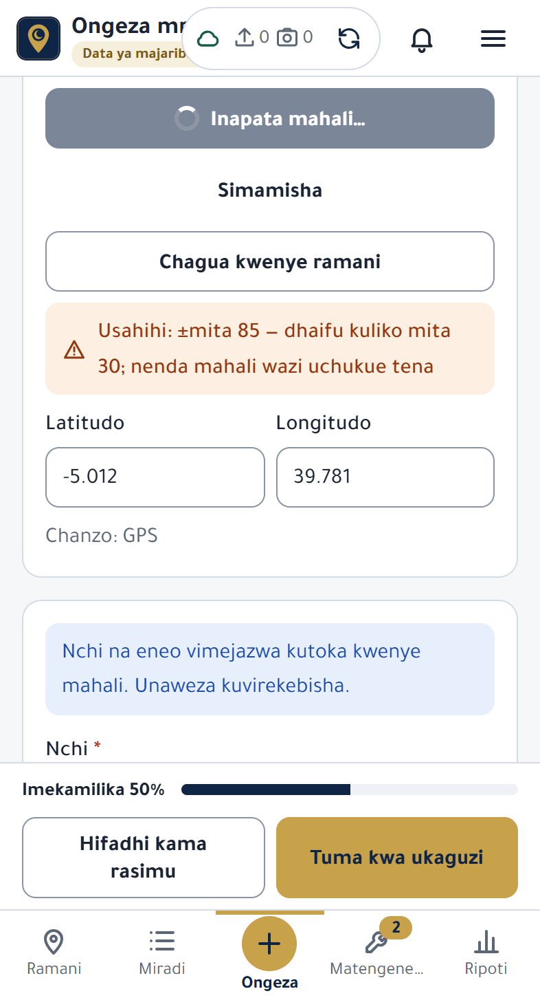

Nukta ikiwa nje ya nchi au eneo lililochaguliwa, onyo wazi linaonekana kabla ya kuhifadhi.
Kagua mahali au eneo.

**3) Kijiji.** Chagua kijiji kwenye orodha. Usipokipata, andika jina lake; kinahifadhiwa kama
"kijiji kilichopendekezwa" na msimamizi atakiidhinisha.

**4) Hali.** Hali inaonekana kila wakati: Inafanya kazi, Inahitaji matengenezo, Inajengwa,
Imesimama. Ukichagua **"Inahitaji matengenezo"**, dirisha linafunguka ili uandike kumbukumbu ya
matengenezo: maelezo, kipaumbele na gharama inayokadiriwa.

| Hali na picha                                      | Dirisha la matengenezo                                               |
| -------------------------------------------------- | -------------------------------------------------------------------- |
| 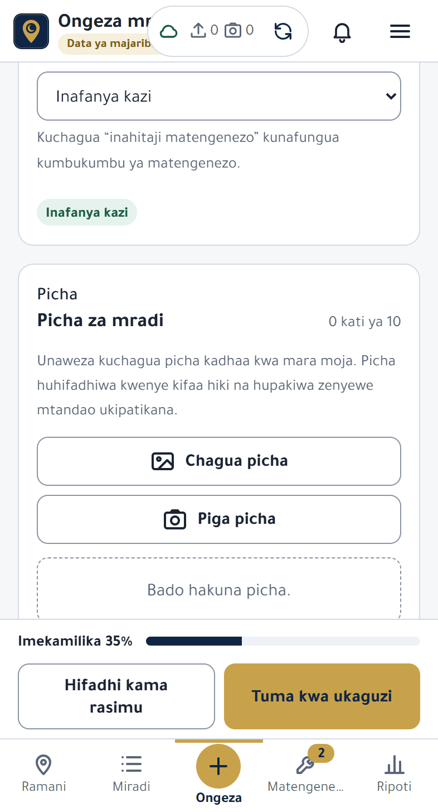 | 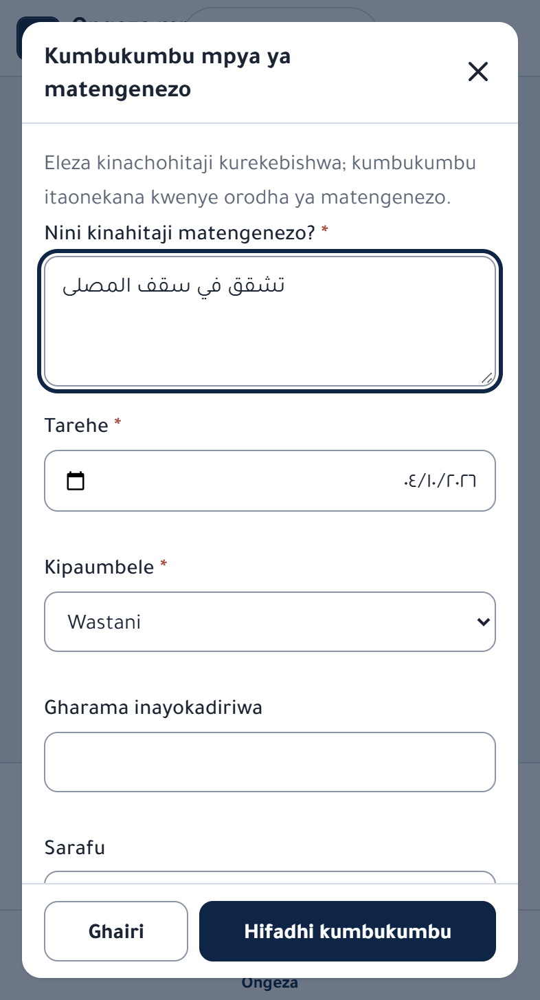 |

**5) Picha.** Tazama [3.5](#35-picha).

**6) Maelezo ya ziada (si lazima).** Sehemu zilizokunjwa; bonyeza sehemu yoyote kuifungua:

| Sehemu                           | Unachoingiza                                                                                                                   |
| -------------------------------- | ------------------------------------------------------------------------------------------------------------------------------ |
| Uwezo, mjenzi na mwaka wa ujenzi | Idadi ya waumini/wanafunzi, aliyejenga (kwa kawaida "Istiqama"), mwaka wa ujenzi (tarehe kamili si lazima)                     |
| Wafadhili                        | Chagua mfadhili aliyepo au ongeza mpya, pamoja na kiasi, sarafu na mwaka vikijulikana                                          |
| Watumishi                        | Imamu, walimu, wakala, msimamizi wa utawala na meneja. Andika jina kisha chagua kwenye "Watu wanaoweza kulingana" (tazama 3.9) |
| Ardhi                            | Umiliki, mmiliki, ukubwa, asilimia ya matumizi, uwezekano wa kupanua                                                           |
| Huduma                           | Makazi, maktaba, Misahafu (iliyopo na inayohitajika), ukumbi, usafiri                                                          |
| Taarifa za jamii                 | Idadi ya watu, asilimia ya Waislamu, shughuli, changamoto… (chaguo nyingi)                                                     |
| Taarifa zilizozuiliwa            | Taarifa nyeti zinazoonekana kwa meneja wa nchi na ofisi kuu pekee                                                              |

| Uwezo na ujenzi                                         | Wafadhili                                        | Watumishi                                       |
| ------------------------------------------------------- | ------------------------------------------------ | ----------------------------------------------- |
| 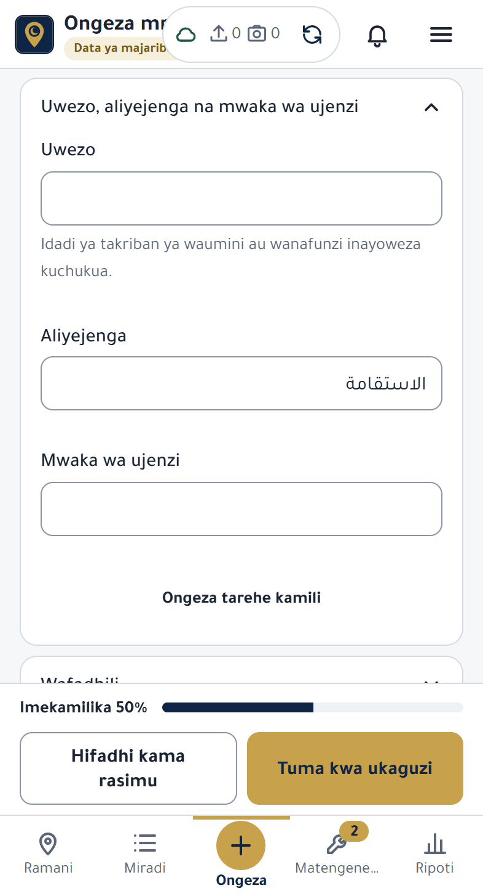 | 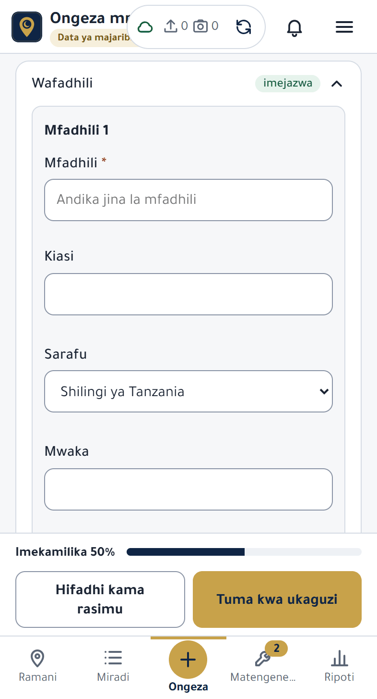 | 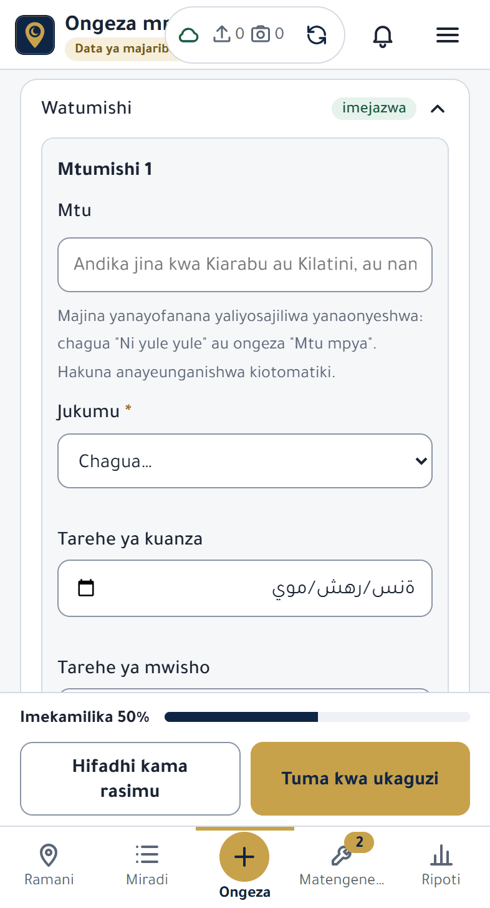 |

| Ardhi                                      | Huduma                                            | Jamii                                           | Taarifa zilizozuiliwa                                           |
| ------------------------------------------ | ------------------------------------------------- | ----------------------------------------------- | --------------------------------------------------------------- |
| 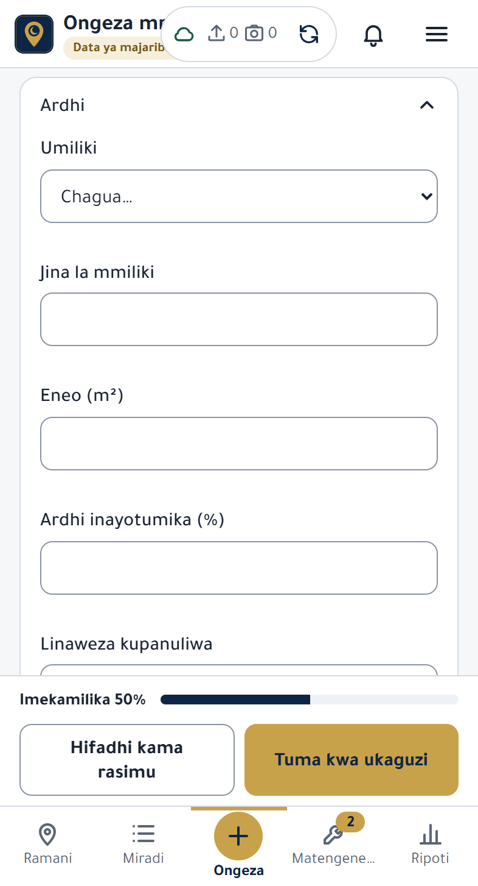 | 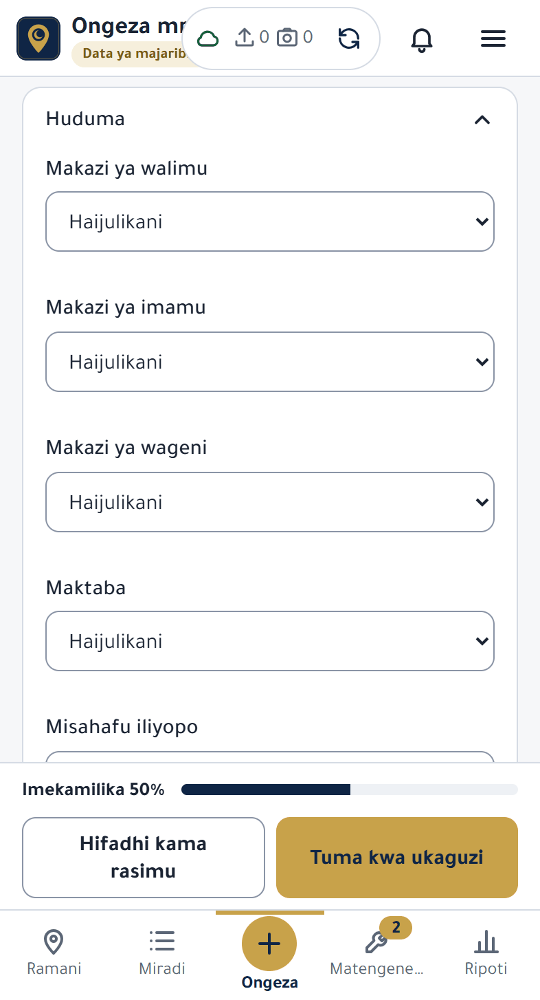 | 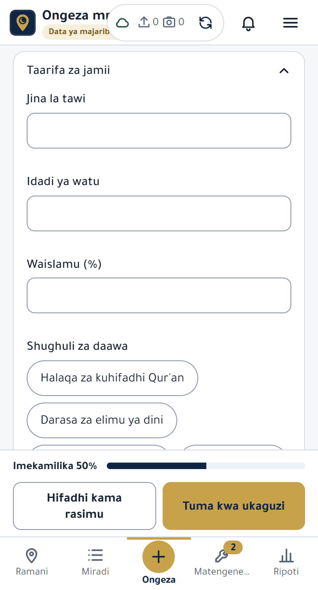 | 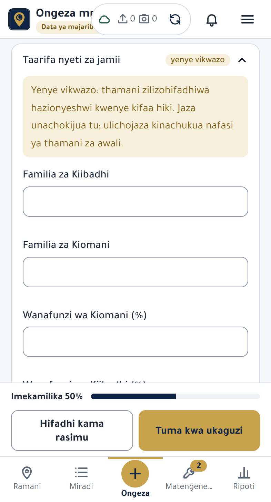 |

> **Mishahara na taarifa zilizozuiliwa:** unaweza kuziingiza, lakini **hazibaki kwenye simu
> yako**: zinapakiwa kisha zinaondolewa kwenye kifaa, na wewe wala mwingizaji mwingine hamwezi
> kuziona tena. Hii ni kwa makusudi ili kulinda watu.

**7) Kiashiria cha ukamilifu.** Chini ya fomu kuna upau wa "Imekamilika %". Ukijaza sehemu zaidi
unapanda. Rekodi pungufu zinaonekana kwenye ukurasa wa "Rekodi pungufu".

**8) Kuhifadhi.** Vitufe viwili:

- **"Hifadhi kama rasimu"**: inahifadhi na rekodi inabaki kwako ili uikamilishe baadaye.
- **"Tuma kwa ukaguzi"**: inahifadhi na kutuma rekodi kwa msimamizi wa tawi ili aiidhinishe.

Sehemu ikiwa na kosa, kosa linaonekana **karibu na sehemu hiyo hiyo** kwa rangi nyekundu.

### 3.5 Picha

- Bonyeza **"Chagua picha"** kuchagua picha kadhaa kwa mara moja, au **"Piga picha"**.
- Hadi **picha 10** kwa kila mradi. Programu inabana kila picha kwenye simu kabla ya kuihifadhi,
  inaondoa taarifa binafsi za mahali ndani ya picha na kubakiza muda ilipopigwa tu.
- Kwa kila picha: **aina ya picha** (mbele ya msikiti, ndani ya madrasa, ardhi…), **"Picha ya
  jalada"** (inaonekana kwenye orodha na ramani), "Piga upya" na "Futa".
- Maneno **"Inasubiri kupakiwa"** juu ya picha yanamaanisha imehifadhiwa kwenye simu na bado
  haijapakiwa. Ni kawaida ukiwa nje ya mtandao.
- Faili lisilo picha au lenye zaidi ya MB 25 linakataliwa.

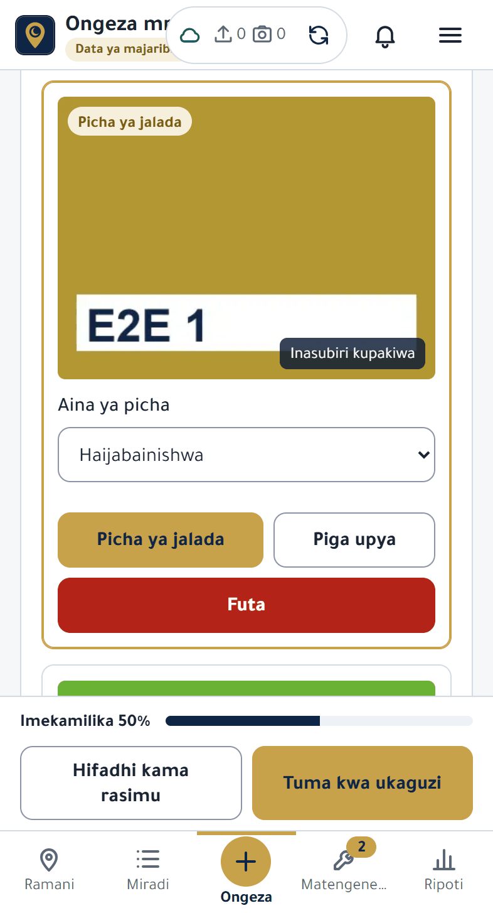

### 3.6 Onyo la "Huenda ni marudio"

Kabla ya kuhifadhi, programu inatafuta mradi **wa aina ileile ndani ya mita 150**, au wenye jina
linalofanana katika kijiji kilekile. Ikiupata inakuuliza:

- **"Ni mradi uleule — fungua ili kubadilisha"**: usiunde nakala ya pili; unafungua mradi uliopo ili kuuhariri.
- **"Mradi tofauti — hifadhi"**: kama ni miradi miwili halisi iliyo karibu.
- **"Rudi kwenye fomu"**: ili kukagua ulichoingiza.

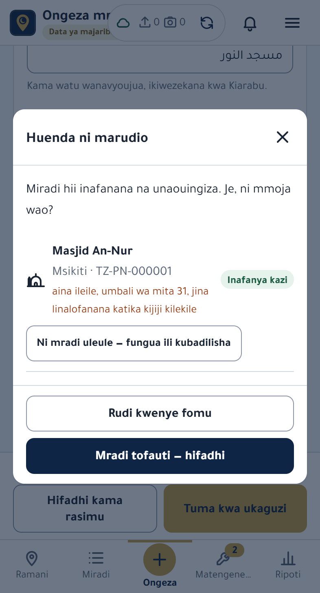

### 3.7 Hakuna kinachopotea: rasimu ya kiotomatiki

- Fomu inajihifadhi kwenye simu **kila sekunde 5 na kila unapobadilisha kitu**.
- Kitufe cha kurudi, Esc au kubonyeza nje ya dirisha **havifuti chochote**; programu inauliza
  kwanza.
- Ukitoka kwenye fomu kisha ubonyeze "Ongeza" tena, programu inakupa **kuendelea na uingizaji
  ambao haujakamilika**.
- "Tupa" inafuta uingizaji ambao haujahifadhiwa baada ya wewe kuthibitisha tu.

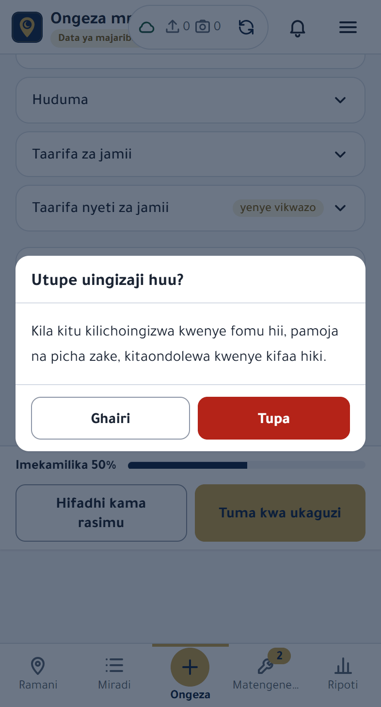

### 3.8 Maelezo ya mradi, matengenezo na rekodi pungufu

Ukurasa wa maelezo unaonyesha sehemu zote, picha na historia ya matengenezo, pamoja na vitufe:
**Hariri**, **Tuma kwa ukaguzi**, **Chapisha kadi**, **Futa** (kufuta hakuondoi rekodi kabisa, na
kunahitaji ruhusa), na **Maelekezo** (inafungua ramani kwenye simu).

| Juu ya maelezo                                      | Historia ya matengenezo                                             | Vitufe                                                        |
| --------------------------------------------------- | ------------------------------------------------------------------- | ------------------------------------------------------------- |
| 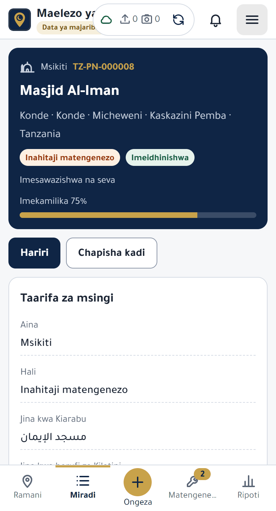 | 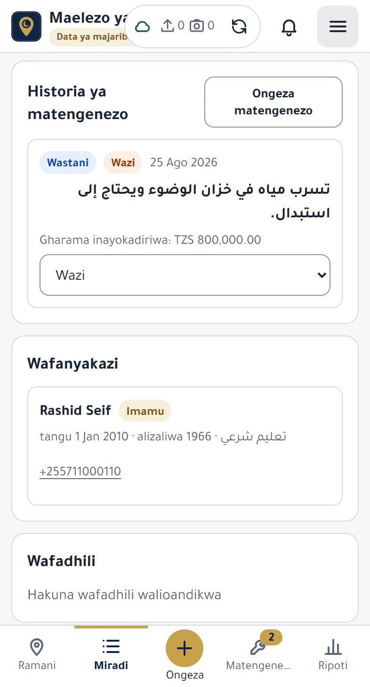 | 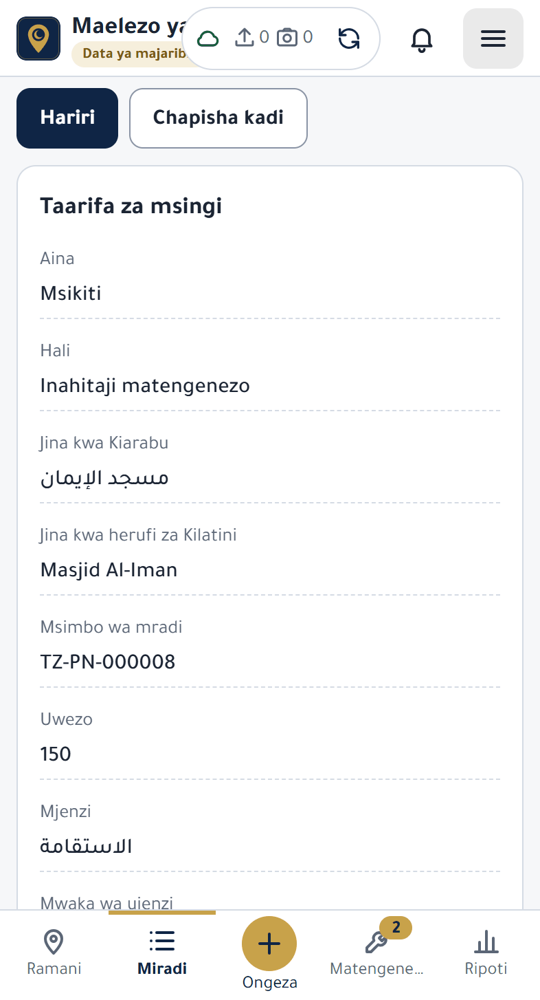 |

- **Ukurasa wa Matengenezo** (kwenye upau wa chini, ukiwa na idadi iliyo wazi): maombi yote ya
  matengenezo yaliyo wazi kwa kipaumbele. Unaweza kuongeza kumbukumbu ya matengenezo kwa mradi
  wowote wa eneo lako.
- **Rekodi pungufu** (kwenye "Zaidi"): rekodi zako zinazokosa kitu, na kinachokosekana kwa kila
  moja.

| Matengenezo                                | Rekodi pungufu                               | Orodha ya miradi                                  |
| ------------------------------------------ | -------------------------------------------- | ------------------------------------------------- |
| 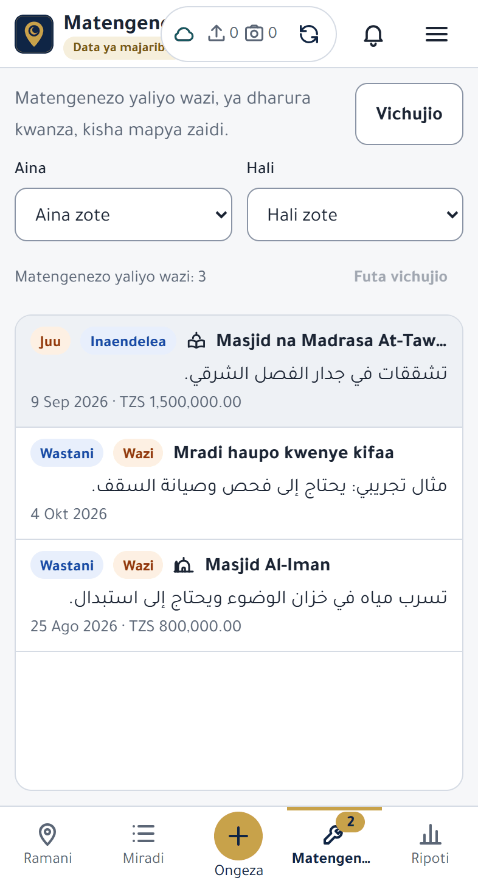 | 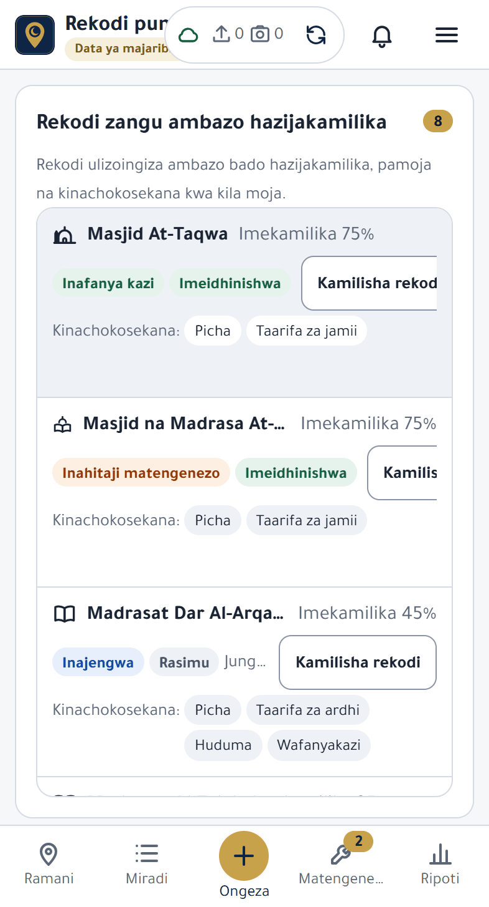 | 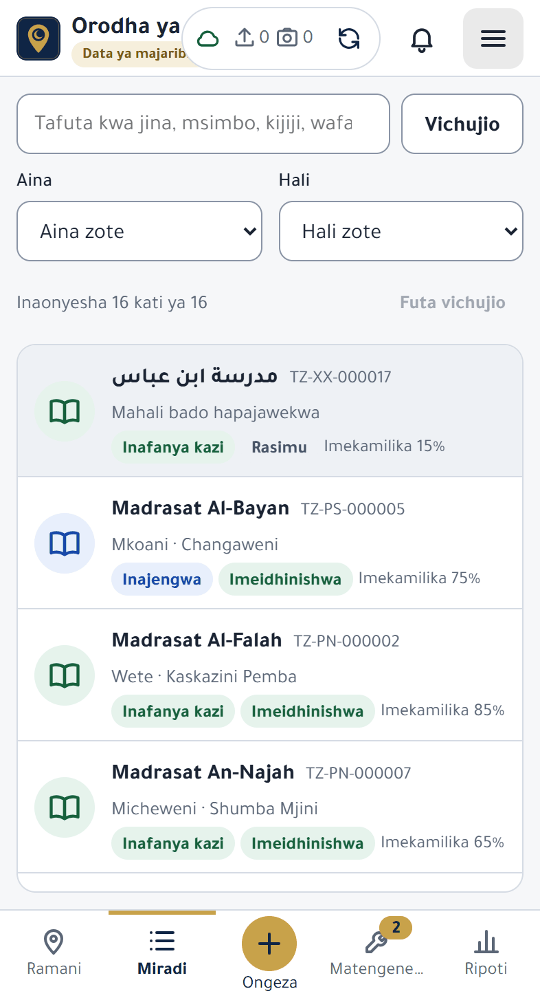 |

**Msimamizi akirudisha rekodi yako:** hali yake inakuwa "Imerudishwa" pamoja na **maelezo ya
msimamizi** juu ya ukurasa wa maelezo. Rekebisha alichoomba kisha bonyeza "Tuma kwa ukaguzi"
tena.

**Ukihariri rekodi iliyoidhinishwa:** inarudi kuwa "Imewasilishwa" ili msimamizi aione tena. Hii ni
kwa makusudi.

### 3.9 Watu: hakuna kuunganisha kiotomatiki

Unapoandika jina la imamu au mwalimu, programu inaonyesha **"Watu wanaoweza kulingana"** (kwa
simu, jina linalofanana, au eneo). Chagua:

- **"Ni yule yule"** kama ni yeye kweli (kwa mfano imamu yule yule anafanya kazi misikiti
  miwili), au
- **"Mtu mpya"** kama si yeye.

Programu **haiunganishi watu wawili kamwe kwa sababu tu majina yao yanafanana**. Ukiingiza mtu
mmoja mara mbili kwa makosa, msimamizi anaweza kuwaunganisha baadaye.

### 3.10 "Mgongano" ni nini? (maelezo rahisi)

Wakati mwingine watu wawili wanahariri **sehemu ileile** ya **mradi uleule** wakiwa nje ya mtandao
(kwa mfano wewe kwenye simu yako na mwenzako kwenye simu yake). Wakati wa kupakia, mfumo hauwezi
kujua thamani ipi ni sahihi, kwa hiyo unahifadhi ya kwanza na kutuma zote mbili kwa **msimamizi
wa tawi** ili achague. Hii inaitwa "mgongano".

- Kila mmoja akihariri **sehemu tofauti** (wewe jina na mwenzako uwezo), mabadiliko yote mawili
  yanaunganishwa yenyewe bila swali lolote.
- Huhitaji kufanya kitu wakati wa mgongano; hakuna kinachopotea, na msimamizi anaamua.
- Ili kupunguza migongano: sawazisha kabla ya kwenda uwandani na baada ya kurudi, na watu wawili
  wasihariri mradi mmoja siku moja.

### 3.11 "Inahitaji uangalizi"

Seva ikikataa badiliko (kwa mfano kwa sababu liko nje ya eneo lako), badiliko hilo linabaki
kwenye orodha ya "Inahitaji uangalizi" pamoja na sababu, na namba nyekundu inaonekana kwenye
kiashiria cha usawazishaji. Mabadiliko mengine yanapakiwa kama kawaida. Soma sababu kisha
rekebisha rekodi au muulize msimamizi wako.

### 3.12 Kuingiza data kwa wingi (kutoka faili)

Ili kuingiza miradi mingi kutoka jedwali (CSV au Excel):

1. Fungua **Zaidi ← Kuingiza data** kisha pakua **kiolezo rasmi** (CSV au XLSX). Bonyeza
   "Onyesha maelezo ya safu" kuona maana ya kila safu na thamani zinazokubalika.
2. Jaza kiolezo, chagua faili kisha bonyeza **"Pakia na ukague faili"**.
3. **Kagua safu kabla ya kutekeleza:** kila safu ina hali yake (halali, ina makosa, huenda ni
   marudio, ina tahadhari) na hatua (unda, sasisha, ruka). Safu za marudio zinaonyeshwa pamoja na
   mradi unaofanana.
4. Bonyeza **"Tekeleza uingizaji"**. Uingizaji **unaunganisha** na haubadilishi data iliyopo; miradi mipya
   inahifadhiwa kama rasimu.
5. Kwenye "Historia ya uingizaji" unaweza **kurejesha kundi zima** ukikosea.

| Mwanzo na kiolezo                                   | Maelezo ya safu                                    |
| --------------------------------------------------- | -------------------------------------------------- |
| 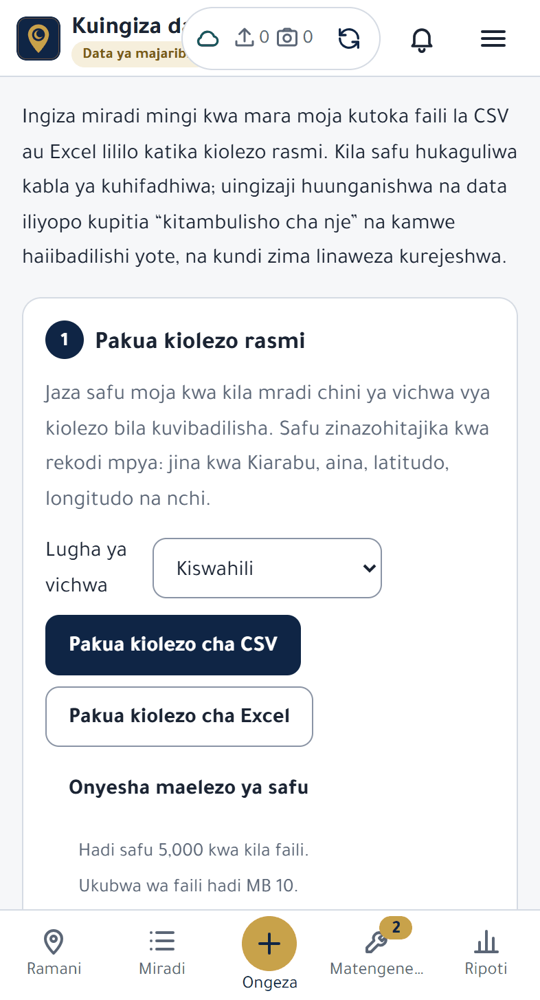 | 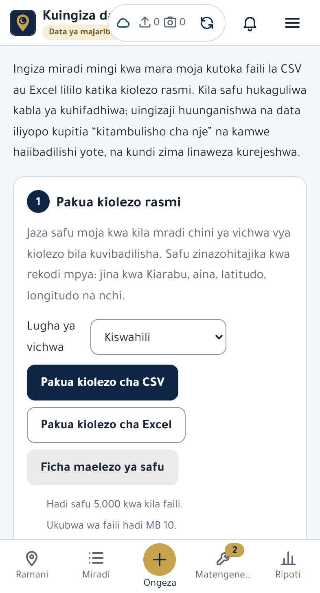 |

| Kukagua safu                              | Maelezo ya safu moja                        | Historia na kurejesha                      |
| ----------------------------------------- | ------------------------------------------- | ------------------------------------------ |
| 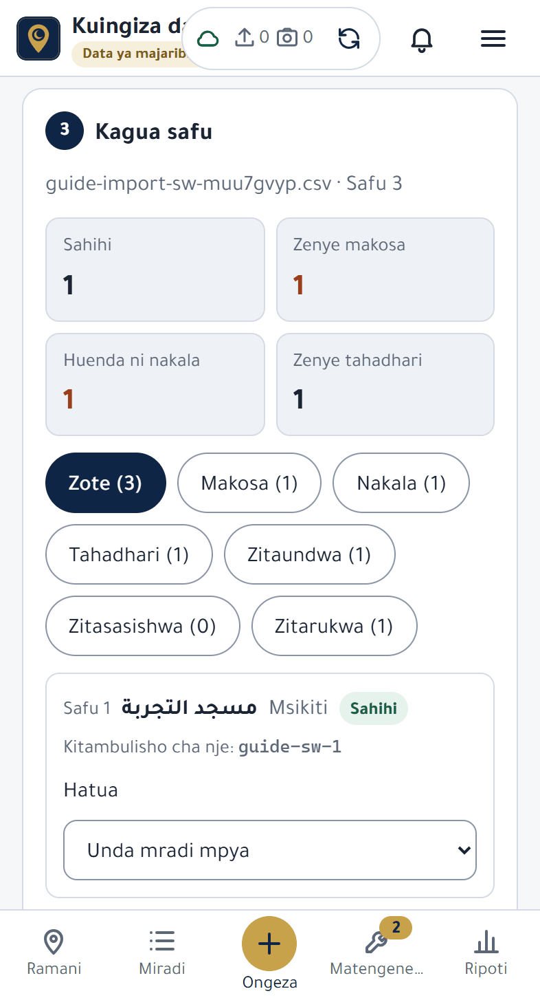 | 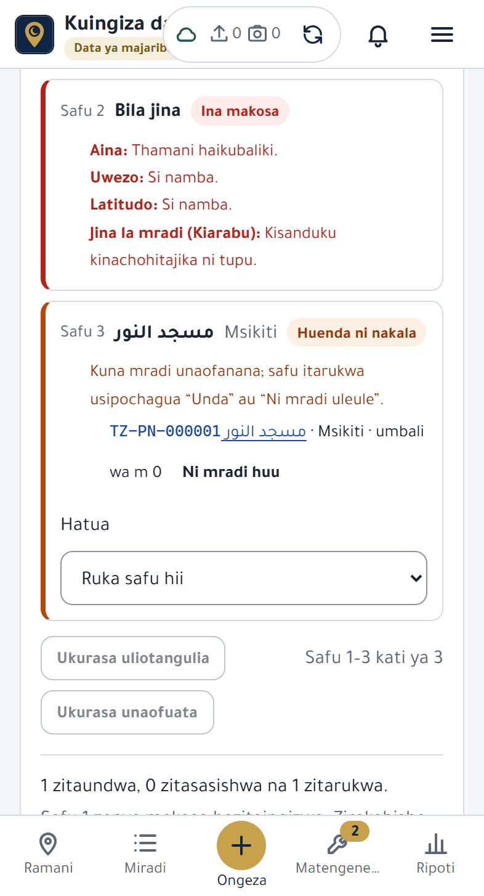 | 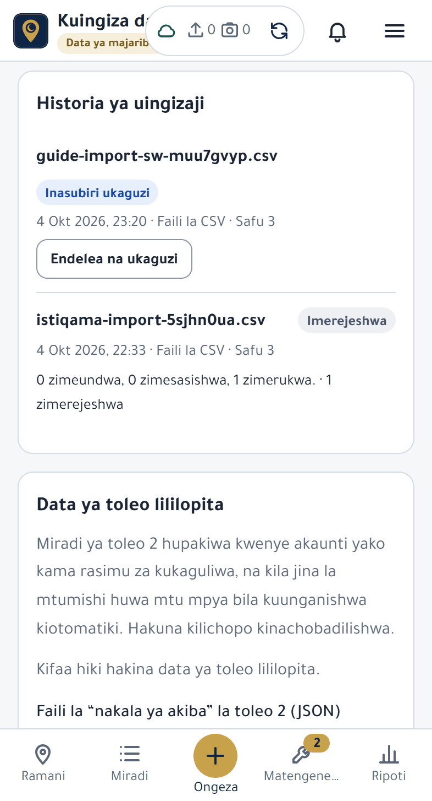 |

### 3.13 Kuhamisha data kutoka toleo la zamani (toleo 2)

Kama simu yako ina toleo la zamani la programu lenye miradi, programu mpya inakupa, unapoingia
mara ya kwanza, **kuipakia kwenye akaunti yako**:

1. Bonyeza kukagua data. **Muhtasari** unaonekana: idadi ya miradi, watu, nafasi za watumishi,
   mishahara na matengenezo.
2. Bonyeza **"Pakia miradi kama rasimu"**. Kila mradi unahifadhiwa kama **rasimu** ili uukague na
   kuutuma.
3. Hakuna mtu anayeunganishwa kwa jina; majina yanayofanana hutumwa kwa msimamizi kama
   **pendekezo la kuunganisha** ili aamue.
4. Mishahara ya toleo la zamani haina sarafu, kwa hiyo hupewa sarafu ya nchi na mradi huwekwa
   alama ya kukaguliwa.
5. **Data ya zamani inabaki kwenye simu hadi kila kitu kithibitishwe kwenye seva**, kisha
   inaondolewa.

Una faili la nakala ya akiba (JSON) la toleo la zamani? Lipakie kutoka **Mipangilio** au kwenye
ukurasa wa Kuingiza data.

| Pendekezo                                           | Muhtasari                               | Maelezo                                              |
| --------------------------------------------------- | --------------------------------------- | ---------------------------------------------------- |
| 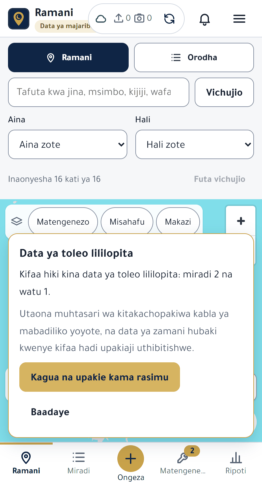 | 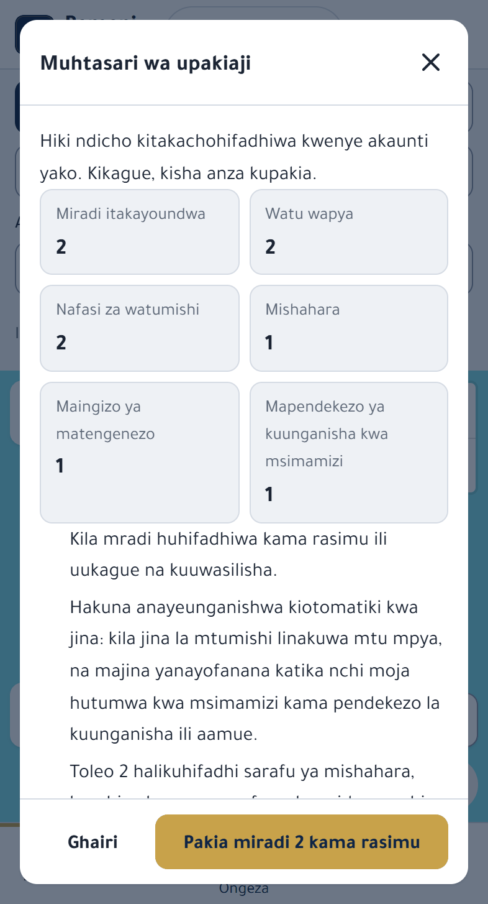 | 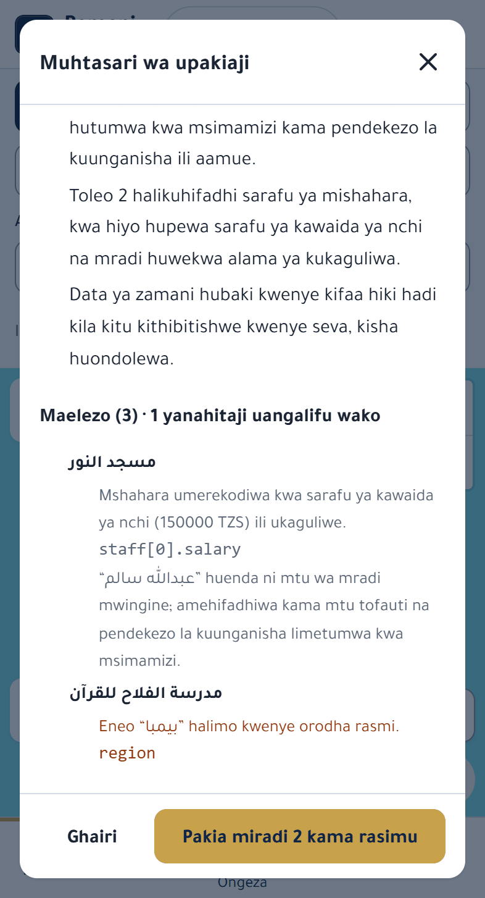 |

### 3.14 Mipangilio

Kutoka **Zaidi ← Mipangilio**:

- **Lugha:** Kiarabu, Kiswahili au Kiingereza.
- **Hifadhi na usawazishaji:** nafasi iliyotumika kwenye simu, idadi ya mabadiliko na picha
  ambazo hazijapakiwa, na kitufe cha kusasisha.
- **Pakia picha kwa Wi-Fi pekee:** picha zinabaki kwenye simu hadi uunganishwe na Wi-Fi.
- **Vifurushi vya ramani bila mtandao:** pakua ramani ya eneo lako (kama "Pemba yote") ili mandhari
  ya ramani ionekane vijijini. Ukubwa wa kila kifurushi unaonekana kabla ya kupakua, na upakuaji
  unaendelea ukikatika.
- **Usalama:** Badilisha PIN, "Funga programu sasa" na "Ondoka".
- **Kuhusu programu:** namba ya toleo na kitambulisho cha kifaa (huulizwa na msaada wa kiufundi).

| Mipangilio                             | Hifadhi na Wi-Fi                            | Vifurushi vya ramani                                       |
| -------------------------------------- | ------------------------------------------- | ---------------------------------------------------------- |
| 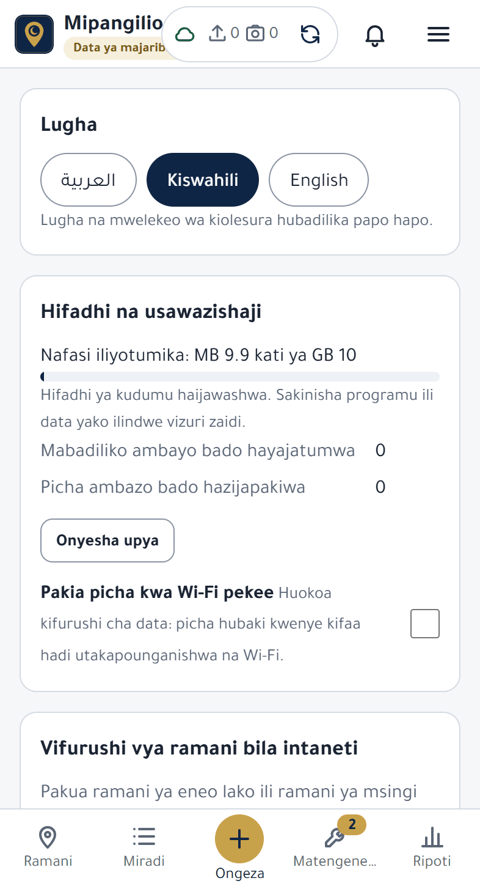 | 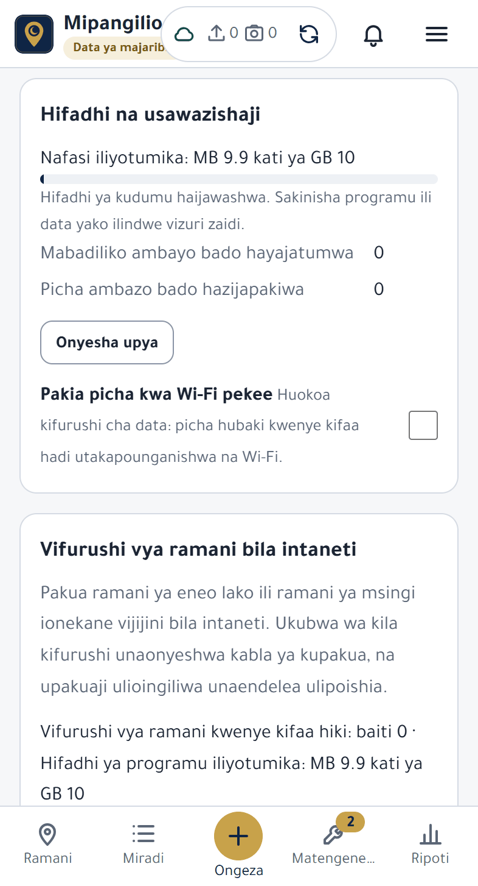 | 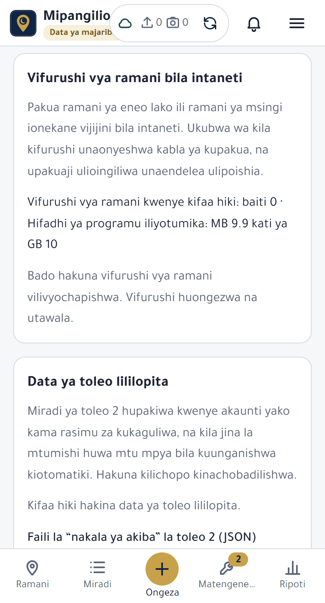 |

| Kubadilisha PIN                                 | Faili la toleo 2                                       | Kuhusu programu                                   |
| ----------------------------------------------- | ------------------------------------------------------ | ------------------------------------------------- |
| 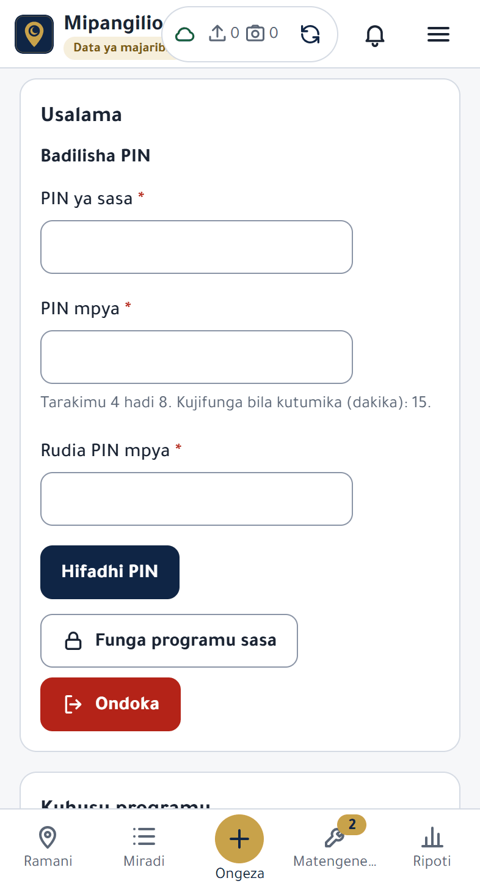 | 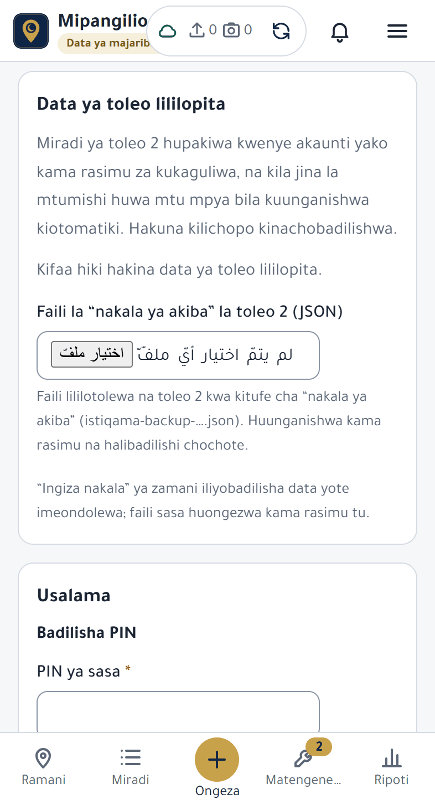 | 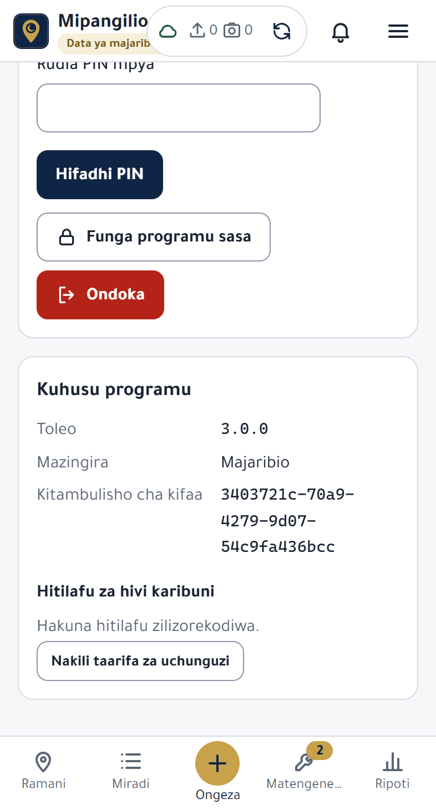 |

> **Kuondoka wakati simu ina data ambayo haijapakiwa:** programu inakuonya kwanza. Pakia kila kitu
> kabla ya kuondoka.

---

## 4. Mwongozo wa msimamizi wa tawi

Msimamizi anaona miradi yote ya tawi lake, anaweza kufanya yote anayofanya mwingizaji, na zaidi:
**kukagua na kuidhinisha**, **kuamua migongano**, **kuidhinisha vijiji vilivyopendekezwa** na
**kuunganisha watu**. Ukurasa wa "Mapitio na uidhinishaji" uko kwenye menyu ya "Zaidi" kwenye simu
na kwenye upau wa pembeni kwenye kompyuta.

### 4.1 Orodha ya mapitio

Kichupo cha **"Zinasubiri mapitio"** kina kila rekodi iliyotumwa kwa ukaguzi, pamoja na ukamilifu
wake na muda ilipotumwa.

- **Idhinisha:** rekodi inakuwa "Imeidhinishwa".
- **Rudisha kwa marekebisho:** andika maelezo wazi kwa mwingizaji (kinachokosekana na cha
  kurekebisha). Maelezo yanamfikia kwenye simu yake. Maandishi uliyoandika hayapotei ukibonyeza
  kurudi kwa makosa; programu inauliza kwanza.

| Zinasubiri mapitio                                | Kurudisha na maelezo                                       |
| ------------------------------------------------- | ---------------------------------------------------------- |
| 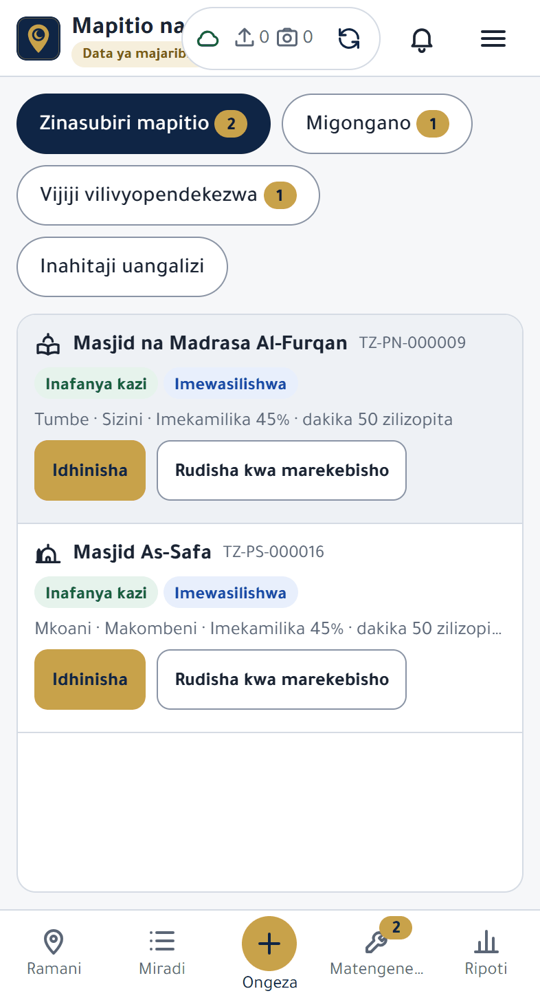 | 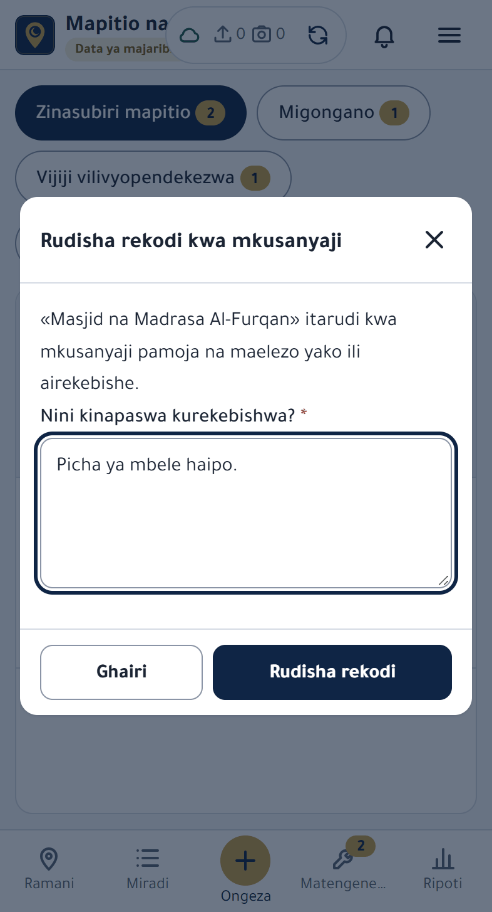 |

### 4.2 Kuamua migongano

Kichupo cha **"Migongano"** kinaonyesha kila sehemu iliyohaririwa pande mbili: **thamani ya seva**
na **thamani iliyotumwa na kifaa**, aliyeihariri na lini. Chagua:

- **"Baki na thamani ya seva"**, au
- **"Baki na thamani ya kifaa"**.

Uamuzi wako unafika kwenye vifaa vyote katika usawazishaji unaofuata. Kama huna uhakika,
mpigie mwingizaji simu kabla ya kuchagua.

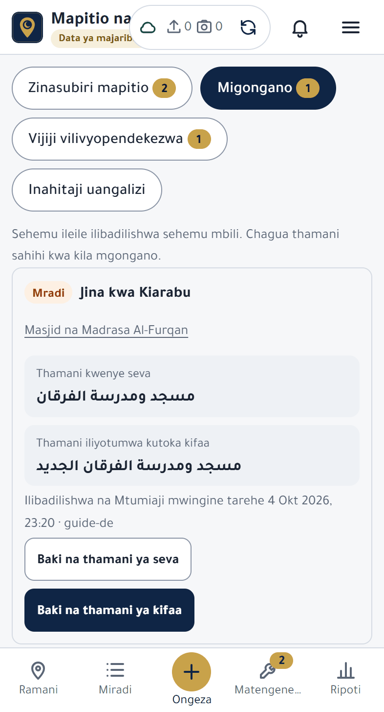

### 4.3 Vijiji vilivyopendekezwa

Kichupo cha **"Vijiji vilivyopendekezwa"**: vijiji vilivyoandikwa na waingizaji kwa sababu
havimo kwenye orodha. Idhinisha vilivyo sahihi, rekebisha jina ikihitajika, na unganisha
vilivyorudiwa na kijiji kilichoidhinishwa (kuunganisha kunaweza kutenduliwa).

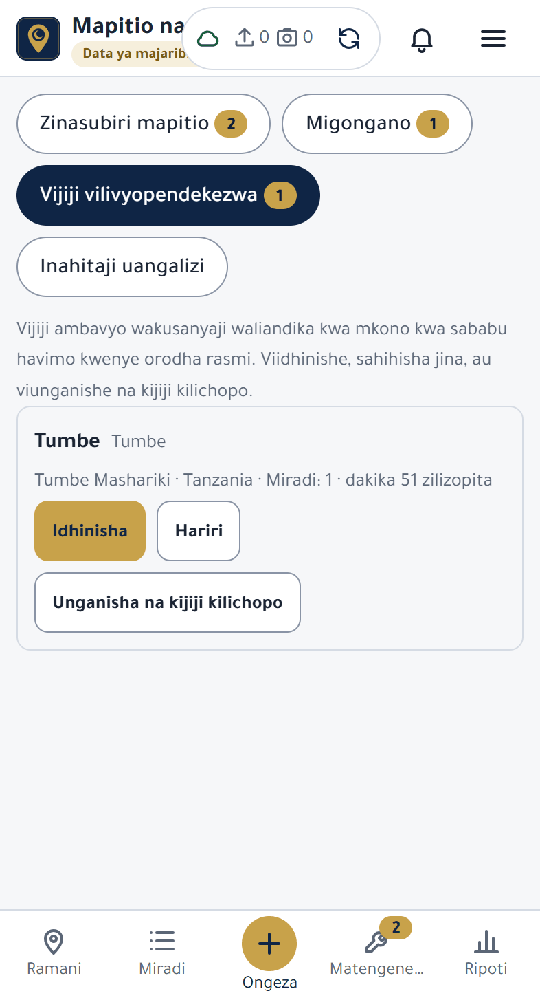

### 4.4 Watu na kuunganisha waliorudiwa

Ukurasa wa **Watu**: orodha ya watu wote wa tawi lako (maimamu, walimu, mawakala…) pamoja na miradi
na majukumu yao.

- Fungua kadi ya mtu kuona simu yake na majukumu yake katika kila mradi.
- **Kuunganisha watu wawili:** kwenye kadi bonyeza "Unganisha na mtu mwingine". Chagua
  **"Anayebaki"** kisha andika **sababu ya kuunganisha**. Majukumu ya aliyerudiwa yanahamishiwa kwa
  anayebaki, taarifa zinazokosekana zinajazwa, na aliyerudiwa anafichwa. **Kuunganisha kunaweza
  kutenduliwa baadaye.**
- Kichupo cha **Maombi ya kuunganisha**: mapendekezo kutoka kwa waingizaji na kutoka uhamishaji
  wa toleo 2. Kubali au kataa pamoja na maelezo.

| Orodha                         | Kadi ya mtu                                |
| ------------------------------ | ------------------------------------------ |
| 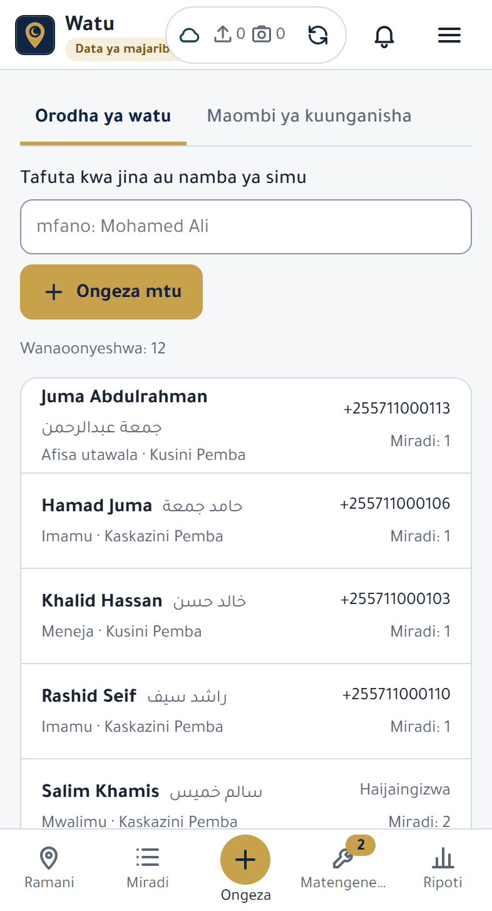 | 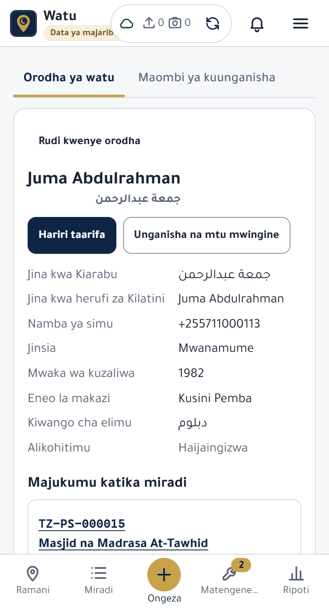 |

| Dirisha la kuunganisha                           | Maombi ya kuunganisha                                   |
| ------------------------------------------------ | ------------------------------------------------------- |
| 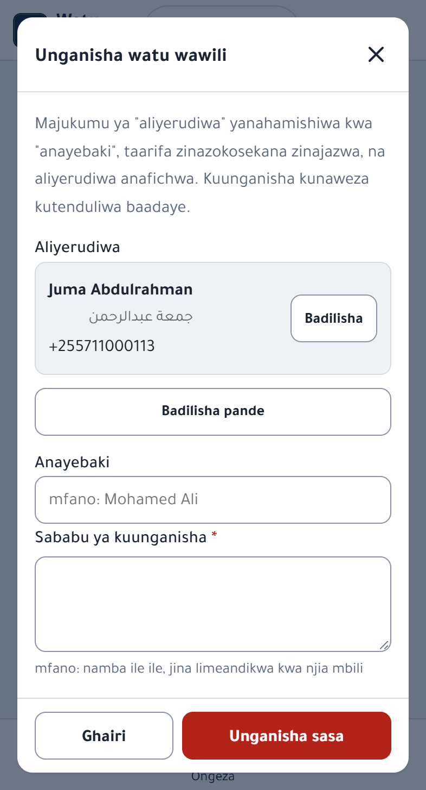 | 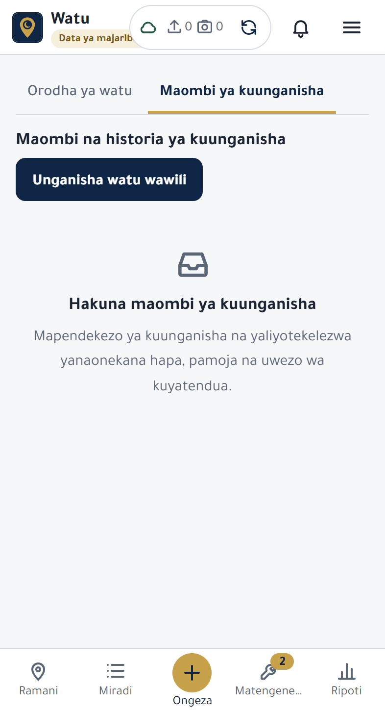 |

> Msimamizi **haoni mishahara** wala taarifa zilizozuiliwa. Hizo ni za meneja wa nchi na ofisi kuu.

---

## 5. Mwongozo wa meneja wa nchi

Meneja wa nchi anaona data yote ya nchi yake, **pamoja na mishahara na taarifa zilizozuiliwa**
(kila anaposoma, inarekodiwa kwa jina lake), ripoti, na usimamizi wa watumiaji wa nchi yake na
vifaa vyao.

### 5.1 Kuingia kwa uthibitishaji wa hatua mbili

Baada ya msimbo wa barua pepe na PIN, skrini ya uthibitishaji wa hatua mbili inaonekana:

1. **Mara ya kwanza:** fungua programu ya uthibitishaji kwenye simu yako, changanua msimbo wa QR au
   andika ufunguo unaoonekana, kisha andika msimbo wa tarakimu 6.
2. **Baada ya hapo:** andika msimbo wa sasa kutoka programu ya uthibitishaji kila unapoingia.

Bila hatua hii ruhusa za meneja hazionekani.

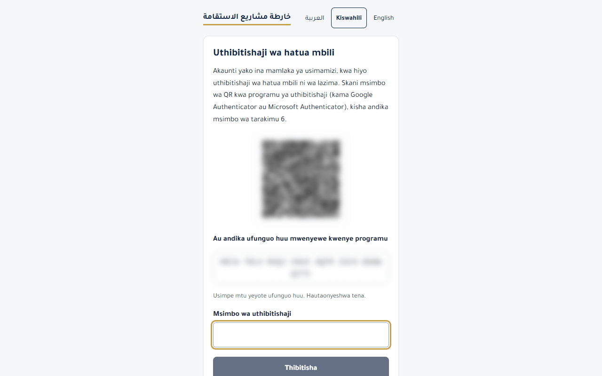

### 5.2 Dashibodi ya viashiria

**Ripoti** zinaonyesha kwa eneo lako (nchi nzima au tawi moja): idadi ya miradi kwa aina na hali,
uwezo, matengenezo yaliyo wazi kwa kipaumbele na gharama, watumishi kwa jukumu, **mishahara ya
kila mwezi kwa sarafu ya nchi na kwa dola**, mahitaji (Misahafu, makazi, usafiri, maeneo
yanayoweza kupanuliwa), ukamilifu wa data, na shughuli ya uingizaji ya kila wiki kwa kila
mwingizaji.

- Takwimu zinahesabiwa kwenye seva na kusasishwa kila dakika 15; muda wa hesabu ya mwisho
  umeandikwa juu ya dashibodi.
- Maadamu viwango vya ubadilishaji ni vya muda, onyo linaonekana kwamba takwimu za dola ni za
  makadirio tu.

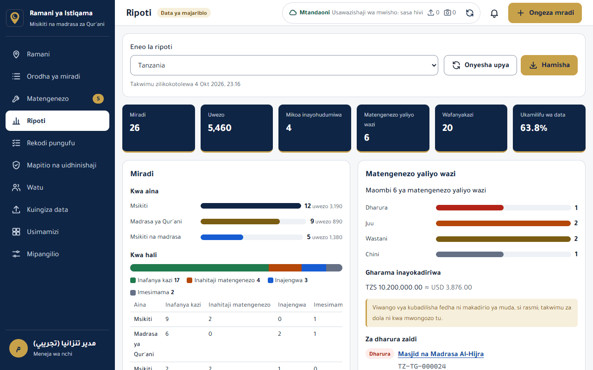

| Mishahara                                    | Mahitaji                                  | Shughuli ya waingizaji                           |
| -------------------------------------------- | ----------------------------------------- | ------------------------------------------------ |
| 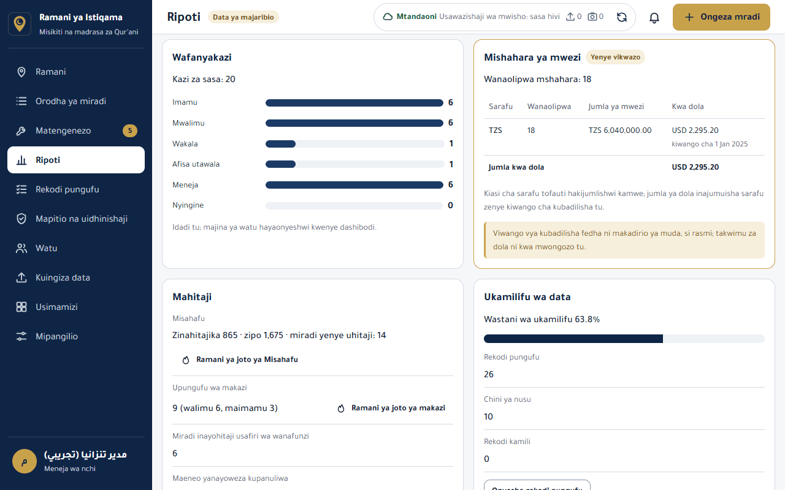 | 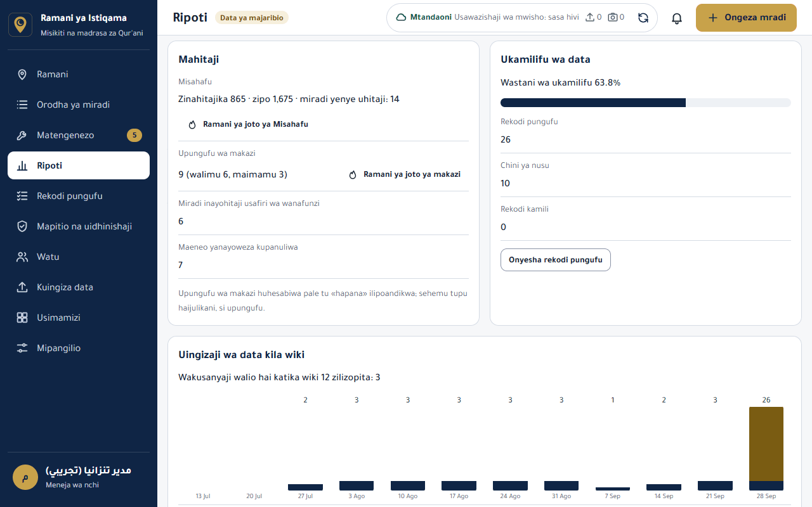 | 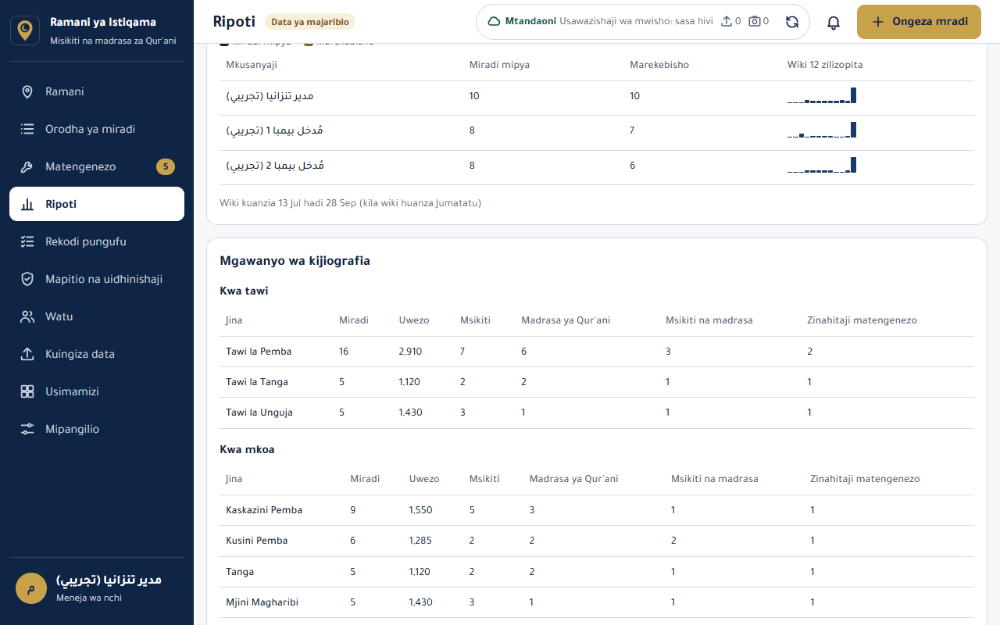 |

Dashibodi hiyo hiyo kwenye simu:

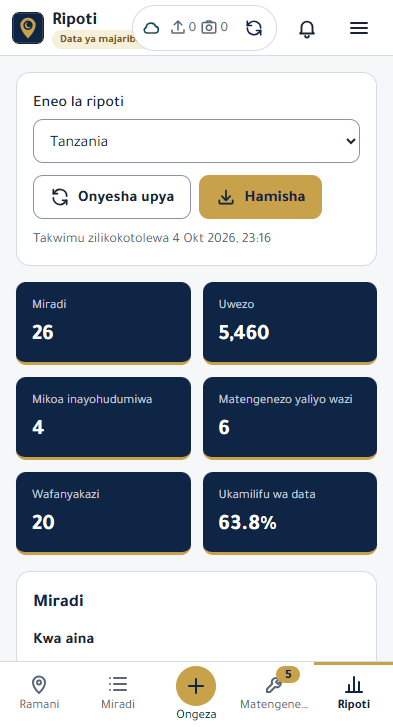

### 5.3 Kutoa data (CSV na Excel)

1. Bonyeza **Hamisha**, chagua muundo (CSV au XLSX) na lugha, na vichujio ukitaka (matengenezo
   yaliyo wazi tu, rekodi pungufu tu).
2. Faili linaandaliwa **kwenye seva** na unapata **arifa** (kengele) likiwa tayari, kisha bonyeza
   "Pakua".
3. Faili lina sehemu zote, na vichwa na thamani ziko kwa lugha yako ("Msikiti", "Inafanya kazi" —
   si misimbo ya Kiingereza). Asiyeruhusiwa kuona mishahara hapewi mishahara kwenye faili.

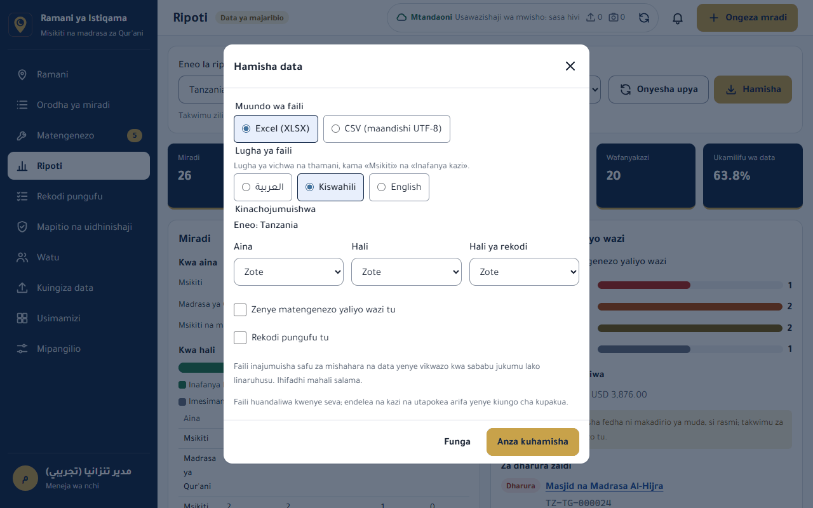

### 5.4 Kuchapisha na PDF

Kwenye ukurasa wa maelezo ya mradi wowote bonyeza **"Chapisha kadi"**: kadi ya mradi yenye picha
kwa rangi za taasisi. Kwenye Ripoti unaweza pia kuchapisha **ripoti ya mfadhili** na **ripoti ya
nchi**. Ili kuhifadhi kama PDF, chagua "Hifadhi kama PDF" kwenye dirisha la kuchapisha. Meneja wa
nchi ana chaguo la kuonyesha mishahara kwenye kadi.

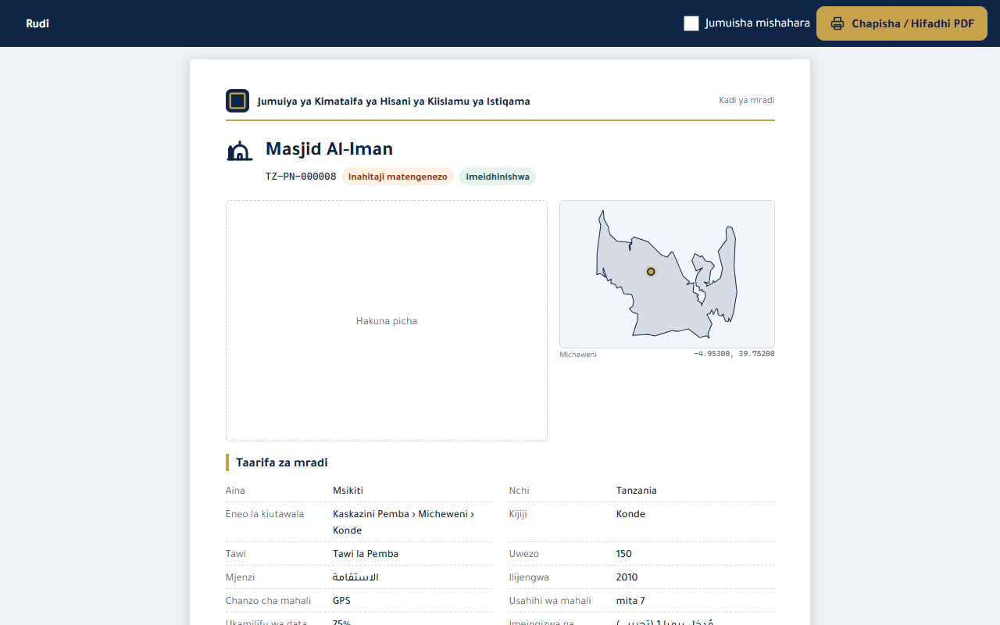

### 5.5 Watumiaji wa nchi yako na vifaa vyao

Kutoka **Usimamizi ← Watumiaji** unaona watumiaji wa nchi yako, majukumu yao, mara ya mwisho
walipoingia na vifaa vyao.

- **Simu imepotea au imeibiwa:** fungua mtumiaji kisha bonyeza **"Zuia kifaa"** karibu na kifaa
  hicho. Kifaa kinazuiwa hadi ukirejeshe, na **data iliyohifadhiwa juu yake inafutwa** kinapounganika
  na seva mara ya kwanza (kisichopakiwa kinapotea, kwa hiyo mwombe mtumiaji asawazishe kwanza kama
  simu bado iko naye).
- **"Maliza vikao vyote"** inamtoa mtumiaji kwenye vifaa vyake vyote mara moja; kazi yake ambayo
  haijapakiwa inabaki kwenye simu zake hadi aingie tena kwa msimbo mpya. Itumie akaunti
  ikishukiwa kutumiwa vibaya.
- Kuunda akaunti, majukumu na orodha ni kazi ya ofisi kuu.

| Watumiaji                                | Maelezo ya mtumiaji                                      |
| ---------------------------------------- | -------------------------------------------------------- |
| 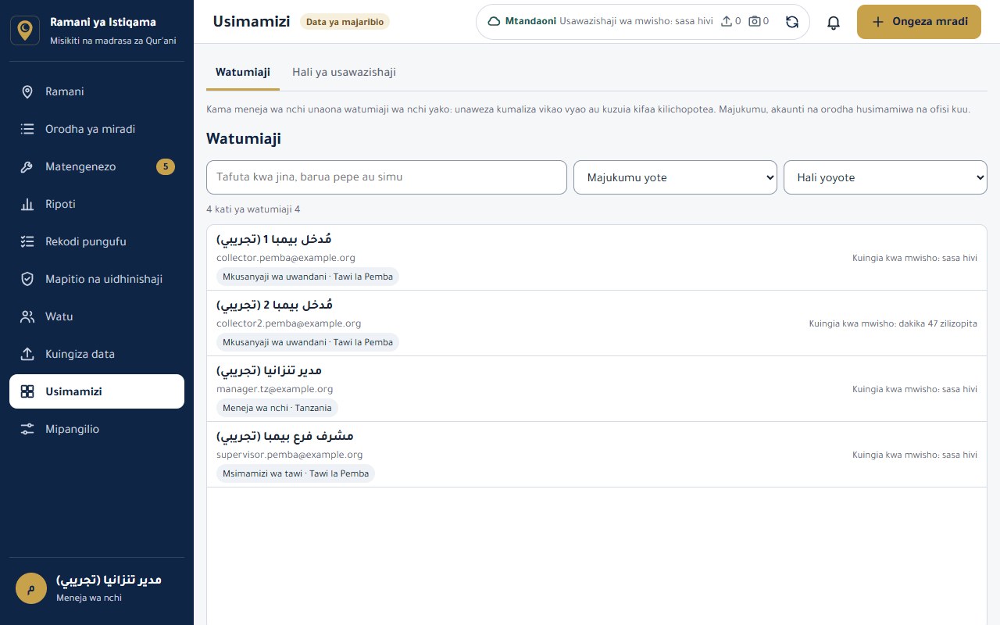 | 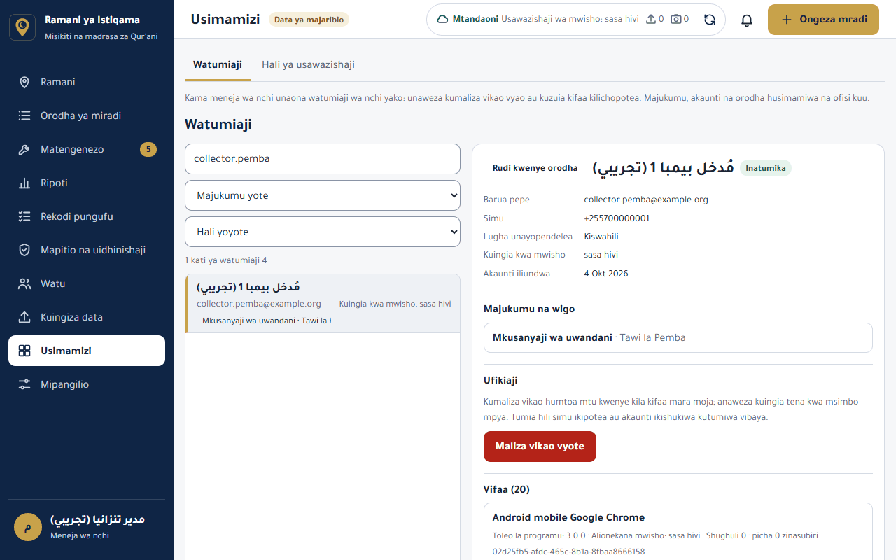 |

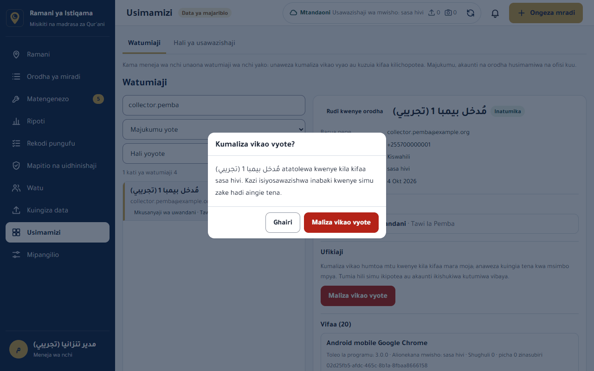

### 5.6 Hali ya usawazishaji

Kichupo cha **"Hali ya usawazishaji"**: kila mtumiaji na kila kifaa pamoja na upakiaji na upakuaji
wa mwisho, mabadiliko na picha zinazosubiri, na mabadiliko yaliyokataliwa. Kitumie kujua nani
hajasawazisha kwa muda mrefu, na umpigie simu kabla data yake haijapotea.

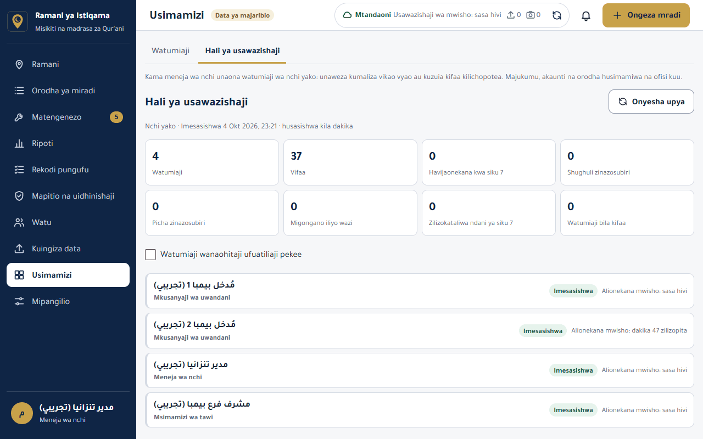

---

## 6. Mwongozo wa ofisi kuu

Ofisi kuu ina ruhusa zote za meneja wa nchi kwa nchi zote, na zaidi (kwenye ukurasa wa
**Usimamizi**):

- **Watumiaji:** kuunda akaunti (jina, barua pepe, simu, lugha), kuongeza jukumu na eneo lake
  (yote, nchi, tawi), kuondoa jukumu, kuzima akaunti, kumaliza vikao, kuzuia au kurejesha kifaa.
- **Nchi:** kuongeza nchi mpya (msimbo, majina kwa Kiarabu, Kiingereza na Kiswahili, sarafu)
  **bila kusasisha programu**.
- **Matawi:** tawi na eneo lake la kijiografia.
- **Orodha za machaguo:** shughuli, changamoto, njia za maisha… kwa lugha tatu, mpangilio wake na
  kuzizima.
- **Viwango vya ubadilishaji:** thamani ya kila sarafu kwa dola na tarehe yake. Visasishe mara kwa
  mara; ripoti zinaonya maadamu ni vya muda.
- **Vifurushi vya ramani:** vifurushi vilivyochapishwa kwa kila eneo na ukubwa wake.
- **Mipangilio:** mipangilio ya jumla ya programu.
- **Hali ya usawazishaji:** kwa nchi zote.

> Kanuni muhimu: akaunti ya mwisho ya ofisi kuu haiwezi kuondolewa, na msimamizi hawezi kujiondolea
> jukumu lake mwenyewe kwa makosa. Kila badiliko linarekodiwa kwenye kumbukumbu za ukaguzi.

---

## 7. Jukumu la "kutazama tu"

Kwa mahusiano na wafadhili. Linaona ramani na ripoti za jumla za **miradi iliyoidhinishwa tu**,
bila majina ya watu, bila namba za simu (zinaonekana zimefichwa), na bila mishahara na taarifa
zilizozuiliwa. Haliwezi kuhariri.

---

## 8. Kutatua matatizo

| Tatizo                                                              | Suluhisho                                                                                                                                                        |
| ------------------------------------------------------------------- | ---------------------------------------------------------------------------------------------------------------------------------------------------------------- |
| Sijapokea msimbo wa kuingia                                         | Hakiki barua pepe au namba, tazama kwenye barua taka (spam), kisha omba msimbo tena baada ya dakika moja. Unahitaji mtandao                                      |
| Nimesahau PIN                                                       | "Umesahau PIN? Ingia upya". Data yako ambayo haijapakiwa inabaki kwenye simu. Unahitaji mtandao                                                                  |
| Programu imenitoa na kuonyesha "Msimamizi amesitisha kipindi chako" | Msimamizi amemaliza vikao vyako (kwa mfano baada ya taarifa ya simu kupotea). Ingia tena; kama ni kosa, mpigie msimamizi wako                                    |
| Ujumbe "Msimamizi amezuia kifaa hiki au akaunti hii"                | Kifaa kimezuiwa (kwa mfano kiliripotiwa kupotea). Mpigie meneja wa nchi yako ili akirejeshe                                                                      |
| Kiashiria kinabaki na namba isiyo sifuri                            | Unganisha intaneti kisha bonyeza "Sawazisha sasa". Kama "Wi-Fi pekee" imewashwa, picha zinasubiri Wi-Fi. Namba nyekundu ikionekana, fungua "Inahitaji uangalizi" |
| Onyo la usahihi wa GPS halitoki                                     | Toka nje ya jengo mahali wazi, washa "usahihi wa juu" wa mahali kwenye mipangilio ya simu, subiri sekunde 30 kisha chukua tena. Au "Chagua kwenye ramani"        |
| Ramani ni ya kijivu bila mtandao                                    | Pakua kifurushi cha ramani ya eneo lako kwenye Mipangilio ukiwa mtandaoni. Miradi inaonekana hata bila kifurushi                                                 |
| "Nafasi imejaa" au simu ni nzito                                    | Pakia kila kitu kisha futa vifurushi vya ramani visivyotumika kwenye Mipangilio. Tazama "Nafasi iliyotumika"                                                     |
| Siwezi kupata mradi ninaojua upo                                    | Futa vichujio kisha tafuta kwa msimbo. Huenda uko nje ya eneo lako (tawi lingine)                                                                                |
| Nimehifadhi mradi na umeonekana eneo lingine                        | Hakikisha mahali palichukuliwa kwenye mradi wenyewe. Eneo linahesabiwa kutoka viwianishi                                                                         |
| Programu inaomba kusasishwa                                         | Bonyeza "Sasisha sasa" kwenye ujumbe unaoonekana. Data yako imehifadhiwa                                                                                         |
| Lugha imebadilika yenyewe                                           | Lugha inahifadhiwa kwa kila kifaa. Ibadilishe kwenye Mipangilio                                                                                                  |

## 9. Maswali yanayoulizwa mara kwa mara

**Je, nahitaji intaneti muda wote?** Hapana. Unaihitaji kuingia mara ya kwanza, kisha mara kwa
mara kwa kupakia na kupata taarifa mpya.

**Itakuwaje simu ikizima kabla ya kupakia?** Hakuna kinachopotea. Data imehifadhiwa kwenye simu na
itapakiwa mtandao ukirudi, bila kurudiwa.

**Je, mradi unaweza kupakiwa mara mbili?** Hapana. Kila rekodi ina kitambulisho cha kipekee
kinachoundwa kwenye simu, na kila upakiaji una namba yake; kutuma tena hakuundi nakala ya pili.

**Kwa nini sioni mishahara niliyoingiza?** Kwa sababu ni taarifa zilizozuiliwa: zinapakiwa kisha
zinaondolewa kwenye simu yako. Zinaonekana kwa meneja wa nchi na ofisi kuu tu.

**Je, mradi unaweza kufutwa kabisa?** Hapana. Kufuta ni "kwa upole": mradi unatoweka kwenye orodha
lakini unabaki kwenye hifadhidata na kwenye kumbukumbu za ukaguzi. Picha zilizofutwa
zinaondolewa kwenye hifadhi baada ya siku 90.

**Kwa nini rekodi yangu iliyoidhinishwa imerudi kuwa "Imewasilishwa"?** Kwa sababu uliihariri
baada ya kuidhinishwa; msimamizi ataikagua tena.

**Nimeingiza mtu mmoja mara mbili, nifanye nini?** Mwambie msimamizi wa tawi, au tuma "Pendekeza
kuunganisha" kutoka kadi ya mtu. Msimamizi atawaunganisha na anaweza kutendua.

**Nitahamishaje data yangu kutoka programu ya zamani?** Fungua programu mpya kwenye simu ile ile
kisha uingie; itakupa kuipakia. Tazama
[3.13](#313-kuhamisha-data-kutoka-toleo-la-zamani-toleo-2).

**Nataka kufanya kazi kwenye simu mpya.** Ingia kwenye simu mpya na uchague PIN mpya. **Kabla** ya
kuacha simu ya zamani hakikisha kiashiria ni sifuri.

## 10. Maana ya hali na maneno

| Neno                                                          | Maana                                                                      |
| ------------------------------------------------------------- | -------------------------------------------------------------------------- |
| Rasimu                                                        | Imehifadhiwa lakini haijatumwa kwa ukaguzi                                 |
| Imewasilishwa                                                 | Inasubiri uamuzi wa msimamizi wa tawi                                      |
| Imeidhinishwa                                                 | Msimamizi ameikagua na kuiidhinisha                                        |
| Imerudishwa                                                   | Msimamizi ameirudisha pamoja na maelezo ili uirekebishe                    |
| Inafanya kazi / Inahitaji matengenezo / Inajengwa / Imesimama | Hali halisi ya mradi                                                       |
| Inasubiri kupakiwa                                            | Imehifadhiwa kwenye simu lakini bado haijafika kwenye seva                 |
| Mgongano                                                      | Sehemu ileile imehaririwa kwenye vifaa viwili; msimamizi anachagua         |
| Kijiji kilichopendekezwa                                      | Kijiji kilichoandikwa na mwingizaji ambacho msimamizi bado hajakiidhinisha |
| Taarifa zilizozuiliwa                                         | Mishahara na taarifa nyeti; kwa meneja wa nchi na ofisi kuu                |
| Eneo lako (wigo)                                              | Unachoruhusiwa kuona: tawi lako, nchi yako au yote                         |

---

_Kutengeneza picha upya: `GUIDE_SCREENS=1 npx playwright test screenshots.spec.ts` ndani ya
`apps/web`, kisha `python docs/screens/optimize.py`._
